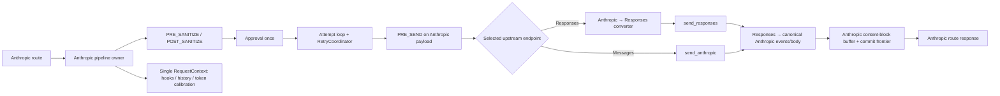

# Anthropic route → Responses upstream：最小正确架构切缝

## 复核结论

**Verdict：当前 HEAD 尚不存在可直接复用的 Anthropic↔Responses bridge，但无需复制一条平行 pipeline。最小正确切缝是保留 `execute_anthropic_pipeline()` 作为 Anthropic 请求的唯一生命周期、retry、approval、hooks、history 与 tokenization owner，只把每次 attempt 的发送与返回值解释替换为可选的 Responses transport adapter + 双向 converter + block commit buffer。**

当前实现与目标必须分开看：`/v1/messages` 目前经 Anthropic upstream 原字节返回；块级 buffering 尚未接线。目标则要求 Anthropic 入站可选择 Responses upstream，并以完整 Anthropic content block 为下游提交单元，不承诺 token/event 级 live streaming。

## 最小组合边界

## 架构建议

### 1. 保留一个 orchestration owner，不复用平行 route pipeline

- **切缝**：让 `execute_anthropic_pipeline()` 继续拥有 `RequestContext`、状态迁移、attempt、approval、hooks、retry 与 History；Anthropic route 仍只调用 `client.execute()`。不要从 Anthropic route 调 `routes/openai.py` 的 `apply_approval_guard()`、`start_protocol_history()`、`OpenAIClient.responses()` 组合，否则会产生第二套生命周期和语义较弱的 History。
- **证据**：`src/app/routes/anthropic.py:65-88` 已把请求委托给 `client.execute()`；`src/app/anthropic/client.py:132-151` 把它落到 `execute_anthropic_pipeline()`；`src/app/pipeline/executor.py:121-280` 已集中拥有完整生命周期。相反，`src/app/routes/openai.py:87-113` 是独立的 approval/history/Responses 路由链。
- **验收 oracle**：Anthropic→Responses 集成测试中，一个请求只产生一个 request id、一个 in-flight History entry 和一组连续 attempt 编号；仓库生产调用扫描仍只有 Anthropic client 调用 Anthropic pipeline，Anthropic route 不导入 `app.routes.protocol_history` 或 `app.pipeline.protocol_guard`。

### 2. 把 endpoint 选择建模为 attempt transport policy，而不是第二个 client pipeline

- **切缝**：在模型解析后选择 `send_anthropic` 或 `send_responses`，向 `AnthropicClient` 注入协议中立的 attempt sender／adapter。选择依据应来自解析后模型的 `supported_endpoints` 或明确配置，而不是模型名字猜测；当前 `ModelInfo` 已保留该能力字段。`OpenAIClient` 继续服务原生 OpenAI route，不成为 Anthropic bridge 的 owner。
- **证据**：`src/app/models/common.py:33-40` 暴露 `supported_endpoints`；`src/app/upstream/base.py:7-34` 的同一 `UpstreamTarget` 已同时提供 `send_anthropic()` 与 `send_responses()`；`src/app/openai/client.py:31-62` 只是一套 OpenAI 请求 facade，并不拥有 Anthropic hooks/retry。
- **验收 oracle**：给 catalog 注入仅含 `responses` endpoint 的模型时，`POST /v1/messages` 恰好调用一次 `send_responses()` 且不调用 `send_anthropic()`；仅含 Messages endpoint 时反之；两者都不支持时，在发起网络请求前得到可审计的 Anthropic 错误，并仍由同一个 `RequestContext` finalize。

### 3. 以 Anthropic payload 为 pipeline canonical form，converter 放在每次 `PRE_SEND` 之后

- **切缝**：sanitize、thinking protection、tool preprocessing、approval 修改和 retry strategy 都继续操作 Anthropic payload。每个 attempt 先运行 `PRE_SEND`，再将该 attempt 的最终 Anthropic payload 转成 Responses request；绝不能只在 attempt loop 之前转换一次。现有 `anthropic_to_openai()` 是 Chat Completions 形状，不是 Responses converter，不能冒充 bridge。
- **证据**：`src/app/pipeline/executor.py:194-221` 在每个 attempt 内执行 `PRE_SEND` 并构造当前请求；`src/app/pipeline/strategies/__init__.py:68-104` 的 poisoned-thinking strategy 直接读取 Anthropic `messages`；`src/app/transform/translator.py:50-98` 产出 `messages/tool_calls`，而 Responses 模型要求 `input/instructions`（`src/app/models/openai.py:62-72`）。
- **验收 oracle**：注入一个在 attempt 1 修改 Anthropic payload 的 `PRE_SEND` hook，再让 attempt 1 触发 poisoned-thinking retry；捕获的两个 Responses payload 必须分别反映各自 attempt 的 hook/retry 修改，且 converter 输入对象始终保有 Anthropic `messages` 结构。

### 4. converter 必须成对且语义完整：请求、非流式响应、流式事件、错误

- **切缝**：建立专用 Anthropic↔Responses semantic converter，而不是继续扩展 Chat translator。请求侧至少覆盖 system blocks、text/image、tool use/result、tool schema/choice、thinking/reasoning、stop/max token 与未知字段处置；返回侧将 Responses output item/content part/function call/reasoning/usage 映射为 Anthropic message/content block/stop reason。非流式与流式必须共享同一语义核心，防止两套映射漂移。
- **证据**：`src/app/models/anthropic.py:47-64` 与 `src/app/models/openai.py:51-72` 的 wire 形状不同；现有 `src/app/openai/responses_conversion.py:10-23` 只规范化 call id；`src/app/openai/responses_stream_accumulator.py:5-28` 只累计 text、terminal response 与 usage，无法重建 tools/thinking blocks。
- **验收 oracle**：以包含多 system block、text、image、tool_use/tool_result、thinking/signature、未知扩展字段的 golden corpus 同时跑非流式和分片随机化流式转换；两者归一化后的 Anthropic `MessagesResponse` 必须相同。每个无法无损表达的字段必须触发显式策略或错误，禁止静默丢弃。

### 5. block buffer 的主体是“完整 Anthropic content block”，不是任意 bytes 或完整 response

- **切缝**：Responses SSE 先经增量 parser 和 semantic assembler，直到一个可映射的 Anthropic content block 完成后才一次性提交该 block 对应的 `content_block_start`、delta 与 `content_block_stop` 序列。buffer 按 block 设 cap，并维护已提交 block frontier；不要使用当前整流 `collect_with_limit()` 作为产品语义。下游没有 token/event 级 live streaming 承诺。
- **证据**：`src/app/streaming/openai_sse.py:6-21` 仅负责拆 SSE JSON；`src/app/streaming/buffered_retry.py:8-18` 会收集完整 byte stream；`src/app/models/anthropic.py:76-84` 已表达 content block start/delta/index。当前 route 在 `src/app/routes/anthropic.py:106-120` 仍是 raw-byte passthrough。
- **验收 oracle**：上游把一个 text block、function-call arguments 和 thinking block分别切成任意 chunk，在对应完成事件前下游读取必须得到 0 字节；完成后一次可观察提交恰好包含一个合法、闭合且 index 连续的 Anthropic block。单 block 超 cap 时请求显式失败，先前已提交 blocks 不重复、不截断；总响应可由多个受限 block 组成而不要求整响应驻留内存。

### 6. retry owner 仍是 application pipeline，并让它看见 block commit frontier

- **切缝**：保持 SDK `max_retries=0`，所有真实上游 attempt 由 `RetryCoordinator` 创建并审计。Responses transport/converter/buffer 不得自行重发。响应 header 前失败或首 block 提交前失败可由统一策略重试；一旦已有 block 对下游提交，除非实现可证明的 resume + 去重协议，否则不得重跑整个 response。converter 应把 Responses 错误先归一成 `ApiError`，再交给现有 strategy。
- **证据**：`src/app/upstream/client.py:31-78` 已关闭两个 SDK 的自动重试；`src/app/pipeline/executor.py:172-193` 创建单一 `RetryCoordinator`，`src/app/pipeline/executor.py:194-280` 记录 attempt 并决定 retry；当前 `RetryDecision` 只改 canonical payload（`src/app/pipeline/strategies/__init__.py:11-62`）。
- **验收 oracle**：故障注入分别发生在 response headers 前、首 block 完成前、首 block commit 后。前两者在预算允许时只由 pipeline 增加一个可见 attempt；第三者不得产生第二次全量发送。SDK mock 的底层请求次数必须与 `context.attempts` 数量严格相等，且每个失败 response 都被关闭。

### 7. approval 只发生一次，修改后重新走 Anthropic prepare，再按 attempt 转换

- **切缝**：继续使用 pipeline 内的 `ApprovalGate`：初次 prepare 后等待一次；若审批修改 payload，则重新校验 `MessagesRequest` 并重跑完整 Anthropic prepare/hooks。不要再套 `apply_approval_guard()`，也不要让转换后的 Responses wire 成为审批合同。
- **证据**：`src/app/pipeline/executor.py:139-165` 已实现审批、拒绝 finalize 与 modified payload 重准备；`src/app/pipeline/protocol_guard.py:7-26` 只构造一个简化 context，无法保留原 pipeline 的 attempts/hooks/history。
- **验收 oracle**：开启 approval，修改 Anthropic tools/messages 后批准；只出现一个 pending approval，实际 Responses payload反映修改后的 sanitize/hook 结果，History 仍使用同一个 request id。拒绝时 upstream 调用数为 0，History 终态为 failed。

### 8. hooks 在 Anthropic 语义边界运行，response hook 看转换后的 Anthropic body

- **切缝**：`PRE_SANITIZE`、`POST_SANITIZE`、`PRE_SEND` 和 retry factories 保持现有顺序与 Anthropic `HookContext(protocol="anthropic")`。非流式 Responses 成功体必须先转换为 Anthropic body，再触发 `RESPONSE` observer 与 response hooks；流式则由 block assembler 汇总 usage，在最终提交后触发一次 RESPONSE/FINALIZE。不要把 Responses wire 暴露给现有 Anthropic hook 合同。
- **证据**：`src/app/pipeline/executor.py:65-116` 定义请求 hook 顺序，`src/app/pipeline/executor.py:222-249` 当前对成功非流式 body 运行 observer/response hook；`src/app/anthropic/client.py:153-188` 当前为流式完成触发 observer；`src/app/hooks/builtin/token_calibration.py:30-37` 明确要求 observer data 中是 `MessagesRequest`。
- **验收 oracle**：同一 hook fixture 分别走 Messages upstream 与 Responses upstream，hook phase 序列、attempt_number 和 modification records 等价；response hook 收到的 bytes 均可校验为 Anthropic `MessagesResponse`，且流式成功/中断各只出现一次 FINALIZE。

### 9. History 继续消费同一个 `RequestContext`，终态由 block drain 决定

- **切缝**：保留 `HistoryConsumer`，记录入站 Anthropic original payload、原始/解析后模型、attempts、hook records 和归一化错误。Responses wire 只能作为 attempt 级诊断 metadata，不能替换用户请求真相。流式请求必须在所有 committed blocks 正常 drain 后标 completed；解析、转换、cap、网络或客户端中断均标 failed/aborted，并且只 finalize 一次。可用 semantic accumulator 给 History 附加完整规范化 Anthropic response，而不是保存原始 Responses events。
- **证据**：`src/app/history/consumer.py:9-48` 已从 `RequestContext` 生成唯一 entry；`src/app/pipeline/context.py:35-69` 已集中保存 attempts、hook records、error、session/agent；当前 `_history_stream()` 在 `src/app/routes/anthropic.py:27-62` 以流是否完整消费决定终态。
- **验收 oracle**：对非流式成功、三 block 流式成功、block 2 转换失败、客户端在 block 1 后断开分别查询 History；每个请求只有一个 entry，状态与终止原因正确，original payload 始终是 Anthropic，attempt 数与真实 upstream 调用一致，成功 response 可反序列化为 Anthropic schema。

### 10. tokenization 保留 Anthropic API 合同，Responses usage 只作为校准事实输入

- **切缝**：`/v1/messages/count_tokens` 继续返回 Anthropic 形状并使用 Anthropic request estimator/calibration；当选中的模型没有 Anthropic count_tokens upstream 时，应走本地 calibrated estimate，而不是误发到不支持的 endpoint。Responses 成功/错误 usage 必须先归一为 Anthropic token facts，再送现有 observers；映射需明确 cached input、reasoning/output 与 prompt-limit error 的口径。
- **证据**：`src/app/routes/anthropic.py:134-139` 已将 count_tokens 独立于 messages pipeline；`src/app/tokenization/service.py:35-86` 已有 upstream 失败后的 calibrated fallback；`src/app/hooks/builtin/token_calibration.py:39-100` 从 Anthropic request、usage 和 prompt-limit error 学习。
- **验收 oracle**：Responses-only 模型调用 count_tokens 时不调用 `send_anthropic_count_tokens()`，仍返回正整数 `input_tokens` 与 `estimated=true`；随后一次 Responses bridge 成功将规范化 input/cache usage 写入同一 Anthropic calibration bucket，400 prompt-limit 错误更新 Anthropic limit registry，且 reasoning tokens 不被误计入 input。

## 最小实现顺序

1. 先冻结 Anthropic↔Responses request/response/error golden corpus，并实现纯 converter。
2. 抽出 attempt sender policy，在现有 pipeline 的 `PRE_SEND` 后接 `send_responses()`；保持 SDK retry 为 0。
3. 非流式先接通 converter→response hooks→History/token observers。
4. 实现 Responses SSE semantic assembler 与 Anthropic block commit buffer，再接流式 finalize。
5. 最后补 endpoint capability routing、count_tokens fallback 与完整 failure-injection 集成测试。

这条顺序不是功能删减：HTTP/WS、thinking、tools、History、approval、hooks、tokenization 与块级交付都保留；只是先冻结共同语义核心，再让不同 transport 复用它，避免产生第三条平行 pipeline。
