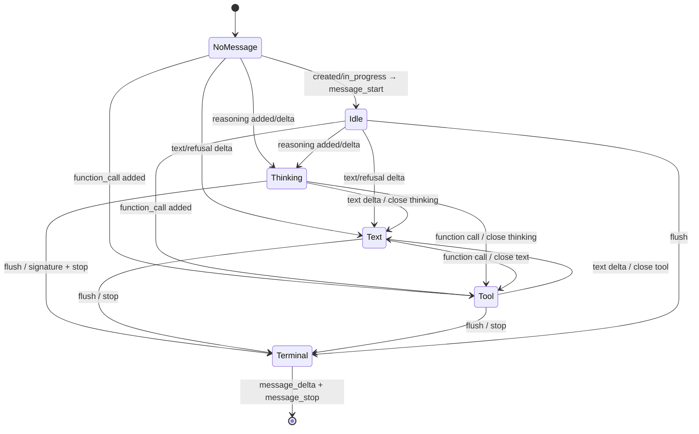

# copilot-api-js Responses stream → Anthropic SSE 调查

## 评审范围与 verdict

- **上游锚点**：`/home/xp/src/copilot-api-js` HEAD `8d5c861c2e079b92401dd8ccd49695a363d078fe`。调查期间 HEAD 两次前进；同调用 gate 均阻断旧锚点操作后重新取证。最后一次增量仅修改 history worker 文档，未触及本报告证据文件。
- **总体 verdict**：**上游目标路径不可原样采用，但已有可借鉴的 block-level buffering/retry 基座。** 当前 Responses upstream → Anthropic SSE translate leg 明确走 live sink，逐 token/event 下发；这与本项目既定的“block-level buffering 且下游无 token/event live streaming”冲突。可借鉴的是 driver 的边界扣留、pre-commit retry、attempt reset、commit ledger 和 post-commit 分类；不可照搬 translate-leg 接线、逐 frame commit、buffer-cap retreat-to-live。
- **blocker 数**：两项采用门槛。其一，目标 translate leg 未接入 buffered sink；其二，buffer-cap overflow 会退化为 live forwarding。二者不解决就不能满足本项目既定契约。
- **双视角覆盖证据**：机械核对覆盖 translator、hub factory、Anthropic codec candidate renderer、messages handler 两条 pump、driver buffered sink、commit predicate 与测试；第一人称执行模拟覆盖 text、thinking、tool、web search、terminal、clean EOF、transport throw、client abort、pre/post-commit cut、buffer overflow 和 sink write failure。

## 结论明细

1. **真实调用链与方向**：Anthropic client 选择 Responses upstream 时，`/home/xp/src/copilot-api-js/src/lib/codec/anthropic/codec.ts:185-207` 为每个 candidate 懒建 `ForwardStreamTranslator`，逐帧调用 `renderFrame`，结束调用 `flush`；`/home/xp/src/copilot-api-js/src/lib/pipeline/hub-translate.ts:327-366` 将 `/responses` 与 `ws:/responses` 映射到 `createResponsesToAnthropicStreamTranslator`。因此目标方向是 Responses upstream → Anthropic client SSE，不是 OpenAI Responses client 的 reverse leg。

2. **转换状态**：`/home/xp/src/copilot-api-js/src/lib/openai/translate/responses-to-anthropic-stream.ts:121-139` 的请求内状态包括 `messageStarted`、message id/model、单调 `nextIndex`、`output_index → Anthropic index` 映射、唯一 `openBlock`、最终 reasoning ciphertext、tool-use 标志、terminal status/usage 与 `flushed`。索引按首次出现分配连续 Anthropic index，不直接使用稀疏 Responses `output_index`。

3. **事件转换状态机**：`response.created|in_progress` 懒发 `message_start`；reasoning item/summary 打开 thinking block；function call item 打开 `tool_use`；text/refusal delta 打开或续写 text；function arguments delta 转成 `input_json_delta`；reasoning `.done` 才采纳最终 `encrypted_content`；web search `.done` 立即生成并关闭一个可读 text block；completed/incomplete 只更新 terminal meta；`flush()` 才关闭最后 open block并输出 `message_delta`、`message_stop`。核心实现位于 `/home/xp/src/copilot-api-js/src/lib/openai/translate/responses-to-anthropic-stream.ts:157-202`、`:207-371`、`:374-398`。

4. **block assembly 粒度**：converter 自身不是 buffer；每个非空 text/thinking/JSON delta 当场返回 Anthropic `content_block_delta`，见 `/home/xp/src/copilot-api-js/src/lib/openai/translate/responses-to-anthropic-stream.ts:256-269`、`:297-338`。只有 block 切换、web-search whole-item 或最终 `flush()` 才产生 `content_block_stop`。所以 converter 可作为“block assembler 的事件前端”，不能作为本项目的 block-level delivery policy。

5. **目标 translate leg 当前是 live**：`/home/xp/src/copilot-api-js/src/routes/messages/handler-v4.ts:1745-1750` 明示 L2 buffered retry 未用于 translate leg；`:1760-1773` 调用 `driver.runResponseSink`，每个 rendered frame 直接写同一 live/reconciling sink。clean drain 后的 translator flush 也沿同一 live sink 发送。上游现状因此存在 token/event live streaming，本项目不得沿用这条接线。

6. **可借鉴的 block-level driver 状态机**：`/home/xp/src/copilot-api-js/src/lib/pipeline/driver.ts:1087-1121` 初始化 attempt、buffer、`committedAny` 与 continuation 状态；`:1357-1420` 在 rendered frame 命中 `commitBoundaries` 时 flush 当前 buffer并关闭透明重试窗口；`:1456-1481` 在 terminal drain flush 尾部；`:1490-1533` 仅在尚未 commit 时透明 re-exchange；`:1543-1606` 可在已 commit 后基于 ledger 发 continuation；`:1616-1626` 最终分类 `partial-degrade`、`continuation-exhausted` 或 `exhausted`。

```mermaid
stateDiagram-v2
    [*] --> Buffering
    Buffering --> Retry: cut && !committedAny && retryBudget
    Retry --> Buffering: fresh exchange + reset attempt state
    Buffering --> CommitBlock: commit boundary
    CommitBlock --> Buffering: flush succeeded; committedAny=true
    Buffering --> CommitTail: terminal observed
    CommitTail --> Success
    Buffering --> RetreatLive: buffer cap exceeded
    RetreatLive --> Success: clean drain
    RetreatLive --> StreamError: cut/write failure
    CommitBlock --> Continuation: later cut && continuation gates
    Continuation --> Buffering: fresh continuation leg + index remap
    CommitBlock --> PartialDegrade: later cut && cannot continue
    Buffering --> Exhausted: pre-commit retries exhausted
```

7. **Anthropic commit 边界可直接借鉴，但须作用于 rendered Anthropic frame**：`/home/xp/src/copilot-api-js/src/lib/codec/anthropic/commit-boundaries.ts:16-23` 仅把 `content_block_stop` 与 `error` 判为 boundary；`message_stop` 刻意不是 mid-stream boundary，以便 terminal drain 保持 anchor close-off → `message_delta` → `message_stop` 顺序。driver 的判定对象是 `onRenderedFrame` 后的 `toWrite`，见 `/home/xp/src/copilot-api-js/src/lib/pipeline/driver.ts:1305-1358`，这正适合协议转换后按 Anthropic block 交付。

8. **commit 不是单次原子 block write**：`/home/xp/src/copilot-api-js/src/lib/pipeline/driver.ts:1228-1290` 的 `flushBufferedFrames` 仍对 block 内每个 frame 顺序 `await sink.write`。它保证“直到 block complete 才开始下发”和不与下一 block/heartbeat 交错，但不保证 block 作为一个 wire write 原子出现。若本项目“下游无 event live streaming”要求单一 block payload/单次 write，需借鉴边界与状态机而不是照搬 sink flush 形态。

9. **透明 retry 边界**：`/home/xp/src/copilot-api-js/src/lib/pipeline/driver.ts:1482-1533` 只重试 transport-close 类 throw 或无 throw 的 clean truncation，且要求 `!committedAny`；client abort 不重试，shutdown/idle-timeout 不按 transport-close 重试。重试前会 snapshot failed attempt、finalize duration、调用 `onAttemptReset`、清空 repair/SSE attempt 状态，再通过 coordinator 建 fresh recovery exchange。此“commit 前可重放、commit 后不可透明重放”原则可借鉴。

10. **post-commit retry 是独立 continuation 机制**：`/home/xp/src/copilot-api-js/src/lib/pipeline/driver.ts:1535-1606` 只有在 continuation hooks、committed-block ledger、extractor、预算齐全，且已提交前缀不含完整 interactive `tool_use` 时才拼接 continuation；它丢弃新 leg 的重复 `message_start` 并按已交付 block 数重映射 index。该机制不是透明 retry，也不改变本项目必须 block-buffered delivery 的裁决。

11. **不可借鉴的 downgrade 分支**：`/home/xp/src/copilot-api-js/src/lib/pipeline/driver.ts:1331-1356` 在 `bufferCapBytes` 超限时 flush 已缓存前缀并切到 live write-through，随后永不 retry；`/home/xp/src/copilot-api-js/tests/pipeline/buffered-sink.unit.test.ts:214-255` 锁定了这一行为。对本项目而言这不是可接受的“保护降级”，而是违反既定无 live token/event streaming 契约的 blocker；本地策略必须在保持 block buffering 的前提下处理容量压力。

12. **失败路径**：converter 对无法解析的 data 记录 debug 后跳过，见 `/home/xp/src/copilot-api-js/src/lib/openai/translate/responses-to-anthropic-stream.ts:207-217`；`response.failed` 与 Responses `error` 抛错，见 `:343-360`；translate pump 的 thrown stream error 与 clean EOF 无 terminal meta 都在已经 live-forward 的内容后追加 Anthropic error并失败，见 `/home/xp/src/copilot-api-js/src/routes/messages/handler-v4.ts:1796-1833`、`:1836-1878`。buffered driver 则在 pre-commit cut 丢弃 attempt buffer并 retry，在 post-commit cut continuation/degrade，在 sink write failure 返回 `stream-error`，在 client abort 返回 `settled-abort`。

13. **上游 block assembly 的异常序列盲点**：`/home/xp/src/copilot-api-js/src/lib/openai/translate/responses-to-anthropic-stream.ts:327-339` 遇到交错 tool arguments 时会先关闭当前 block，再把 `openBlock` 指回一个早已发过 start/stop 的旧 index，却不重发 start，随后向该 index发 delta；这会形成 delta-after-stop。对应测试 `/home/xp/src/copilot-api-js/tests/openai/responses-to-anthropic-stream.unit.test.ts:248-267` 只断言两个 JSON delta 存在，没有通过 Anthropic SDK oracle 验证该异常序列。借鉴时不应继承这一 defensive 路径。

14. **测试证据与缺口**：本次在 HEAD `74853175c2c5771e6110bdbdfb97870132788fa1` 上执行并通过 `/home/xp/src/copilot-api-js/tests/openai/responses-to-anthropic-stream.unit.test.ts`、`/home/xp/src/copilot-api-js/tests/codec/anthropic/commit-boundaries.unit.test.ts`、`/home/xp/src/copilot-api-js/tests/pipeline/buffered-sink.unit.test.ts`、`/home/xp/src/copilot-api-js/tests/pipeline/buffered-block-level.it.test.ts`，共 4 文件、43 项测试；之后到最终 HEAD 的增量未触及这些测试或实现。translator 测试覆盖 text/tool/reasoning/refusal/web-search/meta/error/SDK decode；buffer 测试覆盖 retry、truncation、error terminal、overflow、write failure；block-level 测试覆盖 boundary commit、`partial-degrade`、terminal-only 等价与 terminal dedup。缺口是没有测试把 **Responses→Anthropic translator + `anthropicCommitBoundaries` + `runResponseBufferedSink`** 三者接成目标链路；当前产品接线本来也明确未接，因此现有绿色测试不能证明目标路径满足本项目要求。
