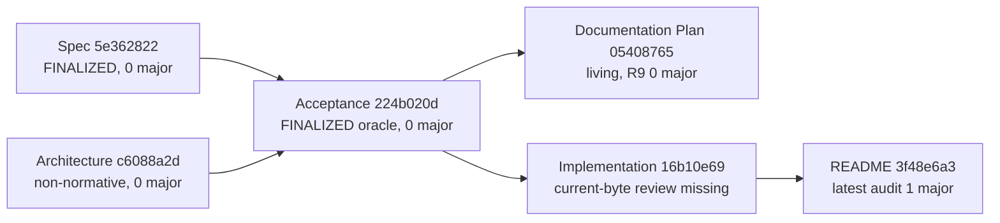
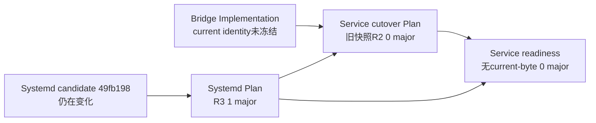

# Current 正式 docs 集合与状态依赖只读审计

- **评审范围**：`main@ed77c9d191df81c451c25161420515cca52ce6a4` 的 current `docs/agents/**/*.md` 全集合，共 10 份正式文档。只审计文件身份、Git 状态、独立评审是否直接绑定 current bytes、living 状态能否继续、上游身份变化是否要求重绑，以及下一次正式 docs checkpoint 的最小依赖闭包；不做正文技术内容评审、不执行产品测试、不修改 index、不提交、不部署、不切换运行态。
- **总体 verdict**：**修复 major 后可进入。** 当前可以形成一个 4 文件的最小、依赖闭合正式 docs checkpoint：Bridge Spec、Architecture、Acceptance 与 documentation-restructure Plan。Research 已独立 0 major，可作为非最小的独立附加文件。README、Implementation、service cutover Plan、service readiness 与 systemd runtime Plan 暂缓；它们分别存在 current-state 评审失效、缺少 current-byte 0 major、或上游候选／oracle identity 漂移。
- **blocker 数**：0。
- **major 数**：5。它们都是状态依赖／checkpoint 边界问题，不是本轮正文内容评审结论。
- **审计基线**：所有采信的 shell 证据均要求在同一次调用内验证物理 root `/home/xp/src/ghc-api-proxy-py`、分支 `main`、HEAD `ed77c9d191df81c451c25161420515cca52ce6a4`。10 份 current SHA-256 均以 `sha256sum` 与 Python `hashlib.sha256` 两种实现交叉复核。文件集合又以 `fd` 与 VS Code 文件枚举两种方式交叉核对，均为同一 10 项。

## 双视角覆盖证据

### 机械核对视角

- 枚举 current `docs/agents/**/*.md`，逐文件记录 `git status --porcelain`、current worktree SHA-256、最新直接绑定 current bytes 的独立评审及其 blocker／major verdict。
- 对 Bridge 依赖链按 `Spec → Acceptance → documentation-restructure Plan` 核对内容 identity：Spec `5e362822…`、Architecture `c6088a…`、Acceptance `224b020d…`、Plan `05408765…`。Acceptance 内嵌绑定 current Spec／Architecture；Plan 内嵌绑定 current Spec／Acceptance；直接评审分别允许 current bytes 提交或 living 继续。
- 对 README／Implementation 反向核对最新报告是否仍绑定 current bytes。README 虽有同 SHA 的历史 R3 0／0，但后续同 SHA drift 审计已给出 1 major；Implementation current SHA `16b10e69…` 没有直接绑定的独立 0 major报告，旧 R6只绑定 `e43fd960…`。
- 对 deployment 文档核对 current bytes与最新报告：service cutover Plan `ab840f2a…` 的 R2 为 0／0；systemd runtime Plan `c1c5fd8a…` 的最新 R3为0 blocker／1 major；readiness `483396db…` 无直接 current-byte独立0 major报告。
- 核对易变上游身份：systemd候选已从正式文档记录的`1a220e04…`前进到`49fb1988621bba4356e7a5039a6994c2e6d19604`；Bridge happy-path集成也在继续前进。凡 living文档以旧候选或旧oracle身份作current依据，均要求先同步并重绑，不能沿用旧0 major。

### 第一人称执行视角

- 模拟下一位提交者从 Spec 开始：Spec current bytes已有直接0 major；Acceptance同时绑定该Spec与current Architecture，且自身current bytes已有直接0 major；documentation-restructure Plan再绑定这组current Spec／Acceptance，并由R9直接放行living继续。因此四文件形成闭合、可执行的最小依赖链。
- 模拟把Research加入上述checkpoint：Research不产生behavior expected，也不被四文件依赖；其current bytes已有直接0 major，加入不会改变依赖闭包，但它不是“最小”所必需。
- 模拟把Implementation加入：提交者会消费未获直接current-byte终审的`16b10e69…`，并把随后变化的候选／systemd状态固化为正式current状态，故必须暂缓。
- 模拟把README加入：README会作为冷启动入口转述Acceptance／Implementation状态，但latest drift审计已在同一bytes上发现1 major；在Implementation稳定并重评之前加入会形成错误导航快照。
- 模拟把service cutover三文件加入：service Plan自身旧四项major已由R2关闭，但它依赖的Implementation与systemd候选已变化；readiness又直接绑定旧Implementation身份并描述旧systemd候选；systemd Plan latest R3仍有1 major。三者不能作为同一current部署checkpoint提交。

## Current 正式文档全清单

| 正式文档 | Git状态 | Current SHA-256 | Current独立0 major | Living可继续 | 因上游identity变化需重绑 | 本次checkpoint处置 |
|---|---:|---|---|---|---|---|
| `docs/agents/anthropic-responses-bridge/spec.md` | `AM` | `5e3628226238a2c271824bc47d0f2fd67db9a6eb36224ee088984c96eb62a5f1` | **是。** `260807-review-spec-carrier-final.md`直接绑定current bytes，0 blocker／0 major／0 minor | 不适用；`FINALIZED`正式Spec | **否。** 仅其自身bytes变化时重启下游对账 | **最小checkpoint必选** |
| `docs/agents/anthropic-responses-bridge/architecture.md` | `AM` | `c6088a2d2ce89e2355627372d10973bea6a0794ddc45b84b33b4aaa5a9f29b8d` | **是。** `260807-review-architecture-final-state.md`直接绑定current bytes，0／0／0 | 不适用；仍是未获用户接受的非规范提案，可提交供阅读 | **否。** 用户裁决改变bytes时才重启下游链 | **最小checkpoint必选**，因为current Acceptance显式绑定其identity |
| `docs/agents/anthropic-responses-bridge/acceptance.md` | `AM` | `224b020d30059b899bbdc2571af0ebd199f061df2288e5c202f8cd264e9c76f4` | **是。** `260807-review-acceptance-dual-carrier.md`直接绑定current bytes，0／0／0；联合终审为0 major／1 minor | 不适用；`FINALIZED_ACCEPTANCE_ORACLE`，产品仍为`UNVERIFIED` | **否。** 当前绑定Spec `5e362822…`与Architecture `c6088a…`均匹配 | **最小checkpoint必选** |
| `docs/agents/documentation-restructure/plan.md` | `AM` | `054087655a539ad95babb2a15f918bc0467aa0fd6726d6e17569169f31f12aee` | **是。** R9直接绑定current bytes，0／0／0 | **是。** living Plan可继续执行；不是迁移收口 | **否。** 当前绑定Spec `5e362822…`与Acceptance `224b020d…`均匹配 | **最小checkpoint必选** |
| `docs/agents/anthropic-responses-bridge/research.md` | `AM` | `54cf0cde2bc7122516bec9948f62a65f7900c775d5bd1da6200cb224f184856e` | **是。** external-change复核直接绑定current bytes，0 blocker／0 major | 不适用；稳定研究证据，不产生expected | **否。** 固定来源或目标裁决变化时再复核 | **可独立附加，但不属于最小集合** |
| `docs/agents/anthropic-responses-bridge/implementation.md` | `AM` | `16b10e69ec0fc2b38921b96da54828478d9c13889c2fdc6a1e917f9bd4a8122f` | **否。** 旧R6绑定`e43fd960…`，没有报告直接放行current `16b10e69…` | **文档类型为living，但current checkpoint不可继续消费其状态断言** | **是。** 代码候选、systemd候选与部署计划状态均继续前进 | **暂缓**；同步最新候选／评审后做current-byte定向复评 |
| `docs/agents/anthropic-responses-bridge/README.md` | `A ` | `3f48e6a3cab32545591bad32ae3ee96682a4d9cc870408fbe1da87f664b9b920` | **否。** 历史R3虽对同bytes为0／0，但后续`260807-audit-readme-drift.md`对同bytes给出1 major／1 minor | 不适用；它是最后同步的导航快照 | **是。** 必须等Implementation current identity与verdict稳定后再同步 | **暂缓**；位于`Architecture → Acceptance → Implementation → README`链末端 |
| `docs/agents/service-cutover/plan.md` | `??` | `ab840f2a37407877bc1c6c9526ff811ab7364e795012ffad0596927f3a3a4765` | **是，但仅限该快照及R2指定范围。** service Plan R2为0／0／0 | **是。** 只允许living implementation继续，仍为`NO_CUTOVER` | **是。** current Implementation与systemd候选已变化；复评后的旧身份不能代表latest部署状态 | **暂缓**；先同步上游identity，再定向复评 |
| `docs/agents/service-cutover/readiness.md` | `??` | `483396dbccc0c9786f3696a11de454a76fedb1a4bbf6dae0d38f0b9d4f490d67` | **否。** 未找到直接绑定current bytes的独立0 major报告 | **仅可保持`NO_CUTOVER／FOUNDATIONS_ONLY`；不能据此推进checkpoint状态** | **是。** 文件绑定Implementation `052bda8e…`，current已为`16b10e69…`；systemd候选也已前进 | **暂缓**；重绑Plan／Implementation／systemd并独立评审 |
| `docs/agents/systemd-runtime/plan.md` | `??` | `c1c5fd8a84c71363a4d57f374a0696b3dc5b1074498982a0dc15bd840e42009a` | **否。** latest Plan R3直接绑定current bytes，0 blocker／1 major／0 minor | **living技术工作可继续，但该正式Plan不能进入checkpoint** | **是。** 文档仍以`1a220e04…`与待R2为current；实际候选已到`49fb198…`，code R3仍待消费 | **暂缓**；按R3清单同步后重新定向复评 |

> Git状态口径：`AM`表示文件已在index中新增，但worktree又相对index修改；`A `表示已暂存且worktree与index一致；`??`表示未跟踪。任何最终提交都必须重新精确add获准集合，并验证index blob等于本报告绑定的current worktree bytes；不能直接提交现有stale index。

## 状态依赖结论

### Bridge 正式链

- **稳定闭包**：Spec＋Architecture＋Acceptance＋documentation-restructure Plan。
- **独立稳定叶节点**：Research。它可以一并提交，但不是稳定闭包成立的必要输入。
- **暂缓链**：Implementation先同步并重评；README只能在Implementation稳定后最后同步并重评。

### Deployment／readiness 链

- Service cutover Plan自身上一轮四项major已关闭，但这不冻结其上游候选或Implementation身份。
- Readiness是最下游实时汇总，必须在Plan、Implementation、systemd候选都稳定后最后更新；其`NO_CUTOVER`结论继续有效，但current证据行不能沿用旧identity。
- Systemd Plan是部署链当前明确未关闭的文档门；latest R3要求同步`candidate@49fb198…`、code R2权限major的修复状态与code R3真实verdict。

## 事实性发现

### [major] README current bytes的latest verdict不是0 major

- **位置**：`docs/agents/anthropic-responses-bridge/README.md`。
- **问题**：R3曾直接绑定同一SHA并给出0／0，但其后上游Acceptance／Implementation状态变化；latest drift审计在README bytes未变的情况下给出1 major／1 minor。
- **失败场景**：仅按“文件bytes未变＋旧R3为0／0”提交，会忽略依赖身份变化使导航快照失效这一事实。
- **修复建议**：Implementation current状态冻结后，最后同步README并做current依赖组合的定向复评。

### [major] Implementation没有直接current-byte 0 major，且易变状态继续前进

- **位置**：`docs/agents/anthropic-responses-bridge/implementation.md`。
- **问题**：current SHA为`16b10e69…`，旧R6只绑定`e43fd960…`；同时systemd候选及bridge happy-path集成状态均已前进。
- **失败场景**：把current Implementation并入checkpoint会将未经独立冻结的候选身份与下一动作固化为正式真相源。
- **修复建议**：重新取证全部active worktree／branch／HEAD与latest review，更新Implementation后对最终bytes做定向复评。

### [major] Systemd Plan直接绑定current bytes的latest R3仍有1 major

- **位置**：`docs/agents/systemd-runtime/plan.md`。
- **问题**：Plan仍绑定`candidate@1a220e04…`并要求R2；实际code R2已到达并产生权限major，候选已修到`49fb198…`，code R3尚未被Plan消费。
- **失败场景**：执行者会重复派R2、漏掉第三个权限修复提交，或错误地按两提交集合squash。
- **修复建议**：按Plan R3精确清单同步候选、评审、权限与三提交squash集合；只在真实code R3为0 major时标记可立即squash。

### [major] Service readiness没有current-byte独立0 major且绑定身份已漂移

- **位置**：`docs/agents/service-cutover/readiness.md`。
- **问题**：current bytes未找到直接0 major报告；其输入身份仍写Bridge Implementation `052bda8e…`，而current正式Implementation为`16b10e69…`，systemd候选状态也已前进。
- **失败场景**：下游readiness会把不同时间点的局部证据拼成“实时”状态，违反其自身同一候选与identity漂移退回`UNVERIFIED`规则。
- **修复建议**：在Implementation、service Plan、systemd Plan与候选都冻结后重算输入身份、逐行降级／更新受影响状态，再独立评审current bytes。

### [major] Service cutover Plan虽有current-byte 0 major，但上游identity变化使deployment组合结论必须重绑

- **位置**：`docs/agents/service-cutover/plan.md`。
- **问题**：service Plan R2直接绑定`ab840f2a…`并关闭旧四项major；但该结论不冻结其引用的Bridge Implementation、Spec／Acceptance状态或systemd候选。当前这些上游身份已继续变化。
- **失败场景**：把service Plan与旧readiness／systemd Plan一并提交，会得到“单文档旧范围0 major、部署组合current状态错误”的假绿。
- **修复建议**：保留R2对四项历史major的关闭，不重做正文全量评审；只同步current上游identity与对应状态，随后做部署组合定向复评。

## 下一次正式 docs checkpoint

### 最小可提交集合

以下4个路径构成当前最小、依赖闭合且均有直接current-byte 0 major证据的正式checkpoint：

1. `docs/agents/anthropic-responses-bridge/spec.md`
2. `docs/agents/anthropic-responses-bridge/architecture.md`
3. `docs/agents/anthropic-responses-bridge/acceptance.md`
4. `docs/agents/documentation-restructure/plan.md`

该集合的依赖顺序为：Spec与Architecture先作为Acceptance输入；Acceptance与Spec再作为documentation-restructure Plan的冻结输入。Architecture仍是非规范提案，提交只供用户完整阅读，不等于接受`D-ARCH`／`D-MIGRATION`。Acceptance定稿也不等于产品`PASS`。

### 可选但不属于最小集合

- `docs/agents/anthropic-responses-bridge/research.md`：current bytes已有直接0 major，且不产生behavior expected。若希望把稳定provenance与反例一并固化，可加入同一checkpoint；不加入也不破坏四文件依赖闭包。

### 暂缓集合

1. `docs/agents/anthropic-responses-bridge/implementation.md`：缺current-byte 0 major，且候选状态继续前进。
2. `docs/agents/anthropic-responses-bridge/README.md`：latest同bytes审计为1 major；必须在Implementation稳定后最后同步。
3. `docs/agents/service-cutover/plan.md`：自身R2 0 major保留，但current上游identity需重绑。
4. `docs/agents/service-cutover/readiness.md`：无current-byte 0 major，且输入身份已漂移。
5. `docs/agents/systemd-runtime/plan.md`：latest R3为1 major。

### 提交前机械门

- 再次执行`main@ed77c9d191df81c451c25161420515cca52ce6a4` gate；任一选中文档SHA变化即停止并重审受影响依赖链。
- 对获准路径执行精确`git add -- <paths>`，不得使用`git add docs`或把`docs/tmp/**`夹带进正式checkpoint。
- 验证staged path集合与获准集合双向精确相等，每个index blob等于本报告表中的current worktree blob，并运行`git diff --cached --check`。
- 在最终获准bytes上重跑相对Markdown链接检查。旧`260807-audit-doc-links.md`曾因source hash漂移失效；不得用旧链接verdict覆盖新checkpoint集合。
- 使用普通commit消费已验证index，不用`commit --only`重新读取可能漂移的worktree。提交后核对commit changed-path集合精确等于获准集合。

## 主观建议

[建议] **采用4文件最小checkpoint，Research作为可选附加；不要为了“一个完整目录”把README或Implementation提前带入。**

- **预期影响**：先固化行为oracle、非规范架构阅读材料、验收oracle与文档重组执行控制，解除这些稳定文档与易变实施状态的耦合；随后让Implementation／README以及deployment三文档在各自上游身份稳定后形成独立checkpoint。
- **推荐做法**：checkpoint 1提交上述4文件；若希望provenance同批落地，加Research成为5文件checkpoint。Checkpoint 2再按`Implementation → README`顺序收敛Bridge导航；checkpoint 3按`systemd Plan → service cutover Plan → readiness`顺序收敛部署状态。

## 结论

本轮未发现blocker。当前10份正式文档中，Spec、Architecture、Acceptance、documentation-restructure Plan形成可提交的4文件最小闭包；Research可独立附加。其余5份必须暂缓：Implementation与README需按状态依赖链重新冻结，service cutover／readiness／systemd Plan需按latest候选身份重新绑定，其中systemd Plan已有直接current-byte 1 major。全程保持完整Bridge产品`UNVERIFIED`与部署`NO_CUTOVER`，不得把文档checkpoint解释为实现、部署或生产切换放行。
