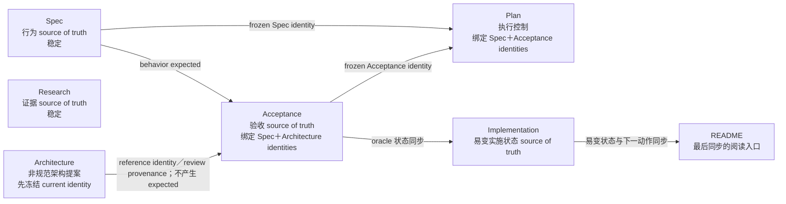
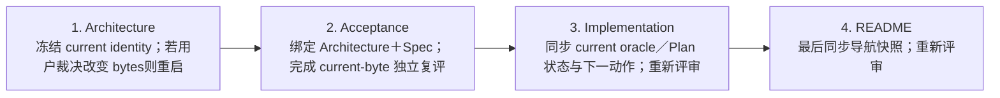

# 7 份正式文档状态依赖 DAG

## 口径

- **用途**：只记录 7 份正式文档的 source-of-truth 依赖、当前内容 identity、独立评审绑定和最后同步顺序，用于阻止后续并发任务继续消费旧快照；不评审文档内容，不改变任何正式文档状态。
- **仓库 gate**：`/home/xp/src/ghc-api-proxy-py`，`main@ed77c9d191df81c451c25161420515cca52ce6a4`。
- **identity 口径**：下表 SHA-256 均取自 2026-08-07 gate 时的 **current worktree bytes**，不是 `HEAD` 中的 blob identity。引用评审 verdict 时必须同时匹配该评审实际绑定的文档 SHA；仅文件名或轮次相同不构成匹配。
- **范围边界**：本文件不新增 behavior expected，不替代 `spec.md`、`acceptance.md`、`implementation.md` 或 `plan.md` 的权威角色，也不把文档放行外推为产品 `PASS`。

## Source-of-truth 依赖 DAG

`Research` 是独立、稳定的证据来源，不向行为、验收或执行控制节点提供 expected，因此没有进入同步边。`Architecture` 尚未获用户接受；其节点进入 DAG 只表示 Acceptance 必须绑定并说明所消费的 Architecture identity／provenance，不表示 Architecture 可以覆盖 Spec。

## 当前 identity 与评审状态

| 节点 | 正式文档 | Current worktree SHA-256 | 当前文档／评审状态 | 仍需更新或重新绑定 |
|---|---|---|---|---|
| Spec | `docs/agents/anthropic-responses-bridge/spec.md` | `a193da7179fbdab2464ee3ae987477ffd6b334e38041a6481994f4cd69c99694` | 文档状态 `FINALIZED`；Spec R3 为 0 blocker／0 major；唯一行为 oracle | **否。稳定。** 只有 Spec bytes 改变才重启 Acceptance policy 对账和 Plan identity gate |
| Research | `docs/agents/anthropic-responses-bridge/research.md` | `54cf0cde2bc7122516bec9948f62a65f7900c775d5bd1da6200cb224f184856e` | 外部变化只读复核为 0 blocker／0 major；current Research 可提交；不产生 behavior expected | **否。稳定。** 后续外部来源变化时再单独复核 |
| Architecture | `docs/agents/anthropic-responses-bridge/architecture.md` | `c6088a2d2ce89e2355627372d10973bea6a0794ddc45b84b33b4aaa5a9f29b8d` | 文档仍是未获用户接受的非规范提案；裁决矩阵独立终审为 0 blocker／0 major并绑定旧 identity `6de919d696514eb69949a57de0916dc7650e055929b174c9af6386afe0f3f327`；current bytes 只记录其后续 review provenance／状态与处置表；`D-ARCH`／`D-MIGRATION` 仍待用户裁决 | **无已知内容修订项。** 先把 `c6088a…` 作为本轮同步起点冻结；若用户裁决导致 bytes 改变，必须从 Architecture 重新启动整条最后同步链 |
| Acceptance | `docs/agents/anthropic-responses-bridge/acceptance.md` | `19635e04886052fa2c2c98e42aab1c87c23c1fb9c8935753201928eaa8463498` | 文档自述 `FINALIZED_ACCEPTANCE_ORACLE`，已绑定 current Spec `a193da…` 与 current Architecture `c6088a…` 并重做七域对账；最近独立 R7 为 0 blocker／0 major，但它绑定的是旧 Acceptance／Architecture 组合，其中 Architecture 为 `6de919…`，不是 current bytes | **需要 current-byte 独立复评并冻结 `19635e…` verdict。** 不得把 R7 的 0／0直接套到 current identity；产品继续为 `UNVERIFIED` |
| Plan | `docs/agents/documentation-restructure/plan.md` | `eba0666f1cd25b36edb2371c12b1eee35f21cd06a67405a1dd126a549b2bfeca` | Plan R7 精确绑定该 SHA，verdict 为 0 blocker／2 major，当前不可提交执行；其 identity gate 仍冻结 Spec `a193da…` 与旧 Acceptance `31673f4af6d3a7fe7d8ccdec7ef8d69f9d20559e0976826d8607999548906091`，已正确拒绝 current Acceptance 漂移 | **需要更新。** 先关闭 R7 两项 major；Acceptance current bytes 获得独立 0／0后，再把 Plan 的 Acceptance identity 从 `31673f…` 更新为已冻结的新 identity，重跑 Plan 自身 identity／distillation gates并复评至 0／0。Spec identity 当前无需变化 |
| Implementation | `docs/agents/anthropic-responses-bridge/implementation.md` | `e43fd96003a8de3a1b9c5e165a65d711e25e76d1cc6444415088af0a994dda65` | Implementation R6 精确绑定该 SHA并给出 0 blocker／0 major、可提交；但 current bytes 仍转述旧 Architecture `6de919…`、旧 Acceptance R7 current 结论，以及 Plan R4“正在修订”，未反映 Acceptance `19635e…` 与 Plan R7 的 current 状态 | **需要更新并重新评审。** 只能在 Acceptance current identity／verdict冻结后同步；Plan 的 current verdict也应按其源文档转述，不得把 Plan 未达 0／0写成可执行 |
| README | `docs/agents/anthropic-responses-bridge/README.md` | `3f48e6a3cab32545591bad32ae3ee96682a4d9cc870408fbe1da87f664b9b920` | README R3 精确绑定该 SHA并给出 0 blocker／0 major、可作为阅读入口；README 是导航快照，不是易变实施状态源 | **最后更新并重新评审。** 只在 Implementation 已完成 current 状态同步后更新导航快照；不得抢在 Implementation 前形成第二份易变状态源 |

## 最后同步顺序

严格顺序为：**Architecture → Acceptance → Implementation → README**。任一上游节点在下游同步后再次改变 identity，下游及其后继节点全部视为 stale，必须从变化点重新同步，不能沿用旧 snapshot verdict。

`Plan` 不插入上述线性链；它是由 `Spec＋Acceptance identities` 驱动的独立侧支。其更新门是：Spec identity 仍匹配、Acceptance current identity 已完成独立冻结、R7 两项 major 已关闭、Plan 新 bytes 复评达到 0 blocker／0 major。`Research` 同样不进入线性链，因为它当前稳定且不产生 expected。

## 当前待办快照

1. 冻结 Architecture current identity `c6088a…`；在用户未作 `D-ARCH`／`D-MIGRATION` 裁决期间，不把提案状态写成已接受 ADR。
2. 对 Acceptance current identity `19635e…` 做独立复评；只有 current bytes 达到 0 blocker／0 major后，才把该 identity作为下游输入。
3. 关闭 Plan R7 的 2 项 major；随后把已冻结的 Acceptance current identity写入 Plan identity gate，重跑 gates并复评。Plan 在此之前保持不可提交执行。
4. Acceptance identity／verdict稳定后，更新 Implementation 对 Architecture、Acceptance 与 Plan current 状态的转述并重新评审。
5. Implementation 稳定后，最后更新 README 导航快照并重新评审。
6. 全过程保持完整 bridge 产品 verdict 为 `UNVERIFIED`；文档评审、oracle 定稿和 foundations 范围内 `PASS` 均不能升级产品 verdict。
