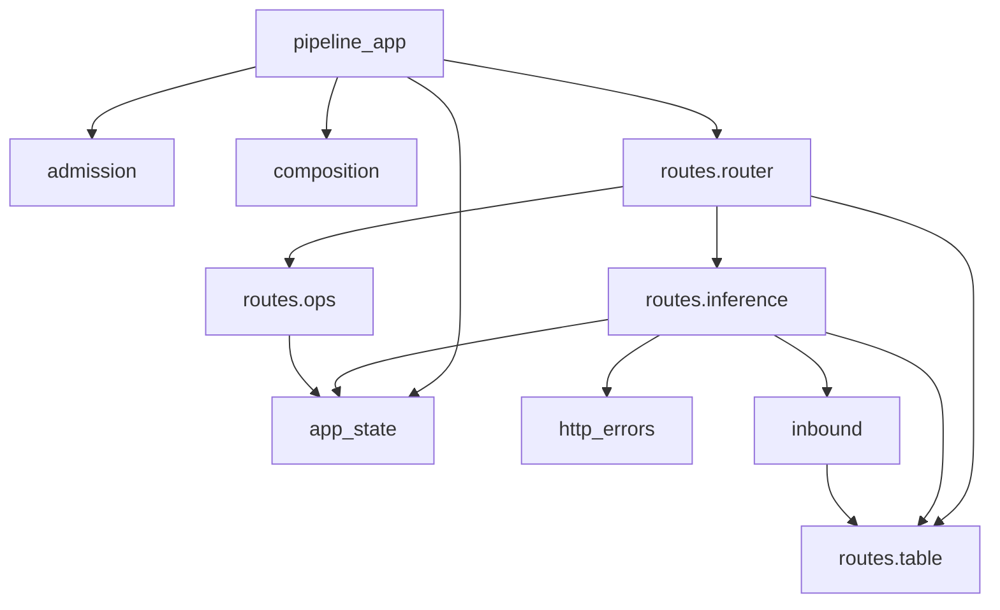

# `app/server/` 模块职责与依赖方向：结构分析

**日期**：2026-08-22 19:01。**性质**：只读分析，给候选不给结论。未修改仓库任何文件。

## 0. 基线与时效声明（先读这一节）

**代码基线在分析期间移动过两次，两次都不是我造成的。**

| 时刻 | HEAD | `src/app/server/` 状态 |
|---|---|---|
| 分析开始（约 18:35） | `ef4defb` | 13 个文件，含 `app_factory.py`，工作树对该目录干净 |
| 分析结束（19:01） | `a59800d` | 12 个文件；`app_factory.py` 已被同伴 **staged rename** 到 `src/.archived/app/server/app_factory.py` |

新增的两个提交（`78be0d4`、`a59800d`）**都没有触碰 `app/server/`**，已用 `git show --stat` 核过。唯一影响本文引用的是 `composition.py` 上一处未暂存的改动（`_warn_about_socks` 的日志措辞 + 一行注释），它让第 248 行之后的所有行号 **+1**。**本文所有行号已按 19:01 的工作树重新核过。**

同伴此刻正在执行的是 `.dev/docs/server-layout/decisions.md` 的 D-3 第 6 步：把整条旧链（76 个文件，含 `app/routes/`、`app/history/`、`app/hooks/`、`app/anthropic/`、`app/runtime.py`、`app/server/app_factory.py`）整体 rename 进 `src/.archived/`。**这是未提交的暂存状态，随时可能变**。第 3 节关于 `app_factory` 的结论因此带保质期，读到这份文档时请先 `git status --short src/` 复核。

**我的证据分两层**，请分别对待：

- **静态事实**（import 图、行号、grep 计数）——按 19:01 工作树核过，可用 `rg`／脚本复算。
- **一处实测**（S-4 的循环导入）——在 `/tmp` 的隔离副本上做的受控变异，带正样本对照，已删除副本，主树未动。

---

## 1. 依赖方向

### 1.1 `app/server/` 内部



**无循环依赖。** 用 AST 抽全 `src/app/**/*.py` 的 import 边、跑 Tarjan SCC 验证过：`app.server` 下没有任何 size > 1 的强连通分量。（归档前全仓有两个 SCC——`app.anthropic.client ↔ app.pipeline.executor` 与 `app.runtime ↔ app.upstream.bootstrap`——两个都只经 `app_factory` 可达，现已随旧链进 `.archived`。）

一处**父子来回**值得单独看，它不是循环但是 S-4 的根：`app.server.inbound`（父包模块）→ `app.server.routes.table`（子包），而 `app.server.routes.inference`（子包）→ `app.server.inbound`（父包）。`routes/router.py:3` 与 `routes/__init__.py:5` 都把「`routes/__init__.py` 必须保持无 import」写成了这个来回的代价。见 S-4。

### 1.2 `app/server/` 与外部

**方向是干净的，没有倒置。** 除 `cli` 与 `debug.models` 外，`src/app/` 下**没有任何模块 import `app.server`**：

| 方向 | 边 |
|---|---|
| 外 → server | `app.cli` → `server.composition`、`server.pipeline_app`；`app.debug.models` → `server.composition` |
| server → 外 | `composition` → `config.paths`／`config.schema`／`core.chain`／`model_provider.*`／`pipeline.{events,rate_limiting,request,request_headers,subscribers,translation_driver.registry}`／`upstream.{copilot,stream_cap}` |
| | `http_errors` → `model_provider`／`pipeline.{count_tokens,driver,exceptions,routing,translation_driver.*}` |
| | `routes.inference` → `core.chain`／`observability.*`（6 个模块）／`pipeline.*`（8 个模块）／`streaming.{deadline,idle_timeout}` |
| | `pipeline_app` → `core.chain`／`observability.{logging,tui}` |
| | `app_state`、`routes.table`、`inbound`、`routes.ops` → 各 1～2 个（`core.chain`／`pipeline.request`／`pipeline.request_headers`） |

`app.config`、`app.pipeline`、`app.model_provider`、`app.lifecycle`、`app.core`、`app.observability` **无一 import `app.server`**。README 记录的 S2（`lifecycle` 为拿 TLS 材料反向 import `app.server.tls`）已由 `928b355` 消掉，本次复核确认不复存在。

唯一一条**方向可议**的内部边是 `pipeline_app → composition`，见 S-7。

---

## 2. 职责边界

| 模块 | 行数 | 自称职责 | 实际职责 | 判断 |
|---|---|---|---|---|
| `__init__.py` | 8 | 「Inbound HTTP surface」的说明 + 禁止 re-export 的理由 | 同左，但**内容已过期** | 见 S-1 |
| `admission.py` | 57 | 并发准入闸门 | 同左，单一职责，无 config 依赖（`max_inflight` 由调用方注入） | 干净 |
| `app_state.py` | 29 | chain 在 ASGI app 上的地址与三种读法 | 同左 | 干净，`c01191f` 的收敛成立 |
| `http_errors.py` | 89 | 「maps the pipeline's **closed** exception set onto a status」 | 映射 10 个类型，其中只有 4 个在闭集里 | 见 S-3 |
| `inbound.py` | 53 | 「Inbound format parsing」 | body → `RequestContext`，外加把客户端 header 过滤成 `forwarded_client_headers`（`:34` 说明了理由，成立） | 干净 |
| `pipeline_app.py` | 86 | 「build it, mount the routes, run its lifespan」 | 同左 | 干净；`ef4defb` 从 1037 行收到 86 行是真的 |
| `composition.py` | 538 | 「Composition root for the new request path」 | 组装根 + httpx transport 构造库 + 两个 async 网络操作 | 见 §2.1 |
| `routes/table.py` | 45 | 路径 → wire format 的表 | 同左 | 干净 |
| `routes/router.py` | 31 | 装配一个 router | 同左 | 干净；其 docstring 的**理由**有偏差，见 S-4 |
| `routes/ops.py` | 62 | health／models／metrics | 同左 | 干净 |
| `routes/inference.py` | 642 | 派发 + 流字节记账 | `serve`／`_dispatch`（369 行）＋ 记账四件套（143 行） | 见 §2.2 |

**没有两个模块在做同一类事**（`c01191f` 已把唯一一处——`CHAIN_STATE_KEY` 两处声明——收进 `app_state`）。但有一处**同类事实分居两处且靠遗漏同步**：`admission.UNGATED_PATHS` 与 `routes/ops.py` 的路径清单，见 S-2。

### 2.1 `composition.py` 是不是「什么都往里放」

**不是「什么都往里放」，但确实装着三类不同的东西。** 按行区分（19:01 工作树）：

| 行 | 内容 | 行数 | 提到 `Chain` 吗 |
|---|---|---|---|
| 67-299 | `TransportOptions`、keepalive socket options、代理三层解析、`build_http_client`、SOCKS 警告、`_effective_proxies` | 233（43%） | **完全没有** |
| 301-328 | GitHub token 文件路径与 provider 链 | 28 | 没有 |
| 331-403 | `resolve_provider_base_urls`——**async，探 `/copilot_internal/user`，走网络** | 73 | 没有 |
| 406-443 | `build_copilot_provider` | 38 | 没有 |
| 446-510 | `build_chain` | 65 | 是 |
| 513-522 | `refresh_catalogs`——**async，对已建好的 chain 做网络刷新，什么都不建** | 10 | 是 |

**这一条不算新发现。** `.dev/docs/server-layout/README.md` §5.1 已经提出把它拆成 `composition/{__init__,http_client,providers,tokens}.py`，D-2（`decisions.md:44-46`）已裁决落点是「入口层」，并**明确把这块挂起等用户表态**（因为它连带要求把 416 行的 `cli.py` 变成 `cli/` 包）。所以现状是「已裁决未执行」，不是「没人注意到」。

我要补的只有一点：`refresh_catalogs` 与其余五段不同类——它接收一个**已建好**的 chain 并发起网络请求，不构造任何东西，唯一生产调用者是 `pipeline_app._lifespan`。README §5.1 把它留在 `composition/__init__.py` 未给理由。见 S-7。

### 2.2 `routes/inference.py` 的 642 行

**大部分是已登记的欠账，不是新怪味**，两块分别有各自的门：

- `_dispatch`（`:130-498`，369 行）——README §8 的**第 4 步「`_dispatch` 拆薄」，明确写了「不依赖任何命名裁决」，至今未做**。§4 的 S4 已经把论证从「违反 D-ARCH 边界 2」降级为内聚性（至少六个变化理由）。
- 记账四件套 `_StreamAccounting`／`_AccountedStreamingResponse`／`_counted_upstream`／`_tracked_delivery`（`:501-643`，143 行）——README §5.3 **门控在 STR-04 切片之后**，理由是它是 response body 的 close owner，压住它的三条在 `spec.md`（`:389`／`:424`／`:448`），而 `spec.md` 是 2026-08-19 授权明文不覆盖的那份。`inference.py:531` 的注释就地重述了这条。**这不是遗漏，是有裁决依据的推迟。**

`_dispatch` 内部我只找到一处不被上述两块覆盖的东西：`:197-224` 那 28 行从 `context.extras` 用字符串键读回 count_tokens 的观测字段。见 S-5。

---

## 3. `app_factory.py` 的地位（Q3）

**结论：是同类，而且比 `app.config.loading` 描述的更彻底——`loading.py` 说 legacy `AppSettings` 在 `src/` 里「除一处 re-export 外没有调用者」，`app_factory` 连那处 re-export 都没有了。**

它构建的 chain **没有任何入口点到达**。证据链（每条可复算）：

1. **唯一入口点**：`pyproject.toml:55` 的 `[project.scripts]` 只有 `ghc-api-proxy = "app.cli:main"`。
2. **`cli.py` 不碰它**：`src/app/cli.py:27-28` 只 import `app.server.composition`（`build_chain`／`build_http_client`／`resolve_provider_base_urls`）与 `app.server.pipeline_app`（`create_pipeline_app`）。`:147`／`:164`／`:187`／`:193` 是全部调用点。
3. **`src/` 内零导入者**：`rg -n "app_factory|create_app" src/` 只命中定义行（`app_factory.py:155`）与三处**散文提及**（`server/__init__.py:7`、`server/pipeline_app.py:5`、`observability/metrics.py:5`）。
4. **无字符串反射入口**：`rg` 扫 `*.toml *.cfg *.service *.sh *.yaml *.yml *.md`（排除 `.dev/`）找不到 `app.server.app_factory:create_app` 这类 ASGI factory 字符串，零命中。
5. **有活的守卫钉住这件事**：`tests/unit/test_module_boundaries.py:38` 断言 `"app.server.app_factory" not in reachable_from("app.server.pipeline_app")`，`:40` 再断言新链闭包里没有任何 `app.routes*`。该测试在**独立解释器**里跑探针（`:8` 解释了为什么不能用卸载 + 重导入）。
6. **只有测试在用**：13 个 `tests/int/*` 与 1 个 `tests/unit/observability/test_observability_phase6.py` import `create_app`。
7. **它是全仓两个循环依赖的唯一入口**：`app.anthropic.client ↔ app.pipeline.executor`、`app.runtime ↔ app.upstream.bootstrap`，两者都只经它可达。

**它为什么还在（截至 19:01：正在离开）**：

- **裁决层面**：`decisions.md:50-54` 的 D-3 裁决「**先接新链，如果有值得迁移的功能，主动迁移**」，顺序是先补功能再删旧链。`decisions.md:56-66` 列了四组 `api.md` 已追认、当前线上无人服务的端点（Azure、Gemini、History、`/api/status` + `/api/config`）**只存在于旧链**；且 `:66` 警告 `src/app/routes/management.py` 同时装着已追认的两个端点与「已裁决暂不支持」的两个 tokenization 端点，**该文件既不能整体搬也不能整体删**。
- **记忆层面**：项目记忆「不得擅自删除已实现的功能」——「暂不支持」是对外行为裁决，不是删代码授权。
- **实时层面**：同伴此刻（19:01，**未提交的暂存 rename**）正在把它连同整条旧链移进 `src/.archived/app/`。**这既不是删除也不是完成迁移**——`src/.archived/` 不在包路径下，所以那四组已追认端点会从「代码在但无人服务」变成「代码在归档区且无人服务」。这个动作与 D-3「先迁移后删」的顺序是什么关系，我判断不了，**建议主会话向同伴或用户确认**：D-3 是否已被一条更新的裁决改写，还是归档被当作「删除的可逆替代」而不触发 D-3 的前置条件。

**我不主张删除，也不主张阻止归档。** 这里只给证据。

---

## 4. `__init__.py` 的导出面（Q4）

**导出面是空的：零 import、零 `__all__`、零符号。** 所以：

- **没有任何导出被使用**（无可用）。
- **没有 re-export，因此不存在「同一个符号两个来源」**——这正是 `aba73fb` 之后刻意维持的状态，`__init__.py:5` 记了理由：曾经 re-export `create_app` 使得 import `app.server` 下任何东西都会拉进整条旧链，实测 175 个可达模块从两个入口看完全相同，「依赖图说这两条链是一条，它们不是，是包 init 造成的」。这条理由**今天仍然成立且有守卫**（`test_module_boundaries.py:38`）。

`routes/__init__.py`（6 行）同样零 import，理由写在 `router.py:3`。见 S-4——**那条理由本身有偏差**。

**但 `__init__.py` 的散文内容已过期**，见 S-1。另外，虽然 `__init__.py` 干净，`composition.py` 的 `__all__` 里有两个 re-export 制造了「同一符号两个来源」，见 S-6。

---

## 5. 命名与实际职责

| 处 | 名字承诺 | 实际 | 判定 |
|---|---|---|---|
| `composition.py` | 「Composition root」 | 43% 是 httpx transport 构造，两个 async 网络操作 | 已登记（README S1／§5.1），非新发现 |
| `refresh_catalogs` 在 `composition` | 组装 | 对已建好的 chain 发网络请求 | S-7 |
| `app_factory.py` | 泛化的「app factory」 | 只造旧链；且 `__init__.py:7` 把它与活着的 `pipeline_app` 并列推荐 | 随归档消失；S-1 会顺带修掉那句 |
| `routes/table.py` vs `routes/router.py` | 两个名字都读作「路由表」 | `table` 是**入站 wire format 表**（被 `inbound` 消费），`router` 是 **FastAPI 注册**（被 `pipeline_app` 消费） | **排除**：两份 docstring 各自把分工写清楚了（`table.py:1-4`、`router.py:14-17`），且消费者不同 |
| `admission.py` vs 配置键 `proactive_rate_limiter.max_inflight` | 模块叫准入，键叫主动限速 | 同一件事两个词 | **排除**：该键在用户亲笔的 `docs/.human-controlled/config.example.yaml` 里，不归 server 改 |
| `inbound.py` | 「Inbound format parsing」 | 还负责剥掉客户端凭据 | **排除**：`:34` 写了理由（「Headers are filtered here rather than at the send site so that nothing downstream ever holds the client's credentials」），理由成立 |
| `http_errors.py` | 避开已存在的 `app/errors.py` | 同左 | 干净，命名理由写在 `:3` |

---

## 6. 发现清单

严重度定义：**major** = 会让一类改动静默出错或让下一个读者被误导到错误的地方；**moderate** = 会让事实漂移或让一条已付过代价的判据失效，但失败可见；**minor** = 可读性／一致性，无失效场景。

### major（2 条）

#### S-1 `server/__init__.py:3` 断言 `app.server.routes` 不存在，而它三小时前刚被创建

**证据**：

```
git blame -L3,3 -- src/app/server/__init__.py   # 1f29d0a (2026-08-22)
git log --oneline --diff-filter=A -- src/app/server/routes/table.py   # ef4defb
```

`1f29d0a` 的提交题目就是 `docs: give the last bare citations a path, and stop asserting a module that is not here`——它当时是对的。`ef4defb`（同日、更晚）建了 `routes/`，**没有回头改这句**。现在这句读作：

> It calls the entry `app.server.routes`; **no such module exists here** — the real list is below — so that spelling is the document's, not this package's.

三处都错了：模块存在；「the real list is below」指的第 7 行清单里**没有 `routes`**，却列着正被归档的 `app_factory`；「that spelling is the document's, not this package's」的整个论证前提消失了。

**失效场景（不是假想）**：`.dev/docs/server-layout/README.md` §7 白纸黑字写着「**我正是读 `server/__init__.py` 的 docstring 才发现整件事的**」。这个包的导出面是空的，**它的 docstring 就是它唯一的对外接口**。一句反过来的断言会把下一个读者送到「追认文档和代码对不上」的错误结论上，而那个差距刚被 `ef4defb` 填平。

**顺带**：第 7 行的模块清单同时漏了 `app.server.app_state`（`c01191f` 新增）和 `app.server.routes.*`，多了 `app.server.app_factory`。

#### S-2 `UNGATED_PATHS` 与 ops 路由清单靠「不改」同步，而漏改的后果是静默的

**证据**：

- `src/app/server/admission.py:22`：`UNGATED_PATHS = frozenset({"/health", "/health/liveness", "/health/readiness", "/metrics"})`
- `src/app/server/routes/ops.py:18,24,25,60`：`/health/liveness`、`/health`、`/health/readiness`、`/metrics`（另有 `:43-45` 的三个 `/models` 变体**故意不在豁免里**）
- 无守卫：`tests/unit/server/test_admission.py:134` 把同样四条路径**硬编码**进 parametrize，从不读 `routes/ops.py`；`rg UNGATED_PATHS src tests` 只有这两个文件。

**失效场景**：往 `routes/ops.py` 加一个新的 supervisor 端点（例如 systemd 想要的 `/health/startup`），**什么都不会报错**——它只是默默落进闸门里。后果 `admission.py:19` 自己描述过，而且是**实测过的事故**：「with the gate over the whole app, one occupied slot made `/health` wait for the inference request ahead of it……precisely when systemd or a monitor asks whether the process is still alive, and precisely when a queued answer reads as 『dead』」。也就是说漏改会**重演一次已经付过代价的事故**，且只在 `max_inflight` 饱和时显现。

**反面论证（我认为它没推翻这条，但要写下来）**：两者**不是同一个事实**——`/models` 在 ops 里却故意被闸门管着（`admission.py:21` 给了理由：它是面向客户端、可能触达上游的调用）。所以不能简单地写成 `UNGATED_PATHS = ops 的所有路径`。真正的缺陷是**「新端点是否豁免」由遗漏决定，而不是由一次必须做出的选择决定**——这正是项目记忆「日志行上的缺席读不出来」的同一形状。

**候选修法（不主张，供裁决）**：让 `routes/ops.py` 自己声明豁免集（例如 `UNGATED = frozenset({...})` 挨着路由定义），由 `pipeline_app` 在装配时传给 `InFlightLimit`。这样 `admission` 仍然不 import `routes`（**保持基础设施不依赖策略的方向**），而新增一个 ops 端点时豁免与否成为一个必须在同一个文件里回答的问题。

### moderate（3 条）

#### S-3 `http_errors.py` 自称映射「closed exception set」，而它映射的 10 个类型里只有 4 个在闭集里

**证据**（类定义位置逐个核过）：

| 类型 | 基类 | 定义处 | 在 `PipelineError` 闭集内？ |
|---|---|---|---|
| `PipelineAbort` | `PipelineError` | `pipeline/exceptions.py:93` | ✅ |
| `UpstreamRateLimit` | `UpstreamError` | `pipeline/exceptions.py:46` | ✅ |
| `UpstreamTimeout` | `UpstreamError` | `pipeline/exceptions.py:42` | ✅ |
| `UpstreamRejected` | `PipelineError` | `pipeline/exceptions.py:59` | ✅ |
| `ProviderError` | `RuntimeError` | `model_provider/types.py:22` | ❌ |
| `CountTokensUnavailable` | `RuntimeError` | `pipeline/count_tokens.py:24` | ❌ |
| `RoutingError` | `RuntimeError` | `pipeline/routing.py:39` | ❌ |
| `TranslatorNotFound` | `RuntimeError` | `pipeline/translation_driver/registry.py:39` | ❌ |
| `TranslationRefused` | `Exception` | `pipeline/translation_driver/semantic.py:52` | ❌ |
| `CountTokensRequestError` | `ValueError` | `pipeline/driver.py:184` | ❌ |

六个「闭集外」的类型分居 3 个包的 6 个模块，`error_status`（`http_errors.py:56`）的兜底是 502。

**失效场景**：新增一个不继承已映射类型的拒绝类型 → 它静默地变成 502。而 `error_status:30` 的 docstring 自己写着这就是这个模块存在的理由：「Everything used to land on that 502 because the SDK's exceptions were outside the closed set」。**没有任何结构让新类型对 `http_errors` 可见**，也没有测试断言映射的完整性。

**顺带的方向问题**：`http_errors.py:10` 为一个 `ValueError` import 了 `app.pipeline.driver`（整条驱动）。`pipeline/exceptions.py:1-6` 的 docstring 自称是「the exception contract between subscribers and the driver……The closed set is the point」，也就是那个契约有一个指定的家，而 `CountTokensRequestError` 不在里面。`test_module_boundaries.py:57-64` 记录过一次真实故障：`ghc_client` 需要 pipeline 的异常名，import 它拉进 executor → `app.upstream` → `ghc_client` 自己，进程起不来。今天没人从 `ghc_client` 侧要 `CountTokensRequestError`；**如果哪天要了，就会撞进那个守卫**。

**我不确定的部分**：任何异常映射器都有「新类型不自动可见」的性质，把它做成注册表要付复杂度。所以这条的权重是「值得处理，但不阻塞」，而不是「必须现在改」。

#### S-4 `routes/__init__.py` 无 import 的**理由**比实际更强——实测循环只在一种 import 顺序下闭合

`router.py:3` 写：

> `app.server.inbound` imports the route table, and an `__init__` that reached back for the dispatcher would close a cycle through the package **the moment it did**.

**实测（`/tmp` 隔离副本，带正样本对照，副本已删，主树未动）**：

| 场景 | 结果 |
|---|---|
| 未改动的副本，import `app.server.pipeline_app` | **OK**（正样本对照：探针确实跑到了真代码） |
| 给 `routes/__init__.py` 加 `from app.server.routes.router import build_router`，import `app.server.pipeline_app` | **OK——循环没有闭合** |
| 同一变异，import `app.server.inbound` | **ImportError: cannot import name 'InboundRequestError' from partially initialized module 'app.server.inbound'** |

**结论**：`pipeline_app` 是生产入口，走它**不会**炸。会炸的是先 import `app.server.inbound` 的路径——今天有四个：`tests/int/recorded/record_cassette.py:27`、`tests/int/test_recorded_upstream.py:29`、`tests/unit/pipeline/test_client_request_headers.py:16`、`tests/unit/server/test_server_inbound.py:6`。

**失效场景**：有人给 `routes/__init__.py` 加上那个非常自然的 re-export，**起服务验证一切正常**，只有部分测试红。而 docstring 说的是「the moment it did」，会让人以为验证过服务就够了。这条不改代码也行，但**那句理由该改成它实测的样子**。

**根因是 §1.1 那个父子来回。** 候选修法（不主张，供裁决）：把 `inbound.py` 移进 `routes/`，来回消失，`routes/__init__.py` 也不必再受这条约束。`docs/.human-controlled/module-org.md` 只追认了包名树，`routes` 是 `server` 唯一追认的子包，把一个模块放进已追认的子包**不新增任何顶层或包名**。

#### S-5 边缘与 pipeline 之间靠 `context.extras` 的字符串键交接观测字段

**证据**：

- 生产者：`pipeline/driver.py:235,236,241,272,274,280,282`（`count_tokens_upstream_protocol`、`count_tokens_bytes_in`、`count_tokens_bytes_out`、`count_tokens_provider`、`count_tokens_attempts`、`count_tokens_reason`）
- 消费者：`routes/inference.py:204,208,212,215,219`——每个都是 `extras.get(...)` + `isinstance` 守卫，**类型不对就静默跳过**
- 全仓 `extras.get(` / `extras[` 共 21 处

**这个通道已经在漏了，两个可复算的例子**：

1. `count_tokens_attempts`（`driver.py:274`）——**生产侧唯一，消费侧只有一个测试**（`tests/unit/pipeline/subscribers/test_builtin_subscribers.py:265`），生产代码里没有任何读者。
2. `rate_limit_wait_s`（`pipeline/direct_driver/base.py:150`）——`rg` 全仓（含 tests、含 `.dev` 之外一切）**只有这一处**，写进去之后无人读。

**失效场景**：改一个键名 → 那个字段从完成行上静默消失。项目记忆已经记过这个形状：「日志行上的缺席读不出来——字段『有才打印』，于是没观测到和不报这项同形」。`inference.py:203` 的注释自己也在解释绝对不能让 count 行与「交付了但丢了 reply」的行长得一样。

**反面论证**：`extras` 是订阅者机制的开放槽位，收窄它有代价；且 count_tokens 那六个键都在同一个提交里写的，今天并没有漂。所以这是**倾向性判断，不是已发生的缺陷**——权重「值得登记，等下次动 count_tokens 时顺手收」。

### minor（2 条）

#### S-6 `composition.py` 的 `__all__` 里有两个 re-export 制造了第二来源

- `composition.py:38` import `build_request_headers`，`:533` 放进 `__all__`——**模块正文完全没有用它**（`rg build_request_headers src/app/server/composition.py` 只有这两行）。真正的 owner 是 `model_provider/ghc_client/headers.py:20`，真实消费者是 `ghc_client/client.py:58` 与 `upstream/copilot.py:58`，**没有任何人从 `composition` 取它**。
- `composition.py:527` 把 `Chain` 放进 `__all__`。`c170f0f` 刚把 `Chain` 记录搬进 `app/core/chain.py`，`decisions.md:43` 引用 `app/core/__init__.py` 自己的话作为搬迁论证：「一个被多个领域依赖的模块，不能住在其中任何一个里面」。从 `app.server.composition` 继续 vend 它，等于给这条论证留了一个可绕开的入口。今天**没有人从 composition import `Chain`**（已 grep 确认）。

**为什么 Ruff 不会报**：`__all__` 里的名字算「已使用」，`uv run ruff check src/app/server/composition.py` 现在全绿。所以这两处**永远不会有工具指出来**。

无失效场景，纯读者误导——所以是 minor。

#### S-7 `pipeline_app → composition` 这条边的方向可议，但代价实测很小

`pipeline_app.py:21` 只为 `refresh_catalogs` 而 import 组装根。方向上，ASGI app 模块依赖组装根，而真正的组装根调用者是 `cli.py`（`:147` 先 `build_chain`，`:164` 再 `create_pipeline_app(chain)`）。`refresh_catalogs(chain)`（`composition.py:513-522`）是一个对已建好 chain 的 10 行网络刷新循环，**什么都不构造**。

**我实测了这条边的重量，结果削弱了我自己的论点**：

| 入口 | `app.*` 闭包大小 |
|---|---|
| `app.server.pipeline_app` | 138 |
| `app.server.routes.router` | 126 |
| `app.core.chain` | 83 |
| `app.server.composition` | 106 |

`composition` 相对 `routes.router ∪ core.chain` **只额外贡献 8 个模块**（`app.upstream.{client,copilot,ghc_settings,stream_cap,urls}`、`app.upstream`、`app.model_provider.ghc_client.auth{,.providers}`）。README §S3 说的「37 个 pipeline 模块被反向拖进来」讲的是 `cli`／`debug` 那两个消费者，**不是这条边**。

所以**这条只是命名与方向的观察，不是重量的观察**。候选落点是 `app.core` 或 `model_provider`（`refresh_catalogs` 只碰 `chain.providers`），但 README §5.1 已经把它留在 composition 且未给理由——**建议下次动 D-2 第 0 步时一并回答，而不是现在单独动**。

---

## 7. 看着像怪味、读完排除的

| 处 | 为什么看着像 | 排除理由 |
|---|---|---|
| `routes/inference.py` 642 行 | 单文件过大 | 两块各有各的门：`_dispatch` 是 README §8 第 4 步的未做项（已登记、不依赖任何裁决）；记账四件套受 §5.3 门控在 STR-04 之后，压住它的三条在授权明文不覆盖的 `spec.md` 里。**不是没人注意到。** |
| `composition.py` 538 行、43% 是 transport | 组装根塞了一个 httpx 库 | README §S3／§5.1 已登记，D-2 已裁决落点，`decisions.md:46` 明确挂起等用户对 `cli/` 包化表态 |
| `_dispatch` 里 5 次 `trace.absorb_losses(context)` | 重复调用 | 每处都有注释说明为什么是不同时点（`:190`／`:223`／`:237`／`:251`／`:497`：请求半程 vs 响应半程 vs 失败时），理由成立 |
| `inference.py:412` 的 `if accounting.handed_over: return None` 守卫「今天不可能触发」 | 死代码 | 注释自己写了：「that is a property of control flow somewhere else, and the guard's whole value is surviving a change to it. **This project has already found guards stranded on a path nobody takes.**」——与项目记忆一致 |
| `_StreamAccounting._ending` 里 `failure is None` 那一项「无法构造出来」 | 恒真条件 | `:536` 写了：留着是为了让这道门和 `_ending()` 用同样的顺序问同样的问题，删了之后有人加一个 `break` 就会静默重开缺口 |
| `admission.py` 在 ASGI 层而不是 `accept()` 层 | 位置奇怪 | `:7` 给了判据：两个入口点（`start` 自己持 listener、`--fd` 交给 uvicorn）只有 app 是共同的；且 keep-alive 下要数的是请求不是连接 |
| `app_state.py` 只有 29 行、三个函数 | 太薄 | `:5` 写了理由：三个调用者都要它，重了会被拖进三处。`c01191f` 的提交信息给了它要防的具体故障 |
| `routes/table.py` 模块级 for 循环建 `_BY_PATH` | 模块级副作用 | 纯粹是把常量表展开，无 I/O、无外部状态 |
| `app/server` 无循环依赖 | —— | AST + Tarjan 验证，确认无 |

---

## 8. 能力边界

- **可达性结论基于静态 import 闭包**，看不见动态 import、字符串反射、第三方插件入口。已对 `*.toml/cfg/service/sh/yaml/yml/md` 做过字符串扫描（零命中），但这不覆盖运行时拼接。
- **未跑测试套件**。工作树里有同伴在途的 `src/app/pipeline/delivery/*` 改动与一次 76 文件的暂存 rename，此刻跑出来的红绿归因不到我要分析的对象上。本文所有判据都是静态的或在 `/tmp` 隔离副本上做的。
- **S-4 是唯一一条实测结论**，做过正样本对照（未变异副本能正常 import，证明探针跑到了真代码）。其余全部是 grep／AST／行号，可复算。
- **第 3 节带保质期**：同伴的归档动作在我写这份文档时仍是未提交的暂存状态。
- **未读 `spec.md`／`architecture.md` 全文**，§2.2 关于 STR-04 门控的转述来自 `.dev/docs/server-layout/README.md` §5.3 与 `inference.py:531` 的就地注释，未回到原文核行号。

---

## 9. 给主会话的建议

1. **S-1 可以立刻改**，不依赖任何裁决，只是一段散文，而它是这个包唯一的对外接口。
2. **S-2 建议提到用户面前**：它要么维持现状（接受「靠遗漏同步」），要么按 §S-2 的候选修法把豁免声明挪到 ops 旁边。这不是我能替用户裁的。
3. **S-3／S-5 建议登记进 `.dev/docs/server-layout/` 或 `anthropic-responses-bridge/implementation.md` 的「结构怪味登记」**，等下次动到对应切片时处理，不单独开工。
4. **S-4 的 docstring 修正建议与 S-1 一起做**，都是「理由写得比事实强」这一类。
5. **需要确认的阻塞点**：同伴此刻的 `src/.archived/` 归档动作与 D-3「先迁移后删」的关系。D-3 明确说四组已追认端点要「主动迁移」再删，而归档把它们移出包路径且没有迁移。这可能是一条我没看到的新裁决，也可能是顺序被跳过了。**我没有权限也没有依据替它做判断。**
