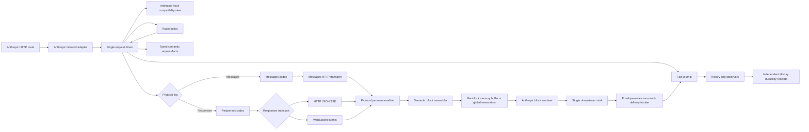

# Anthropic Messages → OpenAI Responses bridge 目标架构

> 状态：**已获用户接受（2026-08-19）。** `D-ARCH = B`（typed semantic kernel＋single driver＋protocol／transport legs），`D-MIGRATION = M1`（一次建立完整 B 骨架）。注意 `D-MIGRATION` 的裁决与本文推荐（M2）**不同**，以用户裁决为准。
>
> 用户在裁决时附加了一条授权范围说明，逐条实施时以它为准：本轮属于「在用户授权下、依用户提议实现补全」，并非所有细节都是用户已逐项知悉的实现；因此实现方可全面推进 B，**若将来发现与用户文档不一致，再讨论与修复，而不是停下来等裁决**。这条授权覆盖实现细节，不覆盖 `spec.md` 的可观察行为合同，也不覆盖 `docs/.human-controlled/`。
>
> 裁决前的旧状态记录（保留以便追溯）：本版裁决矩阵曾于 260807 经 `docs/tmp/260807-review-architecture-decision-matrix.md` 独立终审为 0 blocker、0 major，当时唯一门是用户阅读后分别裁决 `D-ARCH` 与 `D-MIGRATION`；该门已于 2026-08-19 关闭。
>
> 历史设计基线：`/home/xp/src/ghc-api-proxy-py`，`main HEAD ed77c9d191df81c451c25161420515cca52ce6a4`。下文“生产事实”描述提案形成时的代码接缝，不是 current 状态；current 实现状态见 [implementation.md](implementation.md)。
>
> 权威边界：`spec.md` 是唯一行为 oracle。完整 block、Anthropic SSE、首 block 前零 success headers／body、单一串行下游写入 owner，以及无已证明 resume contract 时的 post-commit partial failure 都是已决可观察行为；本文只说明架构如何承载，不重新投票。

## 目录与阅读要求

本文必须完整阅读；本目录只用于定位，不能替代正文，也不能只读推荐与裁决矩阵后直接接受。

- [提案结论与裁决边界](#提案结论与裁决边界)
- [历史事实与不可破坏边界](#历史事实与不可破坏边界)
- [候选架构比较](#候选架构比较)
- [推荐目标架构](#推荐目标架构)
- [共享内部事实模型](#共享内部事实模型)
- [Route policy 与 Responses transport](#route-policy-与-responses-transport)
- [Converter 边界](#converter-边界)
- [Block assembler、buffer 与 sink](#block-assemblerbuffer-与-sink)
- [Retry 与 delivery frontier](#retry-与-delivery-frontier)
- [History 与 observer](#history-与-observer)
- [非流式路径](#非流式路径)
- [可证伪的架构判据](#可证伪的架构判据)
- [结构怪味与目标处置](#结构怪味与目标处置)
- [已决 Spec 输入与历史 ADR 承载记录](#已决-spec-输入与历史-adr-承载记录非待裁决)
- [唯一用户裁决矩阵](#唯一用户裁决矩阵)
- [评审问题处置表](#评审问题处置表)
- [容量政策的当前边界](#容量政策的当前边界)
- [最终推荐](#最终推荐)

## 提案结论与裁决边界

**紧邻术语说明：** `typed semantic kernel` 是按类型表达请求、路由、转换、交付和终态事实的内部模型，不是另一套 wire 协议；`protocol leg` 是 Messages 或 Responses 语义分支，`transport leg` 是 HTTP 或 WebSocket 物理交换方式；`semantic block assembler` 只在一个完整 Anthropic content block 组装完成后产出结果；`downstream sink` 是唯一向客户端写响应的组件；`delayed response-start owner` 在首个完整 block 或确定终态前暂缓成功响应头；`delivery frontier` 记录哪些响应头、起始事件、完整 blocks 和终态已被写入层接受或处于结果不确定状态。

**本文推荐用户在完整阅读后为 `D-ARCH` 选择方案 B：“typed semantic kernel＋单一 request driver＋可插拔 protocol/transport legs”。该推荐不是接受记录。** Anthropic route 继续只有一个请求生命周期 owner，但内部不再以 Anthropic wire `dict` 作为所有策略、转换器和 transport 的共享状态。入站 Anthropic 语义先进入 typed semantic model；路由策略按“明确 override 优先，否则双端点默认 Messages”选择 protocol leg；每次 attempt 在 `PRE_SEND` 后由纯 converter 生成目标 wire；Responses HTTP SSE 或 WebSocket 只负责物理交换；返回数据依次经过 parser、semantic block assembler、request-owned memory buffer、commit sequencer 和唯一 downstream sink。Delayed response-start owner 在首个完整 block 或确定 terminal 前保留 HTTP response start；只有 sink 对 HTTP headers、`message_start`、完整 block batch 或 terminal 的对应写入给出 accepted／uncertain outcome 后，delivery frontier 才能单调前移。

该方案比“继续以 Anthropic payload 为 canonical、只在发送前后挂 Responses adapter”多一层 typed semantic kernel，但长期消除了以下结构风险：wire 字段成为隐式跨策略协议、流式与非流式 converter 漂移、Responses HTTP 与 WebSocket 各自复制生命周期、converter 同时承担 delivery policy，以及 History 从原始 transport bytes 反推领域事实。

本文还推荐用户为 `D-MIGRATION` 选择“分阶段建立 B，并以受约束的 A 形 adapter 过渡”，而不是要求首个切片一次形成全部 B 模块。过渡只改变落地节奏，不允许形成第二个 lifecycle owner、第二套 converter 语义或永久 wire-shaped canonical state；正式 bridge route 启用前必须通过本文列出的前置门。该推荐同样不是接受记录。

## 历史事实与不可破坏边界

### 历史设计基线下的生产事实

- Anthropic route 已把请求交给 `client.execute()`，当前流式返回仍是 `with_idle_timeout()` 后的原始 upstream bytes passthrough，见 `src/app/routes/anthropic.py:82-120`。目标架构必须保留 route 薄层，但替换 raw-byte downstream 接线。
- `execute_anthropic_pipeline()` 已是 approval、hooks、rate limiter、attempt、retry 和 History 的主要生命周期 owner，见 `src/app/pipeline/executor.py:121-280`。目标不是再造一条 Responses pipeline，而是把该 owner 泛化为协议中立 driver。
- `RequestContext` 已集中 request state、attempts、hook records 和 error，但尚无 route、conversion、delivery 与 commit facts，见 `src/app/pipeline/context.py:34-74`。
- 当前 retry contract 是 `should_retry + payload dict`，策略与 driver 共享 wire-shaped mutable state，见 `src/app/pipeline/strategies/__init__.py:11-60`。它不足以区分已成立 observation、待执行 action 与 action 完成后才成立的 effect。
- 同一 upstream target 已具备 `send_anthropic()` 与 `send_responses()`，见 `src/app/upstream/base.py:7-34`；SDK 自动 retry 已关闭，因此 application driver 可以继续作为唯一 retry owner。
- 模型目录已经暴露 `vendor`、`supported_endpoints` 与 capabilities，见 `src/app/models/common.py:32-40`，但当前 `ModelResolver` 只解析 model id，不作 endpoint route decision。
- 原生 Responses HTTP facade 只解析 Responses request 并调用 `send_responses()`；它不拥有 Anthropic hooks、retry 或 block delivery，见 `src/app/openai/client.py:31-62`。它应复用 transport/converter primitives，但不能成为 Anthropic bridge 的 orchestration owner。
- Responses WebSocket 当前是独立 client/route 生命周期，见 `src/app/openai/responses_ws.py:17-38` 与 `src/app/routes/responses_ws.py:22-62`。目标 bridge 不应从 Anthropic route 跳进该 route，而应把 WebSocket 收敛为 `ResponsesTransport` 的一个物理实现。
- 当前 `parse_sse_json()` 只切分 SSE JSON，见 `src/app/streaming/openai_sse.py:6-19`；`collect_with_limit()` 只收集整条 byte stream，见 `src/app/streaming/buffered_retry.py:8-18`。二者都不是 semantic block assembler 或 block-level delivery policy。
- `HistoryConsumer` 当前以同一个 `RequestContext.id` 创建与 finalize entry，见 `src/app/history/consumer.py:9-52`。目标必须保留单 entry、单 finalizer，不为 Responses leg 另建 protocol history。
- 历史基线 `ed77c9d191df81c451c25161420515cca52ce6a4` 的 `responses_reasoning_to_anthropic()` 曾把多个 Responses reasoning items 聚合为至多一个 thinking block，只保留最后一个非空 `encrypted_content`，并丢弃 encrypted-only item。这是设计反例，不是 current 实现断言；current 状态见 [implementation.md](implementation.md)。Carrier codec 与逐 block reverse consumer 可以保留，有损 forward aggregation 不得进入目标 bridge normalizer。

### 已决不变量

- **一个入站请求只有一个 driver、一个 request id、一个 attempt 序列和一个 History entry。** Protocol leg 或物理 transport 切换不创建第二套生命周期。
- **上游读取可以增量进行，下游提交必须以完整 Anthropic semantic content block 为最小业务单元。** SSE 仍可作为兼容 framing envelope，但不得把未完成 block 的 delta 提前写出。
- **buffer pressure 不得退化为 live forwarding。** Block buffer 只使用内存，并由普通全局 reservation、有限队列与 upstream/downstream backpressure 控制；16 MiB 不是特殊边界，不存在按单个 block 大小触发的专门状态、spill 或阈值分支。全局 reservation 暂不可得时停止继续读取 upstream；若实际全局内存耗尽，当前最小止血是拒绝新的 bridge admission，不设计落盘。若真实运行证据表明还需 victim selection、额外终止政策或其他全面容量设计，必须先提交用户裁决。
- **retry 与 commit 共用同一份 frontier 真相。** Frontier 前可安全丢弃 attempt-local draft 并重试；frontier 后不得透明重放整条 response。
- **converter 不拥有网络重发、sleep、budget、History finalize 或 downstream write。** 它只作协议语义转换并产生具名事实或 typed error。
- **History 和 observer 消费事实，不重新解析 raw Responses events 来猜 route、usage、commit 或 failure state。**

## 候选架构比较

### 方案 A：Anthropic canonical pipeline＋Responses adapter

保留 Anthropic prepared payload 作为 pipeline canonical form。每次 `PRE_SEND` 后将 Anthropic payload 转为 Responses wire；返回侧把 Responses JSON/SSE 转成 Anthropic response/events，再送 block buffer。现有 retry strategy 继续修改 Anthropic payload。

**可行性与优点：**

- 与当前 `execute_anthropic_pipeline()` 和 Anthropic hooks 最接近，接线面较小。
- Approval、sanitize、poisoned-thinking retry 与 token calibration 可以较直接保留。
- 对仅有 Anthropic 入站的 bridge 来说，协议转换路径短且容易形成首个正确闭环。

**长期代价：**

- Anthropic wire shape 会继续充当跨策略、跨 attempt 的内部事实模型；新增其他入站协议时要么绕经 Anthropic，要么再复制 pipeline。
- Retry strategy、route policy 与 converter 容易继续通过 `dict` 形状隐式耦合，字段所有者、reset 与 fork 语义无法由类型表达。
- 流式和非流式转换很容易分别维护 Anthropic bytes 与 Responses events，最终形成两份语义规则。
- Driver 若要观察 conversion loss、reasoning identity、tool pairing 或 block frontier，只能理解越来越多的协议字段。

### 方案 B：typed semantic kernel＋单一 driver＋protocol/transport legs

Anthropic wire 只存在于入站/出站 adapter 和现有 hook compatibility view。Pipeline 内部使用 typed semantic request、response block、usage、error、route 与 delivery facts。Messages 和 Responses 是 protocol legs；Responses HTTP SSE 与 WebSocket 是同一 leg 下的 transport implementations。Driver 解释策略 action、执行 attempt、推进 frontier 并发布 lifecycle facts。

**可行性与优点：**

- 策略作领域判断，driver 作流程控制；二者共享完整 typed facts，而不是互相隐藏数据或共享无类型 bag。
- 请求转换、非流式响应转换和流式 assembly 可复用同一 semantic block constructors、tool/reasoning/usage mappings 与 loss policy。
- Protocol leg 与 physical transport 正交，Responses HTTP/WS 不再复制 approval、retry、History 与 finalize。
- Block buffer、sink 和 History 都消费协议中立的 completed block/commit facts，未来扩展其他 upstream 不改变 delivery contract。
- Canonical model 可以显式携带 opaque provider extensions、reasoning identity 和 conversion diagnostics，避免静默丢字段。

**成本与风险：**

- 必须严肃定义 semantic schema；过度抽象成“万能 message dict”会退化为换名后的公共 bag。
- 现有 Anthropic `PRE_SEND` hook 与 poisoned-thinking strategy 需要 compatibility projection，且 projection 必须无损保留受支持扩展字段。
- 如果 semantic kernel 一次覆盖过多协议而缺少真实 fixture oracle，容易得到看似统一、实际最低公分母化的模型。

### 方案 C：Anthropic route 调用现有 OpenAI/Responses route pipeline

该方案技术上可以通过 route-to-route 或 facade-to-facade 复用快速接通，但**不采用**。

不采用理由：它会产生两个 approval/history/finalize owner，使 attempt 数与真实 upstream 请求失去一一对应；Anthropic hooks 会看到错误协议边界；block frontier 无法同时约束内外两条 pipeline；取消和 response close 的所有权也不唯一。现有原生 Responses route 可以共享 primitives，不能作为 bridge orchestration owner。

### 比较结论

| 维度 | 方案 A | 方案 B | 方案 C |
|---|---|---|---|
| 单一生命周期 owner | 是 | 是 | 否 |
| Typed 共享事实 | 部分，仍以 Anthropic wire 为主 | 是 | 否，跨 pipeline 只能靠 wire 传递 |
| HTTP/WS transport 收敛 | 可实现 | 自然形成 | 否 |
| Converter 语义单源 | 较难 | 是 | 否 |
| Block delivery 可独立验证 | 是 | 是，边界更清晰 | 较难 |
| 多协议长期演进 | 需继续加 adapter | 最佳 | 持续复制生命周期 |
| 推荐 | 可作为迁移兼容形态 | **长期目标** | 不采用 |

**推荐方案 B。** 方案 A 不删除，保留为向方案 B 迁移时的兼容形态：在 semantic kernel 尚未覆盖某个 Anthropic extension 前，bridge 可以明确拒绝或走 direct Messages leg，但不得静默降级语义，也不得因此另建 pipeline。

## 推荐目标架构



### 单一 driver 的职责

Driver 拥有以下流程控制，任何 strategy、converter、transport 或 observer 都不得自行执行这些动作：

- request、attempt、candidate、transport exchange 与 cancellation scope 的生命周期。
- Approval 的唯一等待点，以及批准后 payload 的重新验证与重新 prepare。
- Route action 的接受、retry budget、rate limiter、timeout 与 backoff；未来 continuation 只有在独立 ADR 接受后才增加自己的 budget。
- Transport 的打开、关闭、切换和 response cleanup。
- Parser、assembler、buffer、renderer、sink 的调用顺序与背压传播。
- Commit frontier 的推进、post-commit failure 分类和唯一 finalize。
- Request-local facts 到 History、hooks、logs、metrics 和 tracing 的投影时点。History writer 在 request FINALIZE 后独立发布的 durability receipt 不由 driver 代发，也不回写已冻结的 request journal。

Driver **可以读取全部领域 facts**，但不能根据 raw error text 或 payload shape 重新推导 strategy 已作出的领域决定。例如 poisoned-thinking strategy 负责判断该错误是否适用及产生移除 thinking 后的 next semantic request；driver 只检查 retry budget/frontier/cancellation gate 并执行新 attempt。

### 唯一策略 outcome 契约

所有 route、retry、recovery policy 使用同一个 discriminated union，不再返回可产生非法组合的布尔字段：

```python
PolicyOutcome = (
    DeclineToNextPolicy(observations)
    | ContinueFlow(state, observations)
    | RequestAction(action, next_state, observations, proposed_effects)
    | Abort(error, observations)
)

Action = (
    SelectProtocolLeg(leg, reason)
    | SelectPhysicalTransport(transport, reason)
    | RetryAttempt(reason)
    | FailDelivery(reason)
)
```

- `observations` 是 policy 正常返回时已经成立的事实，例如“模型广告 `/responses`”“上游拒绝 thinking”“当前 frontier 已提交 block”。即使 driver 因预算拒绝 action，这些事实仍发布。
- `next_state` 只有在 action 被接受后才替换当前 state。Retry 被拒绝时，strategy 生成的 next request 不能泄漏到后续流程。
- `proposed_effects` 不是已发生事实。当前只有 driver 真正打开新 attempt 或切换 transport 后，才发布对应 accepted／completed effect；未来 continuation 若经独立 ADR 加入，也必须遵守同一真值边界。
- Policy chain 采用显式 ordered chain。`DeclineToNextPolicy` 才允许同轮交给下一 policy；`Abort` 不得被调用方偷换成 fallthrough。
- Commit 不是 strategy action。Assembler 产生 `CompletedBlock` 后，driver 按已决 delivery invariant 调用 buffer/renderer/sink；strategy 无权跳过 buffer 或要求 live write。
- 基础版本不预留无合同的 `ContinueSuffix` action 或 dedicated continuation port。将来只有在 resume identity、dedup、tool boundary、budget 与可验收行为由独立 ADR 定稿后，才扩展该 union；当前保留 typed action 可扩展性即可。

## 共享内部事实模型

共享事实不是一个任意可写的 `context: dict`，而是按 owner、生命周期和真值时点分组的 typed records。History、observer、strategy 和 driver 可以读取公共 facts；只有声明的 owner 能修改对应组。

### 核心 records

```python
RequestFacts(
    request_id,
    inbound_protocol,
    original_model,
    resolved_model,
    original_anthropic_request,
    approved_semantic_request,
)

RouteFacts(
    protocol_leg,
    physical_transport,
    catalog_capabilities,
    route_reason,
    decision_source,
)

AttemptFacts(
    attempt_id,
    attempt_number,
    semantic_request,
    rendered_wire_digest,
    protocol_leg,
    physical_transport,
    started_at,
    ended_at,
    outcome,
)

ConversionFacts(
    source_protocol,
    target_protocol,
    preserved_extensions,
    explicit_losses,
    warnings,
)

DeliveryFacts(
    headers_state,
    message_start_state,
    assembled_blocks,
    committed_blocks,
    open_block,
    committed_digests,
    terminal_state,
    sink_status,
)

TerminalFacts(
    upstream_terminal,
    normalized_usage,
    stop_reason,
    client_abort,
    final_error,
)

HistoryProjectionFacts(
    projection_id,
    handoff_status,
    handoff_reason,
)

HistoryDurabilityReceipt(
    projection_id,
    outcome,
    persisted_at,
    failure,
    reservation_released,
)
```

`HistoryProjectionFacts` 属于 request-local lifecycle facts；`HistoryDurabilityReceipt` 属于 History writer 自己的 persistence receipt event stream。两者只以 `projection_id` 关联，后者不是 `TerminalFacts` 的延迟更新，也不得追加到 FINALIZE 后冻结的 request journal。

### 所有权与生命周期

| Facts | Owner | 生命周期 | 更新语义 | Retry/fork/reset | 可见时点 |
|---|---|---|---|---|---|
| `RequestFacts` | inbound adapter＋driver | request-stable | approval 前 replace，批准后冻结 | 所有 attempt 共享；不得由 transport 修改 | request validated／approval accepted 后 |
| `RouteFacts` | route policy 提议，driver 发布 effect | attempt-scoped decision | 每次 route action replace；reason append journal | transport fallback 新建 attempt fact，不覆写旧 attempt | route action accepted 后 |
| `AttemptFacts` | driver | per-attempt | append-only summary，进行中字段由 driver 封口 | retry 新建，不复用旧 parser/assembler state | attempt start 后逐步可见，结束后冻结 |
| `ConversionFacts` | converter | per-conversion | append warnings/losses；不可由 driver重解释 | 每个 attempt 独立；retry 重新转换 | conversion 正常完成或 typed failure 时 |
| assembler draft | assembler | per-attempt、per-open-block | 顺序追加 parts，单 owner 可变 | retry/transport re-exchange 必须丢弃未提交 draft | 仅 assembler/driver 可见，不直接投影为 committed |
| `DeliveryFacts` | delayed response-start owner＋driver＋sink acknowledgement | request-scoped | headers、message start、连续 block prefix 与 terminal 状态只单调前移，digest append-only | retry 不回退；任一外部 envelope 已提交后禁止透明 full replay | 对应 sink 操作返回 accepted 后发布 committed effect；write outcome 不确定时发布 uncertain |
| `TerminalFacts` | parser/normalizer 提议，driver finalize | request-scoped | 各字段 single-assignment，final error 最终冻结 | retry attempt terminal 不等于 request terminal | 对应真值成立后；request terminal 仅 finalize 时 |
| `HistoryProjectionFacts` | driver | request-scoped | projection handoff 只从 pending 进入 accepted 或 rejected；FINALIZE 后冻结 | retry 不新建 History entry；projection id 全 request 唯一 | queue 接受或明确拒绝时 |
| `HistoryDurabilityReceipt` | History writer | per-projection、request-external | durable 或 failed 单次终结，reservation release 恰好一次 | 不参与 retry，不改变 request terminal | driver 发布 `request.finalized` 后，由 writer 的独立 receipt stream 发布 |

### 隔离规则

- 每个 attempt 获得新的 parser、normalizer、assembler 和 incomplete-block buffer。禁止在 retry 时复用旧 `output_index → block index` map、terminal flags 或 partial tool arguments。
- Request-level commit frontier、History id、approval result 和 original payload 在 attempts 间共享，但只读或单调更新。
- 若未来支持 hedge/candidate fan-out，每个 candidate 必须拥有独立 assembler/buffer；只有 driver 选中的 winner 可向唯一 sink 提交。不同 candidate 不得共享 mutable block map。
- Opaque provider extension 使用具名、namespaced extension bag，并记录 producer 与 round-trip policy；禁止把完整 raw response 当作后续策略需要自行解析的事实来源。

## Route policy 与 Responses transport

### Protocol leg 与 physical transport 分离

`/v1/messages`、`/responses` 是 protocol legs；HTTP SSE、HTTP JSON 与 WebSocket 是 physical transports。模型广告 `ws:/responses` 可以证明 WebSocket transport capability，但不能把 protocol route decision 与 transport choice 合并成一个字符串分支。

推荐 route policy 的输入是 resolved model、`ModelInfo.vendor`、`supported_endpoints`、显式 route override 和配置事实；输出是具名 `SelectProtocolLeg` action。已决默认优先级是：显式且通过 capability gate 的 override 优先；无 override 时，只支持 Messages 则选 Messages，只支持 Responses 则选 Responses，同时明确支持两者时选 Messages；其他 leg 仅在独立规格定义其语义与 loss policy 后加入，不在本 bridge 中暗中回退。Physical transport availability 只能在选定 protocol leg 内选择 HTTP／WebSocket，不得反向改变“双端点默认 Messages”。

`supported_endpoints` 缺失、model catalog miss 或广告互相矛盾时，必须遵守正式 Spec 已冻结的 fail-closed 行为：自动路由只依据明确 capability，unknown／missing capability 在网络请求前返回可审计的 route／capability error，不得把“未知”解释成“全部支持”，route override 也不得伪造 capability。该行为是目标架构的输入约束，不是本文待用户重裁的架构选项；任何 legacy permissive policy 都会改变 Spec，不能通过 `is_supported()` 默认值或本文 ADR 草案暗中引入。

### Responses transport port

Responses protocol leg 只依赖统一 port：

```python
class ResponsesTransport(Protocol):
    def exchange(
        self,
        request: ResponsesWireRequest,
        *,
        cancel_scope: CancellationScope,
    ) -> AsyncContextManager[UpstreamExchange]: ...

class UpstreamExchange(Protocol):
    body: JsonBody | AsyncIterator[ResponsesEvent]
    metadata: ExchangeMetadata

    async def cancel(self, cause: CancelCause) -> CancelOutcome: ...
    async def aclose(self) -> CloseOutcome: ...
```

Driver 必须以 `async with transport.exchange(...) as exchange` 使用 port。Exchange cleanup 采用 session-liveness 候选 `f27a8c04cd3470bd50d7194a30371ca5404f727e` 经 `docs/tmp/260806-review-code-liveness-r3.md` 独立复评验证的模式；这是目标合同的实证来源，不表示该候选已经进入当前 main。首次进入 close 路径时创建唯一 cleanup task，由它顺序 settle producer／active pull 并关闭底层 HTTP response、WebSocket 或 iterator；调用方只通过 `asyncio.shield()` 或等价不向内传播 cancellation 的机制观察该 task。cleanup 中再次到达的 cancellation 必须被记住，但调用方要在循环中继续观察同一 task，直到底层资源进入 terminal close state，再恢复应向外传播的 cancellation 或异常。不得以一次普通 `await aclose()` 让第二次 cancellation 截断 cleanup，也不得为每次取消创建新的 cleanup task。

退出原因按机械优先级裁决：进入 cleanup 前已有的 primary exception／cancellation 保持最终异常；cleanup 期间首次出现的 cancellation 在没有既有 primary 时成为 primary；secondary close failure 必须形成 typed close fact并被 metrics／journal 观察。存在 primary 时，最终仍传播 primary，并把 close failure 作为显式 `__cause__`；不存在 primary 时，close failure 才成为最终异常。`cancel()` 与 `aclose()` 都是幂等操作：第一次调用启动或观察同一个 cleanup task，后续调用返回同一个 typed outcome，不重复关闭底层资源。`CloseOutcome` 至少区分 clean、cancelled、already-closed 与 close-failed；`CancelOutcome` 至少说明是否首次发出取消、来源及最终 close 是否仍待完成。

- HTTP non-stream 返回 `JsonExchange`；HTTP SSE 与 WebSocket 返回统一 typed Responses event iterator。
- HTTP SSE parser 与 WebSocket frame decoder 只负责 framing、schema validation 和 transport metadata，不做 Anthropic block rendering。
- WebSocket upgrade failure、network cut 或 HTTP fallback 不能在 transport 内部静默重发。Transport 返回 typed failure；policy 提议新 action；driver 新建可见 attempt 后执行。
- `stream=false` 的 Anthropic 请求走 Responses JSON conversion；`stream=true` 可使用 HTTP SSE 或 WebSocket upstream，但 downstream 仍遵守 block-level buffering。上游 transport 的增量能力不等于下游 live 产品合同。
- 每个 exchange 有唯一 close owner。Driver 在 success、retry、parse error、buffer failure、client cancel 与 shutdown 路径都退出 async context；converter 和 observer 不关闭 transport。即使已经观察到 protocol terminal，仍必须完成 context exit，因为 terminal event 不等于物理连接已释放。
- Responses HTTP 与 WebSocket 必须共享 request converter、event normalizer、assembler、error normalization 和 usage mapping；差异仅留在 framing 与连接管理。

## Converter 边界

### 三段式边界

Converter 被拆成三个职责清晰的纯语义组件：

- `AnthropicInboundAdapter`：Anthropic request wire → `SemanticRequest`，保留 block 顺序、tool pairing、reasoning identity、cache/context/provider extensions 和原始客户端模型事实。
- `ResponsesRequestCodec`：`SemanticRequest` → validated Responses wire，并返回 `ConversionFacts`。它在每次 attempt 的 `PRE_SEND` compatibility hook 之后运行，不能只在 retry loop 外运行一次。
- `ResponsesResponseNormalizer`：Responses JSON/events → semantic response items、usage、terminal 或 typed error。非流式 converter 与流式 assembler必须调用相同 block constructors 和 field mapping，不分别实现 text/tool/reasoning 规则。

`AnthropicOutboundRenderer` 是独立末端 adapter：semantic response → Anthropic non-stream JSON 或完整 block SSE batch。它不决定何时 commit；只有 driver 能把 renderer 产物交给 sink。

### Hook compatibility

现有 Anthropic hooks 是公共行为，不能为了内部 canonical model 而静默改变：

- `PRE_SANITIZE`、`POST_SANITIZE`、approval payload 和 `PRE_SEND` 继续看 Anthropic-shaped view。
- 批准后的 `SemanticRequest` 是 attempt state 的唯一真相。运行 legacy `PRE_SEND` 时，compatibility adapter 从 semantic state 无损投影 Anthropic view，hook 返回后重新 decode 成新的 attempt-local semantic request。
- Retry strategy 产生 semantic `next_state`。下一 attempt 的 hook view 必须反映该修改；driver 不同时维护一个“已改 semantic request”和一个“未改 Anthropic payload”。
- 无法通过 compatibility projection 无损 round-trip 的字段必须产生 typed conversion error 或显式 loss observation，禁止静默删除。
- 非流式 response hook 在 Responses response 已规范化并渲染为 Anthropic body 后运行。当前 byte-oriented response hook 不得逐 block 套用于流式 response；未来若需要流式变换，应新增 typed semantic block hook contract，而不是让 byte hook破坏 block grammar。

### 必须覆盖的语义面

Converter contract 不得只覆盖 text happy path。目标 schema 至少承载 system blocks、text/image、tool use/result、tool schema/choice、thinking/reasoning 与 opaque identity、stop/max token、usage/cache/reasoning token facts、incomplete/error terminal、unknown event 和 provider extension policy。不能无损表达的能力必须进入 `explicit_losses` 或失败，不能由 driver 猜测。

## Block assembler、buffer 与 sink

### Anthropic block identity

Assembler 的主键表示“将被渲染成哪个 Anthropic content block”，而不是“来自哪个 Responses item”。建议的 typed identity 为：

```python
AnthropicBlockKey(
    attempt_id,
    source_item_identity,
    content_part_identity,
    semantic_kind,
)
```

- `source_item_identity` 优先使用协议稳定 item id，并同时保存 `output_index` 作为 attempt-local 排序／关联事实；缺少稳定 id 时使用经过校验的 attempt-local identity，不能把稀疏 `output_index` 暴露成 Anthropic index。
- `content_part_identity` 对 message item 使用协议 `content_index` 或等价稳定 part identity；对 function call、reasoning 或原子 item 使用各自规范化 slot identity。一个 Responses message item 含多个 content parts 时，会产生多个不同的 `AnthropicBlockKey` 与多个 Anthropic blocks，不能合并进一个 per-item draft。
- **Reasoning item 是不可跨 item 聚合的原子 source identity。** 每个 Responses reasoning item 的 summary parts 只在该 item 内按序拼接，并与该 item 自己的 `encrypted_content` 绑定；summary 非空或 `encrypted_content` 非空时恰好生成一个 Anthropic thinking block。Encrypted-only item 必须生成 `thinking=""` 且携带自己的 v1 carrier，不能因为可见 summary 为空而丢失。多个 reasoning items 必须形成多个有序 blocks，禁止把 summaries 全局拼接后只保留最后一个 ciphertext。
- `semantic_kind` 防止相同 source／part 坐标下的 text、refusal、thinking、tool use 等异类状态互相覆盖；合法映射规则仍由 converter contract 决定，不能靠 key 将不兼容类型强行接受。
- 目标顺序来自协议定义的 output 序位与 item 内 content 序位；首次 arrival 只用于校验和补齐缺失 metadata，不得覆盖已知协议顺序。只有协议确实不给出顺序坐标时，才可使用稳定的首次合法出现顺序，并记录该 provenance。

### 职责分离

- **Parser/normalizer** 把 transport frames 变成 validated Responses semantic events；它不知道 downstream commit。
- **Block assembler** 按 `AnthropicBlockKey` 维护相互隔离的 per-block drafts，聚合 text、thinking、tool arguments 等。它只在对应 Anthropic block 达到协议完成条件时产出 immutable `CompletedBlock`，不按完成先后决定下游顺序。
- **Commit sequencer** 按协议 output／content 序位冻结 semantic order；只有队首及其之前不存在未完成 block 时，才把连续完成的 blocks 交给 renderer。较晚 block 即使先完成也必须等待，不能越过较早 block。
- **Block memory buffer** 保存所有未完成 per-block drafts 和等待顺序提交的 completed blocks，通过 request reservation、全局 memory reservation、有限 completed-block queue 与上下游背压约束 resident memory；它不知道 retry policy，也没有默认 disk spill 分支。
- **Anthropic block renderer** 把一个 `CompletedBlock` 渲染为闭合、index 连续的 Anthropic event batch。第一批可附带 `message_start`；最后由 terminal batch附带 `message_delta` 和 `message_stop`。
- **Delayed response-start owner** 是 route 与 sink 之间唯一有权发送 ASGI `http.response.start` 的组件。流式 success headers 在首个完整 block 已 materialize、或无 block 的 terminal／pre-body error 已确定前保持未提交。
- **Downstream sink** 是唯一 body writer，串行接收完整 bytes batch。Heartbeat、error、normal block 与 terminal 不得从旁路并发写响应。
- **Delivery ledger/frontier** 分别记录 headers、`message_start`、连续 block prefix 与 terminal 的 accepted／uncertain 状态。Assembler 完成、renderer 生成 bytes 或 buffer flush 开始都不等于 committed。

### 下游 wire contract

Anthropic SSE 作为 `stream=true` 的兼容 envelope，以及完整 semantic block 在开始下游提交前已经 materialize，均是 Spec 已决行为。一个逻辑 block batch 可以包含 `content_block_start`、一个或多个 delta 和 `content_block_stop`；第一批和 terminal batch 也经过同一串行 sink。**逻辑 batch 是否恰好由一次 sink API 调用完成，不是用户需要裁决的架构分叉。** 方案 B 建议首版以一次调用提交一个预构造 batch，便于绑定 accepted／uncertain outcome；只要仍由唯一 sink 串行写入、block 内不交错、未完成 block 不暴露、frontier 以真实写入 outcome 推进，后续可局部调整为多个内部调用而不重开 `D-ARCH`。

这保证的是**应用层提交前不暴露未完成 block**，不是宣称一次 Python `yield` 会成为单个 TCP packet 或客户端事务。Delivery frontier 的观测点是本进程 response-start／body sink 接受对应操作；当前 HTTP 协议没有客户端 durable acknowledgement，因此不得宣称进程崩溃后对下游 exactly-once。

### 容量 reservation 与背压

Block 可能包含很长 text、reasoning 或 tool arguments。已决默认是 request-owned memory buffer：接收 frame／扩展 draft 前增量申请全局 reservation；申请暂不可用时停止继续读取 upstream，并让有限 queue 的背压沿 await 链传播。完成并提交 block、丢弃 attempt draft、取消或失败时释放对应 reservation。Reservation 必须按实际 resident bytes 记账并具备原子 acquire／release，不能先分配后补记。

Global budget 是所有 bridge requests 共用的 resident-memory admission 水位，不是 single-block hard cap。每次 request admission 与后续 draft 增长都走同一套 reservation／backpressure 机制；16 MiB 只是普通大小，不触发专门分支。架构不定义独占超大 block 状态机、固定 per-block threshold 或 disk spill。可观测性保留全局 resident／reserved bytes、reservation wait、queue depth 和 admission rejection，不增加按单个 block 大小分类的专属指标。

若实际全局内存已经耗尽，当前推荐只做最小止血：拒绝新的 bridge admission，避免继续扩大 resident set；已接纳请求仍服从普通 reservation backpressure、取消和既有 request deadline，并在结束时释放 reservation。不为这个低概率事件预先设计 spill、超大 block debt、专门阈值、victim selection 或新的容量状态机。若最小止血不足，必须先携带真实压力证据向用户确认全面设计，不能由实现自行扩张政策。共同约束仍是：不提交 partial block、不退化 live、不回退已提交 frontier；架构也不承诺物理 OOM 后仍可构造协议错误，因此 admission rejection 必须发生在可控的 allocator failure 之前。

### Assembler 不变量

- Anthropic block index 按 `AnthropicBlockKey` 的协议 output／content semantic order 连续分配，不直接暴露稀疏 Responses `output_index`。同一 item 的多个 content parts 分配多个连续目标 blocks；较晚 block 先完成时必须在 commit sequencer 中等待，不得改成完成顺序。
- 每个 reasoning item 拥有独立 draft、完成时点、ledger entry 与 History projection record；同一 item 内可拼接多个 summary parts，但不得跨 reasoning item 共用 open block、summary accumulator 或 ciphertext slot。Encrypted-only 的空可见文本是一个完整 block，不是可省略的空产物。
- 一个 index 只能出现一次 start 和一次 stop；stop 后不得再接 delta。交错 tool argument 若无法由 item identity 安全聚合，应显式失败，而不是把 `openBlock` 指回已关闭 index。
- Upstream terminal 不自动补造一个语义不完整 block。只有 assembler 能证明 block grammar 完整时才能产出 `CompletedBlock`。
- Unknown event 的处置由 typed policy决定：明确忽略并记录 observation、保存在 extension bag，或失败。Parser 不得 debug-log 后无声丢弃。
- Message terminal batch 只有在 upstream terminal 已验证、无 open block、所有 completed blocks 已 sink-committed 后才能生成。

## Retry 与 delivery frontier

### Frontier 模型

```python
DeliveryFrontier(
    headers_state,
    message_start_state,
    committed_block_count,
    committed_block_digests,
    committed_block_keys,
    terminal_state,
    sink_generation,
)
```

Frontier 是 request-scoped、append-only、由 delayed response-start owner 与 body sink 的 accepted／uncertain outcome 驱动的事实。`headers_state`、`message_start_state` 与 `terminal_state` 至少使用 `not_started | accepted | uncertain`，不能用一个 boolean 抹掉 write uncertainty。`committed_block_digests` 用于诊断和 continuation dedup，不作为跨重启 exactly-once 证明。Attempt-local assembler state 与 request-level frontier 必须分开；retry reset 前者，绝不回退后者。

流式 route 必须使用 delayed-start ASGI response 或等价 owner。首个完整 block materialize 后，owner 按顺序提交 success headers，再由同一 sink 串行提交包含 `message_start` 的首 block batch；无 content 的合法成功在 terminal 已确定后提交 headers、`message_start` 与 terminal。首 block 前已确定的失败直接提交 Anthropic HTTP error，不先暴露 HTTP 200。任何外部 envelope 进入 accepted／uncertain 后都关闭透明 full-retry 窗口。

### Failure matrix

| 失败时点 | Delivery frontier | Driver 合法动作 | 禁止动作 |
|---|---|---|---|
| 建连后、HTTP headers 未提交 | 所有 envelope 均 `not_started` | 丢弃 attempt-local draft，policy 可请求新 attempt或切 transport；耗尽时返回真实 Anthropic HTTP error | transport 内静默重发；提前发 HTTP 200 |
| 首 block 尚未完成，HTTP headers 未提交 | 所有 envelope 均 `not_started` | 丢弃 attempt-local draft，按预算 retry | 把 partial delta 或 `message_start` 写下游 |
| 完整 block 已 assembly，但 headers／body 尚未提交 | frontier 不变 | 丢弃未提交 batch，按预算 retry | 把 assembly complete 当 committed |
| HTTP headers accepted，但 `message_start`／首 block 尚未 accepted | headers=`accepted`，body 为 `not_started` 或 `uncertain` | 不再透明 full retry；若写入确定未开始则发送单一 Anthropic SSE error，否则按 delivery-uncertain 终止 | 改 HTTP status；重写 response start；声称 frontier 为空 |
| `message_start` 或一个以上 block accepted 后，上游失败 | 对应 envelope／block prefix 非空 | 显式 partial failure；或在已证明 resume contract 下请求 continuation | 透明重放完整 response |
| 任一 response-start／body write outcome 不确定 | 对应 state=`uncertain` | 标记 delivery-uncertain，终止并 finalize failed | 猜测客户端没收到而重写同一 envelope／batch |
| client abort | 保持现有 frontier | 传播 cancel provenance、退出 exchange context、释放 memory reservation、finalize aborted/failed | 继续后台生成并把 History 标 completed |
| 全局 memory reservation 持续不可得 | 保持现有 frontier | 对已接纳请求传播普通 backpressure，取消／既有 deadline 可终止等待；实际全局内存耗尽时拒绝新的 bridge admission | spill、flush partial block、切 live、引入按单个 block 大小分叉的状态或阈值；未经用户裁决扩张全面容量政策 |

### Post-commit continuation

Continuation 是独立 recovery protocol，不是普通 retry。它只有在具备以下 typed proof 时才可进入：可表达的 resume contract、已提交 prefix ledger、上游能避免或可验证去重、block index remap、interactive tool boundary 安全规则，以及独立预算。缺任一条件时，默认结果是明确的 partial failure。

“无已证明 resume contract 时显式 partial failure”已经由 Spec 冻结，不是本文投票项。基础版本不建立 speculative typed continuation port，也不把 prompt-based suffix generation 冒充透明恢复；未来若提出 continuation，必须以独立 ADR 定义 identity、dedup、tool boundary、budget、失败语义与验收 oracle，再决定如何扩展 `PolicyOutcome`、transport 和 ledger。该未来 ADR 不改变当前方案 B 的可扩展性，也不阻断基础 bridge。

## History 与 observer

### Request lifecycle journal 与 History receipt stream

Driver 把完整 typed lifecycle facts 追加到 request-local fact journal，再由 History、hooks、logs、metrics 和 tracing 各自投影。这里的“完整”指 route、每次 attempt、conversion、exchange close／cancel、每个 Anthropic block、delivery frontier、projection handoff 与 terminal facts 都不因默认持久化精简而从请求内真相中删除；它不要求保存每个 raw transport byte。Journal 不是另一个 state machine；它记录 owner 已发布的事实与 effect，不允许 observer 回写 driver state，也不等于默认 SQLite schema。Request journal 的边界到 `request.finalized` 为止；SQLite commit／failure 是随后由 History writer 独立拥有并发布的 durability receipt，不属于 request-local journal 的“完整”范围。

Request-local journal 的事件面包括：

- `request.received`、`request.approved`、`route.selected`。
- `attempt.started`、`transport.opened`、`conversion.warning`、`attempt.failed`、`attempt.completed`。
- `block.assembled`、`memory.reservation_waited`、`block.commit_started`、`block.committed`。
- `upstream.terminal`、`delivery.partial`、`delivery.uncertain`、`client.aborted`。
- `request.completed`、`request.failed`、`history.projection_accepted`、`history.projection_rejected`、`request.finalized`。

History writer 的独立 receipt event stream 只承载 `history.durable`、`history.persistence_failed` 与对应 reservation release；每条事件必须带 `projection_id`，可由查询层与 request view 关联，但不得反向修改 request terminal facts。Driver 不发布或代签 durability receipt，普通 observer 也不得伪装成 receipt owner。

### 真值时点

- Responses terminal event 只证明 upstream leg terminal，不证明 downstream completed。
- `block.assembled` 不证明 committed；只有 sink ack 发布 `block.committed`。
- `RESPONSE` observer 的成功语义是规范化 Anthropic response 已完成并满足 delivery contract。流式请求应在所有 blocks 与 terminal batch committed 后触发一次；失败流不得发送成功 `RESPONSE`。
- `ERROR` observation 在错误分类成立时发布，即使 retry 随后成功也保留为 attempt fact；request 最终状态另行发布。
- `FINALIZE` 对每个 request 恰好一次，发生在 upstream exchange context 已退出、sink／drain 结束、History projection 已移交或明确拒绝、request-owned buffer／reservation 已清理并冻结 terminal facts 后。Driver 把 `request.finalized` 作为 request-local journal 的最后一个事实发布并立即冻结该 journal；FINALIZE 不等待 SQLite transaction，也不得把 queue accepted 写成 durable。Accepted projection 的 History writer 在该 finalized-request barrier 后独立完成 SQLite transaction并发布 durability receipt，因此默认 History 仍可在 request FINALIZE 后异步 durable／failed。
- Observer failure 可继续隔离，不得改变 request action；但失败记录必须进入 hook records/metrics。History writer 是持久化 consumer，其 durability policy应显式，不与普通 best-effort observer 混为一类。

### History 投影

History projection 必须在 assembler／buffer cleanup 与 request-owned reservation release **之前**由 driver 从待冻结 journal 生成。Projection 是自包含 immutable value：需要保留既有客户端可见 response 时，在此阶段形成该 response 或把其 immutable ownership 移交给 History consumer；不得让异步 writer 在 cleanup 后回头读取 request buffer。为避免大 response 在异步 writer queue 中逃逸全局内存记账，projection 连同覆盖其 resident bytes 的 reservation token 一起移交；History queue 必须同时按 job 数与 reserved bytes 有界。History consumer 返回 `Accepted(projection_id)` 后，projection 与 reservation token 归 History 所有，driver 发布 `history.projection_accepted`，request owner 只释放自己的引用；writer 等待 `request.finalized` barrier 后完成序列化／transaction，发布 `history.durable` 或 `history.persistence_failed` receipt，并恰好一次释放 token。返回 `Rejected(reason)` 时，driver 发布 `history.projection_rejected`，由 request owner 恰好一次释放 token 并完成 cleanup；未被 writer 接受的 projection 不得伪造 persistence receipt，也不能无限保留大 block。

默认持久化严格遵守既有精简裁决：保留原始 Anthropic payload、既有客户端可见 response、original／resolved model、selected route／transport、`attempt_count`、`retry_strategies_applied`、必要的 conversion／commit／terminal 摘要、normalized usage 与 final error；**不持久化完整 request-local journal，不持久化连续逐-attempt 对象图，也不持久化 raw Responses event 序列。** 完整逐-attempt diagnostics 只可进入已另行裁决的可选 detailed mode／受限诊断附件。Bridge 架构不得借新增 journal 隐式重裁 `docs/2604-rewrite/history-system.md` 的轻量终态一次写入设计。

非流式 History 可保存完整规范化 Anthropic response。流式 History projection 从 committed block ledger 与 immutable completed-block records 形成；它不得依赖 cleanup 后仍存活的 request buffer，也不得从 raw Responses events 重推导语义。只有所有 block 正常 committed 并且 terminal batch 完成时状态才是 completed；block conversion failure、capacity failure、sink uncertainty、client abort 或 upstream truncation分别保留明确终止原因。

## 非流式路径

非流式不是另一套语义实现。Responses JSON 先进入同一个 response normalizer，生成与流式 assembler 相同的 ordered `CompletedBlock` 集合、usage 与 terminal facts，再由 Anthropic non-stream renderer 生成 `MessagesResponse`。这允许用同一 fixture 比较“JSON response”和“任意分片 event stream”归一结果。

非流式不使用流式的连续 block prefix，但仍使用同一个 `DeliveryFrontier` 记录 headers、单 body 与 terminal 的 accepted／uncertain 状态，并遵守“转换完成前不发 headers／body”。Retry 只在所有 envelope 均为 `not_started` 时发生。Response hook 在 Anthropic body 形成后运行，其修改结果重新校验 Anthropic response schema 后才能提交。

## 可证伪的架构判据

以下判据同时防 false-green 与 false-red；实施验收时需要正确样本和目标缺陷注入样本，不能只断言模块存在。

- **单 owner：** 一个 Anthropic→Responses 请求只有一个 request id、History entry 和单调 attempt 序列；故意让 WebSocket upgrade 失败再回 HTTP，attempt 数必须与真实 exchange 数一致。
- **策略/编排分离：** retry policy 返回 `RetryAttempt` 后，预算拒绝仍保留 error observation，但 next request 不生效；预算接受才新建 attempt。故意让 policy 内调用 transport 的测试替身应失败架构检查。
- **每 attempt 转换：** `PRE_SEND` 在不同 attempt 修改 payload 时，捕获的 Responses wire 必须分别反映修改；故意把 converter 移到 loop 外应使测试变红。
- **语义单源：** 同一 Responses fixture 的 JSON 与随机 chunked SSE/WS events 归一为相同 ordered semantic blocks、usage、stop reason 和 explicit losses；测试必须另用 Anthropic schema/SDK consumer oracle，不能只做同源 encode→decode。
- **block withholding：** 一个 text、thinking 或 tool block 在 complete event 前，真实 delayed-start HTTP probe 观察到零 success headers、`message_start` 和该 block bytes；完成后只出现一个闭合 batch。故意逐 delta write 或提前 response start 应使测试变红。
- **multi-part identity：** 同一 Responses message item 含两个以上 content parts 时，最终 Anthropic block marker 按 output／content 语义顺序精确相等，且每个 marker 恰好一次；跨 item 交错、done-only、重复 done 与 delta-after-done 同时覆盖。故意按 item 单 draft 合并或覆盖第二个 part 应使测试变红，合法 multi-part 样本必须保持为绿。
- **reasoning cardinality／no-loss：** 两个 reasoning items 各有 summary／`encrypted_content` 时必须生成两个有序 thinking blocks，逐 block reverse 后分别恢复各自 payload；同 item 多个 summary parts 只在 item 内拼接；non-empty encrypted-only item 必须生成 `thinking=""` block。故意恢复 `ed77c9d191df81c451c25161420515cca52ce6a4` 的跨 item forward aggregation／last-ciphertext-wins 行为时判据必须变红，同时 carrier byte compatibility 正样本保持为绿。
- **frontier 真值：** assembler complete 但 response-start／sink 尚未 accepted 时 frontier 不变；headers、`message_start`、block 与 terminal 分别只前移一次；任一 write uncertainty 进入对应 uncertain state。故意在 render 后提前标 committed 或遗漏 headers state 应使测试变红。
- **retry boundary：** pre-commit transport cut 可按预算重试；post-commit cut 不得启动透明 full replay。故意清空 `committed_block_count` 应使测试捕获重复 prefix。
- **普通全局内存门：** 所有 request admission 与 draft 增长共用 resident-byte reservation，不按单个 block 大小进入专门状态或阈值路径；reservation 暂不可得时 upstream read 受背压，实际全局内存耗尽时新 admission 被拒绝，block complete 前 sink 仍无写入。故意启用 spill、per-block threshold failure 或 overflow flush 应使测试变红；不同大小的普通 block 与容量恢复样本必须保持为绿，不建立 16 MiB 专属 fixture 类别。
- **grammar：** start/delta/stop index 连续且 stop 后无 delta；交错 tool arguments 不能恢复已关闭 block。正确的多 item 交错样本也必须通过，避免判据过严。
- **顺序：** item A 先出现但晚完成、item B 后出现但先完成时，sink 在 A 完成前写入数为零；随后按 A、B 顺序提交。故意按完成顺序提交应使测试变红。
- **唯一 finalize：** success、pre-commit exhausted、post-commit partial、sink uncertainty 和 client abort 都各触发一次 FINALIZE，并以 `request.finalized` 冻结 request journal；projection accepted／rejected 恰好一次，observer failure 不改变该结论。
- **exchange cleanup：** HTTP／WS success、fallback、parse failure、capacity failure、client abort 与 shutdown 都退出 async context，资源计数归零；cleanup 中点连续投递第二次及更多 cancellation 时，同一 shielded cleanup task 仍执行到 terminal 且底层 close 至多一次。`cancel + close error` 与 `parser error + close error` 最终保留 primary 并以 close error 为 `__cause__`；`normal exit + close error` 最终传播 close error；所有分支都观察 secondary failure 且无 orphan task。
- **History 移交与 receipt owner：** 大 block 的 immutable History projection 在 request buffer cleanup 前被 accepted 或明确 rejected；accepted 后 driver 可发布 `request.finalized` 并结束 request，writer 随后在独立 receipt stream 发布 durable／failed，且 reservation 恰好释放一次。故意让 writer 回写已冻结 request journal、在 finalized barrier 前发布 receipt、延迟到 cleanup 后读取 request buffer，或把 queue accepted 当 durable，应使测试变红；默认落盘仍只有既定终态摘要而无逐-attempt 对象图。

## 结构怪味与目标处置

| 位置 | 怪味类型 | 目标处置 |
|---|---|---|
| `src/app/pipeline/strategies/__init__.py:11-60` | Wire-shaped retry decision 与 boolean action 混合，缺少 observation/effect 真值边界 | 用唯一 typed `PolicyOutcome` 和 semantic next state 取代 |
| `src/app/pipeline/executor.py:190-267` | Driver 同时内联 hook、wire 构造、send、response observer 与 finalize | 保留唯一 owner，但通过 protocol leg、transport、delivery ports 拆出执行部件 |
| `src/app/routes/anthropic.py:99-120` | Route 持有 raw stream delivery 与 History finalization 接缝 | Route 只绑定 HTTP envelope；delayed response-start owner 与 driver／delivery session 拥有 headers、drain、commit 与 finalize |
| `src/app/anthropic/client.py:148-184` | 流式 observer/finalize 与 executor 的非流式路径分裂 | 统一由 fact journal 的 request terminal 时点驱动 |
| `src/app/openai/client.py:49-62` 与 `src/app/openai/responses_ws.py:31-38` | Responses HTTP/WS 各自暴露不同 exchange 形态 | 收敛为同一 Responses transport port 与 typed event normalizer |
| `src/app/streaming/buffered_retry.py:8-18` | 整 response byte collector 容易被误当 block buffering | 保留为通用 primitive 或退役；目标使用按 Anthropic block identity 分桶的 memory buffer 与 global reservation |
| `src/app/history/consumer.py:20-33` | Final state、projection handoff 与 persistence receipt 时点压成一次调用 | 在 buffer cleanup 前形成自包含投影；driver 以 `request.finalized` 冻结 request journal；History writer 另发 durable／failed receipt，按 projection id 关联且不回写 request state |

## 已决 Spec 输入与历史 ADR 承载记录（非待裁决）

本节只记录正式 Spec 或既有用户裁决如何由架构承载，不改变行为，也不属于本文待用户确认的内部架构决策。旧编号用于追踪历史讨论，**不得出现在待决列表，也不得让用户通过接受或拒绝本文来重开 Spec。**

### ADR-BRIDGE-02：完整 block、SSE 与 sink 可观察行为

- **已决行为：** `stream=true` 使用合法 Anthropic SSE；首个完整 block 前不暴露 HTTP success headers、`message_start` 或 body event；每个 block 在完整 materialize 后按序提交，terminal 只在全部 blocks 之后闭合。网络层可以任意分片，不能宣称单次 write 等于单个 TCP packet 或客户端 durable acknowledgement。
- **架构承载：** assembler 产出 immutable `CompletedBlock`，commit sequencer 保证连续语义顺序，delayed response-start owner 控制 success headers，唯一 sink 串行提交，envelope-aware frontier 记录 accepted／uncertain outcome。
- **非分叉实现建议：** 方案 B 首版建议一个预构造 block batch 对应一次 sink API 调用，便于 outcome 归属；这不是 Spec 要求，也不是用户投票项。只要保持唯一写 owner、不交错、完整 block withholding 与 frontier 真值，内部调用粒度可后续局部调整。

### ADR-BRIDGE-03：buffer capacity policy

- **用户重裁后的已决边界：** memory-only block buffer＋普通 global reservation／有限队列／backpressure；16 MiB 不是架构阈值，不设计超大 block 专属状态机、per-block threshold、disk spill 或 overflow-to-live。
- **最小止血：** 实际全局内存耗尽时拒绝新的 bridge admission；已接纳请求继续服从普通 backpressure、取消与既有 deadline。
- **用户门控：** 只有真实运行证据表明最小止血不足时，才提出全面容量设计并先征询用户；实现不得预先加入 victim selection、额外终止政策或其他专门容量路径。
- **覆盖记录：** 本裁决明确覆盖本文旧版“单 block 越过 nominal global budget 后进入独占债务状态并继续增长”的决定。

### ADR-BRIDGE-04：未知 endpoint capability

- **已决约束：** 正式 Spec 已冻结 unknown／missing endpoint capability fail closed。自动路由只依据明确 capability；catalog miss、`supported_endpoints` 缺失或 capability 互相矛盾时，在网络请求前返回可审计的 route／capability error，显式 override 也不得伪造 capability。
- **架构承载：** Route policy 将 capability 来源与拒绝原因发布为 typed facts；driver 在打开 transport 前执行该 gate。不得把 legacy permissive behavior 藏入 capability helper 默认值，也不得由 transport failure 代替 route validation。
- **裁决状态：** 本项仅记录并承载 Spec 约束，不在本 Architecture 的用户待裁决列表内；改变它必须先重裁正式 Spec，不能通过接受或拒绝本文架构提案来改变。

### ADR-BRIDGE-05：无 resume contract 时的 post-commit failure

- **已决行为：** 一旦任一外部 envelope 进入 accepted／uncertain，禁止透明重放 whole generation；没有可证明 resume contract 时必须显式 partial failure。
- **架构承载：** request-scoped frontier 保留已提交 prefix 与 write uncertainty；driver 只在 frontier 全部 `not_started` 时允许普通 retry，post-commit failure 进入明确失败终态。
- **非分叉实现建议：** 首版不预留 dedicated typed continuation port。未来 continuation 必须先形成独立 ADR 与 PoC，冻结 identity、dedup、tool boundary、预算和验收行为后，再扩展 typed action／port；当前只保留一般可扩展性。

### ADR-BRIDGE-06：已决 bridge 产品合同

- **Block identity：** 以目标 Anthropic content block 为单位；一个 Responses item 的多个 content parts 分别形成多个 block identities。
- **默认 route：** 明确 override 通过 capability gate 后优先；无 override 且 Messages／Responses 双端点同时可用时默认 Messages。
- **Reasoning identity：** 项目自己的版本化 carrier 是默认 producer；consumer 额外兼容 `copilot-api-js` v1 的合法 payload、bare prefix 与 legacy sentinel 主路径。兼容不要求所有 malformed decoder 边界逐字节相同，也不授权复制 upstream 的有损聚合。Cardinality 固定为一个 Responses reasoning item 对应一个 Anthropic thinking block；item 内 summary parts 可拼接，item 间不得聚合，non-empty encrypted-only 必须保留为空 visible thinking 加本 item carrier。历史基线的 forward 聚合 helper 只是迁移反例，不是 current primitive。具体 wire expected 以 Finalized Spec 为准。
- **Delivery：** block buffering，首个完整 block 前 no live downstream；HTTP success response start 由 delayed-start owner 管理。
- **History：** 完整 journal 仅为 request-local 运行态真相；默认 History 仍是既有轻量终态投影。

## 唯一用户裁决矩阵

**两行均已由用户于 2026-08-19 裁决，本节自此是裁决记录而非待决清单。** 裁决内容与授权范围见文首状态段。旧的「沉默／独立评审／开始实施都不构成接受」措辞只适用于裁决之前，保留在下段以说明当时的门是怎么关的。

裁决前的口径：本矩阵是全文唯一待用户裁决清单。用户必须完整阅读本文后分别裁决两行；接受其中一行不自动接受另一行，沉默、独立评审通过或开始实施都不构成接受。`ADR-BRIDGE-02`～`06` 已在上一节归类为 Spec 输入或历史承载记录，不是隐藏附加项。旧 `ADR-BRIDGE-01` 的“内部 canonical model”讨论由 `D-ARCH` 完整取代，不再作为第三个问题并行存在。

| 决策 ID | 真正问题 | 可选方案 | 本文推荐 | 用户裁决（2026-08-19） |
|---|---|---|---|---|
| `D-ARCH` | 长期目标内部架构采用哪一种组织方式？ | A：Anthropic canonical pipeline＋Responses adapter；B：typed semantic kernel＋single driver＋protocol／transport legs；C：Anthropic route 调用现有 Responses route pipeline | **B**；A 只可作为迁移形态，C 拒绝 | **B**（与推荐一致） |
| `D-MIGRATION` | 在保持目标 B 不变时，以何种节奏落地？ | M1：一次建立完整 B 骨架后才接入切片；M2：分阶段建立 B，并以受约束 A 形 adapter 过渡 | **M2 渐进迁移** | **M1**（**与推荐不同**，以裁决为准；本文 M2 相关推荐段落自此仅作备选分析，不再是执行依据） |

### D-ARCH：目标内部架构

#### 方案与权衡

- **A：Anthropic canonical pipeline＋Responses adapter。** 短期接线最小，最贴近现有 hooks／retry；长期让 Anthropic wire shape 继续充当跨策略事实模型，放大流／非流 converter 漂移、HTTP／WS 分叉和 owner 隐式耦合。可作为迁移形态，不推荐作为长期目标。
- **B：typed semantic kernel＋single driver＋protocol／transport legs。** 初期需要建立 semantic schema 与 compatibility projection，但能让事实、owner、转换、交付和 History 时点可独立验证，并让 HTTP／WS、流／非流共享语义核心。**本文推荐。**
- **C：Anthropic route 调用现有 Responses route pipeline。** 表面复用最多，但会制造第二套 approval／attempt／retry／History／finalize owner，与 Spec 的 single-owner 合同冲突。记录为拒绝方案，不推荐。

#### 选择 B 时不可拆分的核心

若用户选择 B，以下边界共同定义 B，不能拆掉其中一项却仍把结果称为本文方案 B：

1. **Typed facts 是内部共享真相。** Request、route、attempt、conversion、delivery、terminal 与 History projection 事实具有具名类型、owner、生命周期和真值时点；Anthropic／Responses wire 只在 adapter／codec 边界存在，不能重新成为公共 mutable bag。
2. **Single driver 是唯一 lifecycle 与 action owner。** Approval、attempt、retry、transport exchange、cancel、delivery、finalize 与 request-local journal 冻结只有一个编排者；policy、converter、transport、observer 和 History writer 不建立第二套请求生命周期。
3. **Protocol leg 与 transport leg 正交。** Messages／Responses 是语义协议腿，HTTP JSON／SSE／WebSocket 是物理交换腿；transport primitive 可复用，但 route-to-route 或 facade-to-facade orchestration 不可复用。
4. **Assembler／sequencer／sink／frontier 是一条完整交付链。** Assembler 只发布完整目标 blocks，sequencer 保持连续语义顺序，唯一 sink 串行写入，frontier 只依据真实 accepted／uncertain outcome 单调推进；任何组件都不能旁路该链发 body。
5. **History projection ownership 与 request lifecycle 分离。** Driver 在 request-owned state cleanup 前生成并移交 immutable projection，以 `request.finalized` 冻结 request journal；History writer 独立拥有 durable／failed receipt 和移交后的 reservation，不回写 request terminal facts，也不把 queue accepted 冒充 durable。

上述五项是共同解决 single owner、typed truth、protocol／transport 分层、完整 block 交付和 History 时点的最低组合。若用户希望删除或替换其中任一项，应记录为对方案 B 的修改并重新检查整体一致性，而不是默认为“仍接受 B”。

#### 选择 B 后可局部调整的边界

以下项目只要不破坏上述五项核心与 Spec 行为，可以在设计深化或实现评审中局部调整，不需要重新发起 `D-ARCH`：

- Record、class、module 与 `PolicyOutcome` variant 的具体名称、字段分组和序列化形状。
- Pure converter、normalizer、renderer 与 transport port 的具体函数签名，以及组件是否按文件或 package 合并／拆分。
- 一个已完整 materialize 的逻辑 block batch 在唯一 sink 内部使用一次还是多次 API 调用；不得因此引入并发 writer、block 交错或错误 frontier 时点。
- Request-local journal 的内部存储结构、metrics／trace 投影字段和诊断采样方式；默认 History 精简政策与 receipt owner 不变。
- Cancellation-resilient cleanup 的具体 task／scope 封装和 typed outcome 命名；唯一 close owner、资源终态和 primary／secondary failure 保真不变。
- Future continuation extension 的接缝位置。首版不预留 dedicated port；只有未来独立 ADR 接受后才新增具体 action／port／ledger contract。

### D-MIGRATION：迁移节奏

`D-MIGRATION` 只决定如何到达用户在 `D-ARCH` 选择的目标，不允许用“渐进”把长期目标偷偷改成 A。若用户没有为 `D-ARCH` 选择 B，本节推荐不自动生效，应按所选目标重新制定迁移决策。

| 迁移方案 | 主要优点 | 主要风险 | 兼容代价 | 退出条件 |
|---|---|---|---|---|
| M1：一次建立完整 B 骨架 | 所有 owner／port／facts 从第一天一致；较少临时 adapter | 改动面与集成爆炸半径最大；容易在缺少真实 fixture 时过度抽象；首个可验证闭环更晚 | 临时兼容层较少，但现有 hooks／strategies 必须一次迁完 | 完整 B 核心与 route 前置门一次通过后启用 route |
| M2：分阶段建立 B＋受约束 A 形 adapter | 可逐步验证 converter、transport、delivery 与 History 接缝；便于保留现有 Anthropic hooks／retry 行为 | 临时双表示可能漂移；adapter 可能被永久化；若门控不严会出现两套 converter／owner | 需要 semantic↔Anthropic compatibility projection、显式 ownership 与删除计划 | 所有请求从 typed facts 进入 B 核心，过渡 adapter 只剩已声明 compatibility view 或已删除，route 前置门全部通过 |

**本文推荐 M2。** 推荐理由不是减少最终范围，而是把 B 的核心按可证伪接缝渐进建立，降低一次性迁移造成的 owner、History 和 delivery 竞态风险。M2 的额外兼容成本必须显式支付，不能靠长期保留 wire-shaped canonical state 来“省掉”。

#### 受约束 A 形 adapter 的允许边界

- Adapter 只能把现有 Anthropic-shaped hooks／retry strategy 接到 typed semantic state，或在某个尚未迁移的内部调用边界提供暂时 projection；typed facts 仍是新路径的权威真相。
- 每个字段必须有单一 owner 和明确 round-trip／loss policy；不得同时维护可独立修改的 semantic request 与 Anthropic `dict`。
- Adapter 不得发送 upstream、写 downstream、推进 frontier、finalize History 或自行 retry，也不得形成第二套 stream／non-stream converter 规则。
- 每个 adapter 必须有命名范围、消费者清单和退出条件。新增消费者、让 adapter 跨越 driver／delivery owner，或把它当公共扩展 API，都必须停止并重审迁移决策。

#### 正式 bridge route 启用前置门

无论选择 M1 或 M2，正式 route policy 都不得把生产请求导向 Responses leg，直到以下架构能力作为一个组合成立：

1. **Single-owner gate：** 一个 request id、一个 driver、一个 attempt 序列、一个 approval／finalize owner；真实 exchange 数与 attempt facts 一一对应。
2. **Per-attempt semantic conversion gate：** `PRE_SEND` 后每次重新从当前 semantic state 生成 wire；request／response 的 text、tool、reasoning、usage、error 与 strict unknown policy 不存在旁路 converter。
3. **Protocol／transport gate：** route policy 只选 protocol leg，HTTP／WS transport 只交换并归一事件；transport 不静默 fallback／retry，exchange 在 success、failure、cancel 和 shutdown 均有唯一 cleanup owner。
4. **Delivery gate：** assembler、continuous-prefix sequencer、request／global reservation、delayed response start、唯一 sink 与 envelope-aware frontier 已共同接线；首 block 前零 success headers／body，write uncertainty 不被误判为未提交。
5. **Lifecycle／History gate：** request-local journal、immutable History projection、`request.finalized` barrier、writer receipt ownership、reservation release 与 single finalize 边界已接通；默认 History 仍只持久化既定精简投影。
6. **真实入口验收 gate：** 对应 Acceptance required gates 已在真实 ASGI／HTTP／WS／sink 接缝证明正确样本为绿、目标缺陷注入为红；helper 单测、模块存在或候选分支局部通过不能替代该门。

#### M2 过渡退出条件

M2 不是永久混合架构。满足以下条件后，A 形过渡必须退出：所有 Responses bridge requests 以 typed facts 为 canonical state；现有 hooks／retry 只经唯一 compatibility projection 往返；HTTP／WS 与 non-stream／stream 共享同一 semantic mapping；所有 downstream bytes 只经 B 的 delivery chain；History 不从 raw wire 重推导事实；adapter 消费者已归零或仅剩明确属于公共兼容合同的 Anthropic hook view。退出后应删除临时 adapter、双表示同步代码与过渡 feature flag，不能把它们留作“备用路径”。

## 评审问题处置表

| 评审项 | 处置 | 架构落点 | 复审证据要求 |
|---|---|---|---|
| M1／R2-M1 exchange close／cancel 与 cancellation-resilient cleanup | **已采纳并修订（A，遵从本轮用户裁决）** | `ResponsesTransport.exchange()` 为 request-owned async context；首次 close 创建唯一 cleanup task，后续 cancellation 反复 shield 观察至 terminal；primary 保持最终异常，secondary close failure 为显式 cause／fact | cleanup 中点二次及 cancellation storm、`cancel + close error`、`parser error + close error`、`normal exit + close error`；资源归零、close 至多一次、secondary 被观察且无 orphan task |
| M2 per-item identity 丢 multi-part | **已采纳并修订（C）** | 新增 `AnthropicBlockKey`，以 source item＋content part＋semantic kind 标识目标 Anthropic block；顺序来自协议 output／content 序位 | 同一 item 多 parts、跨 item 交错、done-only、重复 done、delta-after-done 的正反控制 |
| M3 frontier 漏 headers／`message_start` | **已采纳并修订（C）** | Frontier 扩展为 headers、`message_start`、连续 blocks、terminal 与 uncertainty；新增 delayed response-start owner 和分状态 failure matrix | 真实 ASGI probe 证明首 block／terminal 前无 success headers，且 headers 已提交后的错误不再冒充 pre-commit retry |
| M4／R2-M2 cleanup、History projection 与 durability receipt owner 冲突 | **已采纳并修订（A，遵从本轮用户裁决）** | cleanup 前移交 immutable projection＋reservation token；driver 发布 `request.finalized` 后冻结 request journal；History writer 独立拥有并另发 durable／failed receipt，不回写 request state | accepted 后 request 可结束；writer 后续 durable／failed 均按 projection id 可观测；rejected 不伪造 receipt；reservation 在各分支恰好释放一次 |
| M5 完整 attempt records 越过精简 History 裁决 | **已采纳并修订（C）** | 完整 typed journal 仅 request-local；默认 History 只投影既有 response 与标量／终态摘要，detailed mode 仍需另行裁决 | 默认 schema 不出现逐-attempt 对象图或 raw event 序列，`attempt_count` 等摘要与 request-local journal 一致 |
| U1 用户重裁：`>16 MiB block` 是夸张假设，旧超大 block 债务设计过度 | **用户已重裁并修订，覆盖旧决定（A）** | 删除超大 block 专属债务状态与状态机；16 MiB 不再是架构边界；只保留普通 global reservation／backpressure，实际全局内存耗尽时最小止血为拒绝新 admission，不设计落盘 | 代码与测试不得出现按单个 block 大小分叉的状态、threshold 或 spill 路径；不同大小的 block 只经过普通 reservation，容量恢复后正样本可继续 |
| U2／R2-M3 reasoning carrier、block cardinality 与迁移路径 | **已采纳并修订（A，遵从本轮用户裁决）** | v1 carrier byte-compatible；一 Responses reasoning item 对应一 thinking block，non-empty encrypted-only no-loss；保留 main `ed77c9d…` 的 codec／reverse primitive，替换待修的跨 item forward aggregation 与错误 oracle | 两个 reasoning items 分别 round-trip 自己的 summary／ciphertext；encrypted-only 保留；恢复 main 聚合／last-ciphertext-wins 缺陷时测试变红，同时 carrier fixtures 保持为绿 |
| 可读性-M1 ADR-BRIDGE-04 把 Spec 已冻结的 unknown capability fail-closed 重新列为待决 | **已采纳并修订（C）** | 顶部已决合同、Route policy 与独立的“已决约束的架构承载记录”统一声明 fail closed；ADR-BRIDGE-04 已从“待主会话确认”列表移除，仅说明架构如何承载 Spec 约束 | 全文不得再把 unknown／missing capability 行为写成 Architecture 待确认项；改变该行为必须先重裁正式 Spec |
| 可读性-m1 置顶 Verdict 首次集中使用未解码术语 | **已采纳并修订（C）** | Verdict 前置紧邻短说明，分别解释 typed semantic kernel、protocol／transport leg、assembler、sink、delayed response-start owner 与 delivery frontier 的职责 | 首次阅读 Verdict 无需回跳技术正文即可区分内部事实模型、协议／传输分支、完整 block 组装、唯一写入点、延迟响应头与交付记录 |
| 阅读核对-M1 ADR-BRIDGE-02／05 把 Spec 已决行为与内部建议混成待决项 | **已采纳并修订（C）** | 原 02 的完整 block／SSE／sink 可观察行为和原 05 的无 resume partial failure 均移入“已决 Spec 输入与历史 ADR 承载记录”；sink API 调用粒度降为 B 的可调整实现建议，首版不预留 dedicated continuation port，未来 continuation 归独立 ADR | 待决矩阵只能出现 `D-ARCH`／`D-MIGRATION`；拒绝任一待决项不得重开完整 block、SSE 或 post-commit partial failure |
| 阅读核对-M2 待决集合漏迁移节奏，且方案 B 接受范围不可追踪 | **已采纳并修订（C）** | 建立全文唯一裁决矩阵；`D-ARCH` 明列 A／B／C、B 的五项不可拆分核心及可局部调整边界；`D-MIGRATION` 比较 M1／M2 并冻结风险、兼容代价、退出条件与 route 前置门 | 用户可以分别记录目标架构与迁移节奏；选择 B 时能明确知道接受了什么、哪些细节仍可后续调整 |
| 阅读核对-m1 章节导航与待决范围漂移 | **Architecture 内已采纳；跨文件部分待后续同步（C）** | 本文新增完整目录，章节改为“已决 Spec 输入与历史 ADR 承载记录”与“唯一用户裁决矩阵”，不再使用旧“仅 ADR-BRIDGE-01／02／05”标题 | 本文件内目录链接与真实标题一致；`README.md` 不在本轮允许修改范围内，其导航文字须由后续独立文档同步处理，不能由本文虚报已完成 |
| merged-state M1 Architecture current review provenance 仍写“须独立复评” | **已采纳并修订（C）** | 顶部 current provenance 更新为裁决矩阵已于 260807 独立终审 0 blocker、0 major；当前唯一门是用户从 `README.md` 开始完整阅读并分别裁决 `D-ARCH`／`D-MIGRATION` | 顶部不再要求 Architecture 独立复评；全文不得把独立终审通过表述为用户接受；技术正文与裁决矩阵保持不变 |

## 容量政策的当前边界

用户最新重裁已否定把 `>16 MiB block` 当成需要专门架构的常态假设，并覆盖旧版超大 block 专属债务决定。当前不再预选多套极端容量终止政策，也不为该低概率事件设计状态机。

普通路径只有一套机制：admission 与 draft 增长按实际 resident bytes 申请 global reservation；暂不可得就通过有限 queue 和 await 链背压 upstream；取消、既有 deadline、完成或失败负责释放 reservation。16 MiB 不参与状态选择。

实际全局内存耗尽时，当前推荐的最小止血仅是拒绝新的 bridge admission；不 spill，不新增超大 block 专属状态，不为当前 request 临时发明专门阈值或 victim policy。若生产证据显示该止血不足，主会话必须先把观测到的压力形态、候选政策及公开失败行为提交用户裁决，再扩展全面设计。

## 最终推荐

本文建议用户在完整阅读后作出两项独立裁决：`D-ARCH` 选择方案 B 作为目标架构，方案 A 仅作迁移兼容形态、方案 C 明确拒绝；`D-MIGRATION` 选择 M2，以受约束 A 形 adapter 分阶段建立 B，并在正式 bridge route 启用前通过全部组合门。**这只是推荐，不是用户接受记录；本文、主会话、独立 reviewer 或实现者都不得代替用户接受。**

方案 B 的核心不是“能把 Anthropic 转成 Responses”，而是：**typed facts 作为内部真相；单一 driver 拥有 lifecycle 与 action；protocol／transport legs 正交；assembler／sequencer／唯一 sink／frontier 形成不可旁路的交付链；request journal 在 `request.finalized` 冻结，History writer 独立拥有 projection receipt。** 具体类型名、port 签名、模块拆分、单个逻辑 batch 的 sink API 调用次数与未来 continuation 接缝均可按本文边界后续局部调整，不能反向破坏这五项核心。

这一路径与用户关于 Anthropic content block、双端点默认 Messages、兼容 `copilot-api-js` 当前 v1 reasoning envelope、普通全局内存 admission／backpressure、block buffering／no live downstream 的裁决一致，并为 Messages direct leg、Responses HTTP／WS、完整 converter 语义、post-commit recovery、History durability 和未来其他协议保留长期演进位置。16 MiB 不再是架构边界；若低概率全局容量事件需要超出“拒绝新 admission”的全面设计，必须先征询用户。泛化安全事项不作为本轮架构门；具体 signature 信任边界、日志脱敏等继续由相应兼容规格与现有工程规范承接，不扩张为与 M1～M5、U1～U2 无关的阻断项。