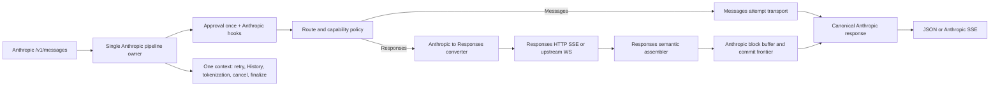

# Anthropic Messages endpoint → OpenAI Responses upstream 正式规格

## 文档状态

- **状态**：正式开发规格，**活文档，不冻结**（2026-08-24 用户裁定全面废除 spec 冻结规则；此前本行写的是 `FINALIZED`，第 7 行写的是「已经冻结，可继续实施」）。新的用户裁决或实测与本文冲突时**当场修订本文**，不把已知错误的条款留在原地。**注意本文其余各处的「冻结」是内容义**——「冻结行为」「冻结矩阵」「已冻结决策」指的是已裁决、实现不得单方面重开的条款，**那些不受本次裁定影响，一律保留原文**。2026-08-07 用户最新重裁覆盖旧 D4，也覆盖 2026-08-06“必须逐字节固定 `copilot-api-js` 格式及全部 malformed 边界”的范围：本项目生产自己的版本化主 carrier，同时兼容 `copilot-api-js` 当前 v1 合法主路径；不要求每个 malformed 输入与 Node codec 同边界，也不复制 upstream 的有损聚合。`reports/260807-review-spec-carrier-dual-format.md` 已对 SHA-256 `0d81c21fb6efcc71e217b162418a89cf53cc7f392669e5b0b280651de512691e` 的本次双格式合同完成独立定向评审，结论为 0 blocker／0 major——**那是当时那份评审对象的身份记录，是历史事实**，不是本文此后不可修订的声明。D1～D3 仍有效。本文件是实现与验收的行为 oracle，但不替代另行接受的 ADR。
- **历史编写基线**：`ghc-api-proxy-py` commit `ed77c9d191df81c451c25161420515cca52ce6a4`。该 commit 只解释本规格形成时观察到的缺口，不表示 current 实现状态；current 状态见 [implementation.md](implementation.md)。
- **总体 verdict**：**规范且活**（原写 `FINALIZED`，2026-08-24 解冻，见上一条）。Carrier 双格式合同及其余行为已裁决，可继续实施；**已裁决不等于本文不可修订**——但反向同样成立：**实现进度不得反向改写本规格**，实现与已裁决行为不符时是把偏离交回用户重裁，不是改本文去迁就代码。规格维持“一 Responses reasoning item → 一 Anthropic thinking block”与普通模式下非空 encrypted-only no-loss。目标在 Anthropic pipeline 的单一生命周期内形成 direct bridge，不能复制 OpenAI route 的第二套 orchestration，也不能采用 raw passthrough、“超限后退化为 live forwarding”或参考实现的有损 non-stream reasoning 聚合行为。
- **已裁决且不可重开**：semantic block 就是一个 Anthropic content block；block-level buffering 是基础能力；下游不提供 token/event 级 live streaming。上游可以增量读取，但完整 Anthropic content block 是最小可观察提交单元。buffer 与 carrier 是普通内存对象，统一服从全局内存预算、准入与背压，不 spill，也不因容量压力退化为 live forwarding。双 endpoint 模型默认走 Messages，Responses bridge 由明确 route policy／config 启用。reasoning signature 的 producer 固定使用本项目主 v1；consumer 同时接受本项目主 v1 与 `copilot-api-js` 当前 v1 合法主路径。不得加入 HMAC、keyring、domain binding 或泛化安全系统，也不得恢复 Anthropic 原生 server-tool 编排。
- **2026-08-22 用户重裁，覆盖本文原「首块前零 HTTP success headers」**：HTTP success headers 在第一次得到上游 HTTP 200 的尝试时就转发给下游，不等待首个完整 block；`ping` 因此可以出现在首块之前。权威是用户亲笔的 `docs/.human-controlled/client-side-block-delivery.md`「客户端响应头」一节，理由是让 `sse_ping_interval` 的保活覆盖等待首块的长窗口。**被覆盖的只有 headers 那一半**：`message_start` 与首个完整 block 进入同一 sink batch 的绑定不变，body event 在首块前仍不可见。已按此改写「Downstream Anthropic SSE」第 1／2／3 条、retry 边界一节与不变量一节；当前新链实现的就是这个行为（`handle_bounded` 跑到上游响应头到达即返回，随后返回 `StreamingResponse`）。
  **尚未跟进、需独立切片**：`acceptance.md` 的 `CAL-04-GRAMMAR-v1`（ping 转移行与冻结 fixtures，并需重新审视 R3-M1／R4-M1／R5-M1 三条已闭评审行）、本文第 579 行那条 M1 评审记录（点时记录，不回填）、以及 `architecture.md` 的 delayed response-start owner 一族（实测该机制及其测试只存在于已不可达的旧链）。
- **2026-08-24 修订「Downstream Anthropic SSE」第 7 条：SSE error event 之前必须先咨询合成续写。** 触发是一次生产事故 req=`75ccdf6f`（诊断见 `../upstream/retry-and-continuation/reports/260824-silent-eof-after-thinking-diagnosis.md`）：上游交付一个完整 thinking 块后静默、随后切穿块中干净 EOF，客户端只拿到一句 `API Error`，而它本可以拿到一个可续写的 `tool_use`。
  **本条不是新裁决，是把一条既有的用户裁决补进本文。** 权威是用户亲笔的 `docs/.human-controlled/upstream-retry-and-continuation.md` 第 30 行：「如果已经交付过至少一个完整块，则将报错合成为自制的 `tool_use` / `function_call` 块……返回给客户端」。该文第 5–11 行的「无法继续」清单未列入「上游流无终止事件」，最接近的第 15 行「网络中断」属「一般可以继续」，故本格落在第 30 行的处方之内。实现此前只在**撕裂**路径上执行了它，干净 EOF 路径从不咨询——两条路把客户端留在同一个位置（`src/app/pipeline/retry.py` 该处注释明文如此），出口却不同。
  **范围限定，不要读宽**：本条只约束**本来就要发 SSE error event 的那些结局**。上游停在块边界、按 2026-08-22 裁决以合成 stop reason 正常收尾的那一格**不报错**，因此不在第 30 行的触发条件内，行为不变。

## 问题与意图

本规格形成时，`/v1/messages` 只把 Anthropic 请求发到 Messages upstream，并把流式响应原字节透传；该描述是历史问题背景，不是 current 实现状态。规格目标是在不改变 Anthropic 客户端公共协议、不复制 lifecycle owner 的前提下，让符合路由与模型能力条件的 Anthropic Messages 请求选择 OpenAI Responses upstream，完成双向语义转换，并仍由 Anthropic pipeline 统一拥有 approval、hooks、retry、History、tokenization、取消与终态。Current 实现状态见 [implementation.md](implementation.md)。

这不是 Anthropic→Chat Completions→Responses 的中转桥。请求与响应都必须在 Anthropic 与 Responses 之间直接转换；Chat Completions 不得成为语义中间表示。

## 目标

- Anthropic 客户端继续使用 `/v1/messages`，非流请求得到 Anthropic `MessagesResponse`，流请求得到合法的 Anthropic SSE envelope。
- 同一请求只存在一个 `RequestContext`、一个 approval、一个连续 attempt 序列、一个 History entry 和一个最终终态。
- endpoint 与物理 transport 由显式路由政策和模型能力决定，不由模型名称猜测，也不由 buffering 开关决定。
- 请求、响应、工具、reasoning、signature、usage、error 与 header 的转换可审计；无法无损表达的语义不得静默丢弃。
- block commit frontier 明确区分未提交 attempt-local 状态与已提交 downstream 状态，保证顺序正确、无重复、无丢失。
- 内存、队列、并发、时间与 upstream frame 均有边界；bridge 不使用磁盘 spill，任何容量压力都不得退化为 token/event live forwarding。
- HTTP Responses SSE 与 upstream Responses WebSocket 共享同一语义转换核心，物理 transport 差异不得泄漏到 Anthropic wire contract。

## 范围边界

本规格覆盖 Anthropic Messages 入站选择 Responses upstream 后的完整请求生命周期，包括 route selection、capability gate、双向转换、非流与流式输出、retry、operational lifecycle 和兼容性。

本规格不把 `/v1/messages/count_tokens` 改成 Responses wire API；它继续提供 Anthropic token-counting contract。本规格也不新增下游 Anthropic WebSocket endpoint。已有 OpenAI／Responses routes 继续拥有自己的公共入口，但不得成为该 bridge 的 lifecycle owner。

## 术语

- **canonical Anthropic request**：完成 Anthropic parse、sanitize、approval 修改、Anthropic prepare 与当前 attempt `PRE_SEND` 后的请求语义；它是 retry strategy 与 hooks 的共同请求事实。
- **Responses wire request**：由当前 attempt 的 canonical Anthropic request 转换而成、即将发往 `/responses` 或 `ws:/responses` 的 payload。
- **semantic block**：一个且仅一个 Anthropic content block。Responses output item 若对应多个 Anthropic content blocks，必须按 Anthropic block 边界拆分；多个 Responses items 也不得因同类型而合并成一个 Anthropic block。
- **block envelope**：该 block 对应的 `content_block_start`、零个或多个 delta、可选 signature delta 与 `content_block_stop` 的完整有序序列。
- **commit frontier**：已向下游开始提交且不得被后续 attempt 重写的最大连续 Anthropic block 前缀。
- **attempt-local state**：尚未越过 commit frontier 的 parser、assembler、usage、terminal metadata、buffer 与 conversion degradation；retry 时必须整体丢弃并重建。

## 总体架构契约

`execute_anthropic_pipeline()` 或其后继的同一语义 owner 必须继续拥有完整生命周期。Responses adapter 只拥有“本 attempt 如何发送、如何把结果解释为 canonical Anthropic response”这条协议腿，不得自行 approval、retry、finalize 或创建平行 History。

## Route selection 与 model capability 契约

### 决策输入

路由只能使用以下已解析事实：

- 客户端模型标识经过既有 model mapping 后得到的 resolved model。
- model catalog 中该 resolved model 的 `vendor`、`supported_endpoints` 与结构化 capabilities／limits。
- 明确 route policy／config 提供的 endpoint override。基础规格不引入 `@responses`、`@messages`、`@cc` 公共模型后缀；若未来增加，它必须先取得独立用户裁决，并归一为同一个显式 override fact 后再进入本节算法。
- transport 配置与运行时可用性，例如 upstream WebSocket 是否启用、连接资源是否可用。

### 冻结的 route precedence

Protocol leg 必须只在一个 route-policy 接缝按以下顺序决定；后续 transport、converter、retry strategy 与 route handler 不得再次推导或静默改写：

1. 先完成 model mapping，得到 resolved model；route config 的匹配键和 capability lookup 均使用 resolved model，original model 只保留作用户事实与诊断。
2. 若存在明确 endpoint override，则它优先于 endpoint availability 与自动选择，直接选定 `messages` 或 `responses` 候选 leg。随后单独验证该 leg 的模型 capability、协议配置与运行时 transport 可用性；任一不满足都返回稳定的 Anthropic-compatible route／capability error，网络调用数为零。显式 override 不因不可用而 fall through 到另一协议。
3. 无 override 时，若模型同时明确支持 Messages 与 Responses，固定选择 Messages。要让双支持模型走 Responses，必须通过第 2 步的明确 route policy／config 启用。
4. 无 override 时，Responses-only 模型选择 Responses；Messages-only 模型选择 Messages。
5. 无 override 且没有任何明确支持的 endpoint、catalog miss、`supported_endpoints` 缺失或 capability 互相矛盾时，fail closed，在网络请求前返回 route／capability error；不得按模型名称猜测，也不得把 unknown 当作 Responses-capable。
6. Chat Completions 不参加上述自动候选集。若未来保留 Anthropic→CC bridge，它必须由独立、明确的 route policy 选择，不能成为本 direct bridge 的中间层或隐式 fallback。

“选择 protocol leg”与“选择 physical transport”是两次独立决策。Responses leg 内部可选择 HTTP 或 WebSocket，Messages leg 使用其已定义 transport；被选 physical transport 不可用时显式失败，不得静默切换 transport 或 protocol leg。只有配置中明确声明、可审计且有顺序的 fallback policy 才能请求下一 transport／leg；每次真实 exchange 必须形成新 attempt，History 必须记录原选择、失败原因与 fallback source。仅配置了单值 override 不等于配置了 fallback。

`vendor` 不覆盖明确的 `supported_endpoints`：非 Anthropic vendor 若明确广告 Messages，自动路由仍把它视为 Messages-capable；Anthropic vendor 若未明确广告 Messages，也不得仅凭 vendor 推断支持。Vendor 与 endpoint声明不一致时必须记录 catalog inconsistency，但结果仍按上表的明确 endpoint facts决定。这样 vendor不会成为第二套隐藏 precedence。

### Route 真值表

| 显式 override | 明确 Messages capability | 明确 Responses capability | 结果 |
|---|---:|---:|---|
| `messages` | 是 | 任意 | 选择 Messages；Messages transport 不可用则显式失败 |
| `messages` | 否／未知 | 任意 | capability error；不得改走 Responses |
| `responses` | 任意 | 是 | 选择 Responses；所选 HTTP／WS transport 不可用则显式失败 |
| `responses` | 任意 | 否／未知 | capability error；不得改走 Messages |
| 无 | 是 | 是 | 选择 Messages |
| 无 | 是 | 否 | 选择 Messages |
| 无 | 否 | 是 | 选择 Responses |
| 无 | 否／未知 | 否／未知 | route／capability error，零网络调用 |

### 能力判定

- `/responses` 与 `ws:/responses` 都表示 Responses 协议能力；后者不等于必须使用 WebSocket。
- 协议 endpoint 选择与物理 transport 选择正交。模型可因 `ws:/responses` 被判定为 Responses-capable，而当前 attempt 仍通过 HTTP `/responses` 发送。
- `streaming`、vision、tool use、parallel tool use、reasoning effort、context／output limits、input count 与 image limits 必须分别 gate；不能用“支持 Responses”替代字段级 capability check。
- catalog 缺失、model index miss 或 `supported_endpoints` 缺失时，不能凭模型名称猜测能力，固定 fail closed；管理员可先补显式静态 capability，再由上述算法选择，但不能用 route override 伪造 capability。
- 路由选择结果、能力来源、物理 transport 与拒绝原因必须进入可观测 metadata；不得改变用户提交的 original model 事实。

## Request conversion 契约

转换发生在每个 attempt 的 `PRE_SEND` 之后。approval、sanitize、thinking protection、tool preprocessing 与 retry strategy 继续操作 Anthropic canonical payload；禁止在 attempt loop 外只转换一次后复用陈旧 Responses payload。

### Envelope 与基础字段

- resolved `model` 映射为 Responses `model`。
- Anthropic `system` 映射为 Responses `instructions`：string form原样使用；text-block list按原顺序取 text，并用两个 LF bytes（`\n\n`）连接，包括空 block产生的空 segment。Block-level cache metadata按矩阵固定`DEGRADE`，不能静默丢弃或由实现者改成任选拒绝。
- `max_tokens` 映射为 `max_output_tokens`；还必须在发送前同时满足 Anthropic request constraint、model-advertised output limit 与代理配置 hard limit。
- `temperature`、`top_p` 和 `stream` 仅在 Responses 与目标模型支持时映射。
- `top_k`、`stop_sequences`、`context_management`、`cache_control`、`metadata` 与未来未知字段必须按下方冻结矩阵处置；silent drop 不是合法状态。
- metadata 只能传递明确允许且长度合规的字段。original request metadata 仍保留在 Anthropic context／History，不以 Responses wire 的裁剪结果覆盖。

### Messages 与 content blocks

- user／assistant turn 顺序必须保持。
- 同一 turn 内 text、image、thinking、redacted thinking、tool use、tool result 与未来已识别 block 的相对顺序必须保持；不得先按类型聚合再重排。
- Anthropic user text／image 映射为 Responses input message content parts。base64 与 URL image source 必须保留媒体类型与内容；超过模型 image limits 时在 upstream 调用前拒绝。
- assistant text 映射为 Responses assistant／output text item；不得与 tool call 折叠成 Chat Completions 形状。
- assistant `tool_use` 映射为 Responses `function_call`，保留 `id→call_id`、name 与 JSON arguments；不得伪造具有不同语义的 Responses item id。
- user `tool_result` 映射为 `function_call_output`，必须保留目标 call id、文本／结构内容与 error 状态。Responses 无法表达的 image／multimodal tool result 不得静默剥离。
- unknown block／item 按矩阵固定`REJECT`并产生明确 incompatibility error；不能由 default branch静默 no-op或自行降级。

### Tools 与 tool choice

- Anthropic function tool declaration 映射为 Responses function tool，保留 name、description 与 `input_schema→parameters`。
- tool declaration、历史 tool call、tool result、forced `tool_choice` 和响应 name restore 必须共享同一个双向 name mapping。开启 sanitization 后，所有引用必须原子地共同变换；禁止只改声明或只改 choice。
- `auto`、`any`／required、`none` 与 named tool choice 必须映射到对应 Responses category。若目标声明被 capability policy 剥离或拒绝，关联 choice 必须同步处理，不得产生 dangling forced choice。
- **Server-tool no-revive**：基础规格只支持 client-executed function tools。Anthropic 原生 server tools／typed tools（包括 web fetch、web search、code execution、tool search 及未来 server-executed 类型）在 request capability gate 显式拒绝，不执行、不合成、不转成普通 function tool、不从 Responses server-tool result 合成 Anthropic 原生 block，也不触发专用降级 retry。若 upstream 在未请求时返回这类 item，response conversion 显式失败；已经提交 block 时按 post-commit partial failure 终止。任何白名单都是新的产品能力与单独用户裁决，不能通过扩充 converter 映射表暗中恢复。
- parallel tool calls 只有在模型能力与 Anthropic client contract 同时允许时才可启用。
- malformed tool arguments 不得静默变成空对象。基础规格固定严格失败；deterministic repair 是下方标记的低概率扩展项，未获裁决前不得启用。

## 双向字段处置矩阵

处置状态的规范含义如下：`PRESERVE` 表示 wire 形状可变但语义值与顺序必须 byte-exact／value-exact 保留；`TRANSFORM` 表示存在本规格定义的确定映射；`REJECT` 表示在任何相关 downstream commit 前返回稳定 incompatibility error，commit 后则返回明确 partial failure；`DEGRADE` 表示请求可继续，但损失必须作为结构化 `ConversionFact` 进入 History、metrics 与 trace，且不得伪装成已保真。只有矩阵明确写为 `DEGRADE` 的项目才允许 permissive 处理；unknown 不自动继承 permissive。

### Anthropic request → Responses request

| Anthropic 字段／语义 | 状态 | 冻结行为 |
|---|---|---|
| original model、resolved model | `PRESERVE`＋`TRANSFORM` | original model 留在 request facts；resolved model value-exact 写入 Responses `model` |
| string system、按序 text system blocks | `TRANSFORM` | string原样映射；list按输入顺序以`\n\n`连接text值，包括空segment，不得按类型重排 |
| system／content block `cache_control` | `DEGRADE` | Responses 无等价字段时从 wire 省略，并记录精确字段路径与值摘要；不得影响原始 History payload |
| user／assistant turn 与同 turn block 顺序 | `PRESERVE` | 逐连续 run 转换，marker、role 与相对顺序必须不变 |
| text block | `TRANSFORM` | 映射为对应 Responses text content；空文本按目标 schema 合法性保留或显式拒绝，不得凭空改成非空 |
| base64／URL image block | `TRANSFORM` | 保留 source kind、media type 与内容；违反 image capability／limits 时调用前拒绝 |
| document、audio、video 及未知 content block | `REJECT` | 基础 bridge 无已冻结等价映射；不得抽取文本或静默剥离 |
| assistant `tool_use` | `TRANSFORM` | 映射为 `function_call`；`id→call_id`、name 与 JSON arguments 保留；不得伪造 Responses item id |
| user `tool_result` 文本／结构内容 | `TRANSFORM` | 映射为 `function_call_output`，保留 call id、内容与 `is_error` 事实 |
| multimodal `tool_result` | `REJECT` | 未冻结等价 Responses 表达，不得只保留文本子集 |
| function tool declaration、`input_schema` | `TRANSFORM` | 映射为 Responses function tool 与 `parameters`；名称 mapper 同时作用于声明、choice、历史 call 与 response restore |
| Anthropic 原生 server／typed tool | `REJECT` | 执行本规格 server-tool no-revive，不进入 upstream |
| `tool_choice` auto／any／none／named、parallel flag | `TRANSFORM` | 映射到 Responses 对应类别；目标缺失或 capability 不满足时拒绝，不产生 dangling choice |
| 本项目主 v1 reasoning carrier | `TRANSFORM` | 先按本项目 namespace、version、tag 与最小 payload schema 恢复 visible summary 和可选 `encrypted_content`；普通 echo 路径必须 value-exact 恢复 payload，细则见双格式合同 |
| `copilot-api-js` upstream v1 payload form | `TRANSFORM` | 在本项目格式之后识别当前 upstream v1 的合法 prefix＋base64url 主路径，恢复 visible summary 与可选 `encrypted_content`；兼容输入不改变本项目 producer 的主输出格式 |
| 本项目 bare marker／upstream bare prefix／upstream legacy bare sentinel | `TRANSFORM` | 按冻结识别顺序恢复仅含 visible summary、无 `encrypted_content` 的 Responses reasoning item；直接 Messages leg 无条件剥离这些 synthetic blocks，避免把代理 carrier 发给 Claude |
| 本项目 unknown version／已识别格式的 malformed payload | `DEGRADE` | 记录稳定分类，整个 thinking block 不进入 Responses wire，不恢复 visible summary 或 `encrypted_content`；不得抛裸异常、输出完整 signature 或把 malformed 当 foreign／成功 payload；不要求与 upstream 每个 malformed 边界一致 |
| foreign／unsigned reasoning signature；原生 redacted thinking | `DEGRADE` | 不恢复为 Responses reasoning item，整个 thinking／redacted block 不进入 Responses wire并记录分类；不得把 visible text改成普通 assistant text或把 opaque signature 当作 `encrypted_content`；直接 Messages leg 对真正 Anthropic signature 仍按原合同保留 |
| `max_tokens` | `TRANSFORM` | 映射为 `max_output_tokens`，并同时执行模型与代理 limit gate |
| `temperature`、`top_p`、`stream` | `TRANSFORM` | 仅在目标模型 capability 支持时映射，否则拒绝 |
| `top_k`、`stop_sequences`、`context_management` | `REJECT` | Responses 无冻结的等价语义；非空／非默认值不得忽略 |
| request `metadata.user_id` 或明确 allowlist 项 | `TRANSFORM` | 映射到 Responses 对应 metadata／user 字段并保留 original metadata |
| 其他 metadata | `DEGRADE` | 不发 upstream，记录字段路径；不得覆盖 original History metadata |
| 未识别顶层字段 | `REJECT` | 默认 strict；Pydantic `extra=allow` 不得把它变成 silent drop |

### Responses response → Anthropic response

| Responses 字段／语义 | 状态 | 冻结行为 |
|---|---|---|
| output item／content part 的语义顺序 | `PRESERVE` | 按首次合法出现的 semantic order 分配连续 Anthropic block index；不得按类型或完成时间重排 |
| `message.output_text` | `TRANSFORM` | 形成 Anthropic text block |
| refusal | `TRANSFORM`＋`DEGRADE` | 形成 text block并记录 `refusal` conversion fact；不得无标记伪装为普通成功文本 |
| `function_call` | `TRANSFORM` | 形成 `tool_use`，value-exact 保留 `call_id`，恢复原 tool name并解析完整 arguments |
| server-tool call／result | `REJECT` | 执行 no-revive；不得合成 Anthropic 原生 server block |
| reasoning summary＋非空 `encrypted_content` | `TRANSFORM` | 每个 reasoning item 一对一形成 thinking block和本项目主 v1 carrier；不得跨 item 聚合／错配 |
| encrypted-only reasoning | `TRANSFORM` | 普通模式下，非空 opaque payload 形成空 visible thinking 加本项目主 v1 carrier 的合法 thinking block，不得丢失 payload；显式 strip 是下方单独定义的有意去除政策 |
| output item／event 的已知非语义 control metadata | `DEGRADE` | 不进入 Anthropic content，但记录 event type 与 provenance；只能用于明确列出的 control 类 |
| 未知 output item、未知 content part、malformed lifecycle | `REJECT` | 不得由空 text block或正常 terminal 掩盖 |
| terminal status／incomplete reason／error | `TRANSFORM` | 按本规格 stop／error 合同映射；未知 reason 显式失败，不映射成 `end_turn` |
| usage 与 details | `TRANSFORM` | 严格按 Usage 契约的冻结算式；reasoning 是 output 子集，不二次相加 |
| upstream response id／model | `TRANSFORM`＋`PRESERVE` | 生成 Anthropic-compatible public id／model，同时在诊断 facts value-exact 保留 upstream id 与 resolved model |
| Responses-specific／hop-by-hop／auth header | `REJECT` | 不下发客户端 |
| request id、`retry-after`、可明确归一的 rate-limit header | `TRANSFORM` | 仅取最终可见 attempt；名称和单位必须按 Header 契约明确映射 |

### 仍需用户选择的低概率扩展

以下项目不阻断基础规格，因为当前行为均已冻结为下列明确基线；只有确有产品需求时才重裁，不能由实现者自行开启：

1. **Malformed tool-argument deterministic repair**：是否允许从特定、可枚举的 malformed JSON 形态修复并标记 `DEGRADE`。基础行为是严格拒绝。
2. **Multimodal tool result compatibility**：是否定义 image／document tool result 到 Responses 的扩展表达。基础行为是拒绝整个不兼容 request，不只丢 multimodal part。
3. **Cross-provider native thinking forwarding**：是否允许把 foreign Anthropic thinking 仅以 visible text 送入 Responses。基础行为固定为记录 degradation 并从 Responses wire 丢弃整个 thinking block；不拒绝整个 request，不把 visible text 改成普通 assistant text，也不把 opaque signature 当 bridge carrier。
4. **公开 model suffix override**：是否新增 `@responses`／`@messages`／`@cc` 客户端语法及 literal escaping。基础行为是只接受服务端明确 route policy／config。

## Reasoning 与 signature 契约

- Anthropic `thinking.enabled`／`adaptive` 映射为 Responses `reasoning` 配置时，必须受模型 `reasoning_effort` 能力与 budget limits 约束。不能把 budget heuristic 当作模型明确支持。
- 从 Responses 返回的每个 reasoning item 一对一映射为 Anthropic `thinking` block；非空 `encrypted_content` 必须通过下方本项目主 carrier 往返。item identity、resolved model 与 upstream identity 只能作为内部 typed facts 保存，不得塞进 carrier。
- carrier 是跨轮 continuation payload，不是认证信封。新 producer 固定输出本项目主 v1；consumer 同时支持本项目主 v1 与 `copilot-api-js` 当前 upstream v1 合法主路径。客户端原样 echo producer 给出的 signature 后，普通模式 consumer 必须 value-exact 恢复同一非空 `encrypted_content`；不要求不同 producer 产生同一 carrier bytes。
- foreign／unsigned signature 不恢复为 Responses reasoning state。它们按既有 translator 的 degradation／drop contract 处理并记录分类；不得把 foreign opaque signature 当作 `encrypted_content`。直接 Messages leg 对真实 Anthropic signature 继续按原合同处理。
- encrypted-only reasoning 的非空 payload 仍须生成可往返 carrier，不能因 summary 为空而丢失。
- 多个 reasoning item 固定一对一映射为多个 Anthropic thinking blocks；不得聚合 summary，也不得把多个 summary 绑定到最后一个 encrypted blob。
- `stripThinkingSignature` 启用时，producer 为每个 reasoning item 发本项目 bare marker，不嵌入 `encrypted_content`，visible summary 仍保留；encrypted-only item 仍保持“一 item 一 block”，但 payload 被该显式政策有意移除，必须记录 strip conversion fact，不能伪装成 no-loss。直接 Messages leg 必须无条件剥离本项目 synthetic namespace、upstream v1 prefix form 与 upstream legacy bare sentinel 标识的 synthetic thinking block，避免把代理 signature 发给 Claude。
- reasoning、tool use 与 text 的相对顺序来自上游语义 item 顺序；转换器不得把 reasoning 无条件移到所有 blocks 前面。

### 项目主 v1 wire contract

本项目拥有 producer 主格式。它只承载 Responses continuation 所需的 opaque `encrypted_content`，不承担来源认证、完整性证明或通用扩展信封职责：

- **Version 与 marker**：项目 namespace 固定为 ASCII `ghc-api-proxy:synthetic-reasoning:`。主版本 payload prefix 固定为 `ghc-api-proxy:synthetic-reasoning:v1:`，bare marker 固定为 `ghc-api-proxy:synthetic-reasoning:v1`。新 producer 只输出这两个项目主 v1 形态，不输出 upstream v1。
- **Payload 编码**：非空 `encrypted_content` 使用一个 UTF-8 JSON object，producer 以无额外空白的紧凑 JSON 序列化，并按 `tag`、`encrypted_content` 的字段顺序输出；非 ASCII 字符直接编码为 UTF-8，不使用 ASCII-only `\uXXXX` 替代，JSON 必需的引号、反斜杠与控制字符仍按 JSON string 规则转义。随后将完整 UTF-8 bytes 编码为不带 `=` padding 的 base64url，拼接到项目主 v1 payload prefix 后。此处只冻结 producer 的稳定输出；consumer 按 JSON object 语义读取，不依赖字段顺序、空白或非 ASCII 字符是否使用合法 JSON escape。
- **最小字段**：payload object 必须且只能包含两个唯一成员 `tag` 与 `encrypted_content`，duplicate key 视为 malformed。`tag` 必须是字符串常量 `openai.responses.reasoning.encrypted_content`；`encrypted_content` 必须是非空字符串，并 value-exact 保存 Responses 原值。Version 已在外层 prefix，不在 JSON 内重复。visible summary 留在 Anthropic block 的 `thinking` 字段，不复制进 payload。
- **Canonical 向量**：`encrypted_content="opaque-😀"` 的紧凑 UTF-8 JSON 为 `{"tag":"openai.responses.reasoning.encrypted_content","encrypted_content":"opaque-😀"}`，完整 signature 固定为 `ghc-api-proxy:synthetic-reasoning:v1:eyJ0YWciOiJvcGVuYWkucmVzcG9uc2VzLnJlYXNvbmluZy5lbmNyeXB0ZWRfY29udGVudCIsImVuY3J5cHRlZF9jb250ZW50Ijoib3BhcXVlLfCfmIAifQ`。Producer payload 只能使用 RFC 4648 URL-safe alphabet `A-Z a-z 0-9 - _` 且不含 `=` padding。
- **明确不包含**：carrier 不编码 item id、model、upstream identity、issuer、timestamp、nonce、HMAC、`kid`、key rotation 或 domain binding；也不采用 JCS。新增字段或语义必须发布新 version，不能在 v1 payload 中静默扩展。
- **Roundtrip**：普通模式下，每个 Responses reasoning item 独立构造一个 Anthropic thinking block；客户端原样 echo 后，consumer 必须从该 block 恢复一个 reasoning item，使非空 `encrypted_content` value-exact 相等、visible summary 顺序不变。不存在跨 item 聚合、last-ciphertext-wins 或 encrypted-only 丢失。缺失或空 `encrypted_content` 产生 bare marker；consumer 恢复 summary-only item，不添加 `encrypted_content`。
- **Echo 与 strip**：普通 echo 不重写 signature。`stripThinkingSignature` 是显式有损选项：producer 改发 bare marker并记录 conversion fact。Direct Messages sanitizer 对整个项目 synthetic namespace 无条件 strip，包括主 v1、项目 unknown version 与项目 malformed payload；它不得把这些代理 signature 发给 Claude。

### `copilot-api-js` upstream v1 兼容合同

兼容 oracle 固定为 `copilot-api-js` commit `8d5c861c2e079b92401dd8ccd49695a363d078fe` 的合法主路径，但它是 consumer compatibility oracle，不是本项目 producer 的主格式或整体转换语义 oracle：

- Upstream payload prefix 为 ASCII `copilot-api:synthetic-reasoning:v1:`。合法非空 payload 是 `encrypted_content` 的 UTF-8 bytes 经 unpadded base64url 编码后直接拼接；合法 consumer 恢复同一字符串。定义与 producer 见 `src/lib/anthropic/synthetic-reasoning.ts:31-46`，请求侧重建见 `src/lib/openai/translate/anthropic-to-responses-request.ts:258-275`。
- Upstream bare prefix `copilot-api:synthetic-reasoning:v1:` 与 legacy bare sentinel `copilot-api:synthetic-reasoning:v1` 都恢复 visible summary，但不添加 `encrypted_content`。Legacy sentinel 只为消费兼容保留，本项目 producer 不输出它。
- 合法兼容向量继续固定：`ENC==` 对应 `copilot-api:synthetic-reasoning:v1:RU5DPT0`，`opaque-😀` 对应 `copilot-api:synthetic-reasoning:v1:b3BhcXVlLfCfmIA`。这些向量验证 upstream v1 合法主路径，不要求本项目主 v1 产生相同 bytes。
- `copilot-api-js` non-stream producer 的跨 item summary 聚合、仅保留最后一个非空 ciphertext 与 encrypted-only 丢失明确不兼容本项目语义合同，不得复制。Stream producer 的单槽聚合也不是 item identity oracle。兼容 upstream carrier bytes 不授权兼容这些有损行为。
- Direct Messages sanitizer 必须继续 strip upstream v1 prefix form 与 legacy bare sentinel。`stripThinkingSignature` 的 upstream 行为只用于读取旧数据与互操作测试；本项目新 producer 使用项目 bare marker。

### 双格式识别顺序与最小止血

Consumer 对每个 thinking block 固定按以下顺序分类，首个命中即停止，不允许失败后把同一 signature 重新解释为另一格式：

1. 精确识别本项目主 v1 payload prefix或 bare marker；payload form 进入项目 v1 decode／schema gate。
2. 识别 `ghc-api-proxy:synthetic-reasoning:` namespace 下的其他 version 为 `project_unknown_version`；不得 fallback 到 upstream 或 foreign decoder。
3. 识别 `copilot-api:synthetic-reasoning:v1:` upstream payload／bare prefix；payload form 只保证合法 canonical 主路径兼容。
4. 精确识别 upstream legacy bare sentinel `copilot-api:synthetic-reasoning:v1`。
5. 其余 signature 分类为 foreign；原生 `redacted_thinking` 继续走自己的既有合同。

最小止血行为固定如下：

- 项目 v1 payload 必须是非空、无 `=` padding、只含 RFC 4648 URL-safe alphabet 的 canonical base64url；decode 后再以同算法 encode 必须等于原 payload。该 gate、严格 UTF-8、JSON object、唯一字段集合、duplicate key、tag 或非空字符串校验任一失败时，分类为 `project_malformed_v1`；upstream v1 payload 无法按本项目兼容 decoder恢复字符串时，分类为 `upstream_malformed_v1`。两者均不得恢复 `encrypted_content`，不得抛出未分类异常，也不得把 malformed 当成成功 bare marker。
- Unknown project version、recognized malformed 与 foreign 均记录稳定分类和字段路径；日志、metrics 与错误不得包含完整 signature／payload。在 Anthropic→Responses 转换中，整个对应 thinking／redacted block 不进入 Responses wire，不恢复 visible summary 或 `encrypted_content`，也不改写为普通 assistant text；不得为低概率 malformed 输入建立认证、密钥、跨域信任或全面攻击防护系统。
- 本项目只承诺 upstream v1 合法 canonical payload 的主路径兼容，不承诺与 Node `Buffer.from(..., "base64url")` 对每个非 canonical alphabet、padding、trailing data 或 UTF-8 replacement 边界一致。兼容测试必须覆盖合法向量、bare、legacy、unknown、foreign 与代表性 malformed 分类，但不得把 differential malformed 全空间提升为产品合同。
- 所有 carrier bytes 仍作为普通对象进入既有 request／global memory budget。Malformed／unknown 不得绕过 size、cancel、deadline 或 cleanup 合同；除此之外不新增 carrier 专用阈值或安全状态机。

历史编写基线 `ed77c9d191df81c451c25161420515cca52ce6a4` 已落地 upstream v1 prefix／base64url codec、legacy 识别与逐 thinking block reverse consumer；这些当时只是兼容输入基础。该历史提交的 forward 聚合、encrypted-only 丢失与旧测试 oracle 是本规格要求纠正的反例，不是 current 实现断言。Current 合规状态见 [implementation.md](implementation.md)，不得反向放宽本规格迁就任何实现快照。

## Response conversion 契约

非流和流式转换必须共享同一个语义映射核心。两条路径对相同 Responses output 的归一化 Anthropic content、stop reason、usage、degradation 与 error 必须等价。

### Content 与 terminal status

- Responses `message.output_text` 映射为 Anthropic text block；refusal 不能伪装成普通成功文本而不带 degradation／error 事实。
- `function_call` 映射为 `tool_use`，保留 `call_id`、name 与 parsed input。
- 任意 server-tool call／result执行 no-revive并显式失败；基础规格没有任何 server-tool 白名单。
- 只要存在可执行 tool call，`stop_reason` 为 `tool_use`。
- `incomplete` 且原因为 output-token limit 时，`stop_reason` 为 `max_tokens`。
- completed 且无 tool call 时，`stop_reason` 为 `end_turn`。content filter、cancelled 与未知 incomplete reason 必须保留原因事实，不能仅映射成看似正常的 `end_turn` 后丢失 side-channel。
- Responses `failed` 与 terminal `error` 不是成功 message，必须进入统一 error mapping。
- 没有 content 的合法成功响应可生成协议要求的空 text block，但不能借此吞掉 unknown item、conversion failure 或 encrypted-only reasoning。

## Non-stream contract

当 Anthropic `stream=false` 时，下游只返回一个完整、可校验的 Anthropic `MessagesResponse` JSON：

- 在完整 Responses body 成功解析、转换、response hooks 完成并通过 limits 前，不提交成功 body。
- content blocks 按语义顺序完整出现，index／SSE envelope 不参与 non-stream public body。
- response id 与 model 必须满足 Anthropic wire contract，同时保留 upstream id／selected endpoint 作为诊断 metadata，而不是泄漏不兼容字段。
- usage 只来自最终成功 attempt；失败 attempt 的 usage 不得累加。
- conversion、limit 或 hook failure 发生在 response commit 前时，返回 Anthropic-compatible HTTP error，并关闭 upstream response。
- non-stream 与 stream 对相同 fixture 的最终 normalized Anthropic message 必须等价，允许的差异仅限 transport envelope 与明确记录的 transport metadata。

## SSE／WS envelope 契约

### Downstream Anthropic SSE

当 Anthropic `stream=true` 时，下游协议仍是 Anthropic SSE：

1. HTTP success headers 在**第一次得到上游 HTTP 200 的尝试**时转发给下游，不等待首个完整 block。用户裁决 2026-08-22，权威是 `docs/.human-controlled/client-side-block-delivery.md`「客户端响应头」一节；理由是它让 `client_delivery.sse_ping_interval` 的保活能覆盖等待首块的那段长窗口，而不是等到首块之后才开始。**headers 一旦提交就不能收回**，因此其后的失败只能走 SSE error event（见下面第 7 条），这与「response header commit policy 必须与 retry 边界一致」是同一条约束的两面。
2. 首个 Anthropic content block 完整组装并通过 response hooks／limits 前，下游不得看到 `message_start` 或任何 body event。首个完整 block 可提交时，`message_start` 必须与该 block 的完整 envelope 进入同一个串行 sink batch，且至多一次。合法零 content 成功响应只有在 terminal 已确定且不存在待完成 block 时，才可用一个完整 terminal batch 提交 `message_start`、`message_delta` 与 `message_stop`。
3. `ping` 不受第 2 条约束：它是 envelope 层的保活，可以在 headers 已提交、首个完整 block 尚未到达的窗口内出现。这正是第 1 条要换取的东西。
4. 每个已完成 semantic block 以连续 `content_block_start` → delta／signature delta → `content_block_stop` envelope 提交。
5. block index 从零开始、连续单调，并与稀疏或重复的 Responses `output_index` 解耦。
6. 所有 blocks 完成后，至多一个 `message_delta` 携带 stop reason 与 terminal usage，随后至多一个 `message_stop`。
7. terminal error 在尚未提交 HTTP success 时使用 Anthropic HTTP error；已提交后使用 Anthropic SSE error event，且不得再发 `message_stop` 冒充成功。**发出该 SSE error event 之前必须先咨询合成续写**：若本回合已向下游提交过至少一个完整 block，则按 `docs/.human-controlled/upstream-retry-and-continuation.md` 第 30 行把这次报错合成为 `turn_interrupted` 的 `tool_use` 块交给客户端，只有在续写不适用或被拒（非 anthropic-messages 客户端、工具名配置为空、本回合已接管过）时才落到 error event。**这一条对失败的到达方式不作区分**——上游撕裂与上游干净 EOF 而无终止事件把客户端留在同一个位置，决定下一步合法性的是那个位置而不是到达方式。**它不改变停在块边界、以合成 stop reason 正常收尾的那一格**：那一格不报错，因此不触发本条。

block envelope 在网络层可能被 HTTP／TCP 任意分片；本规格保证的是“完整 block 已在代理内组装后才开始对下游可见”以及“同一 block envelope 连续、不与其他 block 交错”，不声称单次 socket write 原子性。

### Upstream Responses HTTP SSE

- parser 必须正确处理 CRLF、multi-line `data:`、frame fragmentation、空 frame、`[DONE]` 与 terminal lifecycle event。
- `response.created`／`in_progress` 只建立 attempt-local metadata，不构成 downstream block commit。
- text／refusal delta、function arguments delta、reasoning summary delta 与 `.done` authoritative data 进入同一 semantic assembler。
- `response.completed`、`response.incomplete`、`response.failed`、terminal `error` 与 clean EOF 的语义必须区分。没有合法 terminal event 的 EOF 是 truncation，不是成功。

### Upstream Responses WebSocket

- WebSocket request envelope 为 Responses `response.create`，response body 与 HTTP leg 使用同一 converter output。
- upstream JSON frames先归一为与 HTTP SSE 相同的 Responses lifecycle events，再进入同一 assembler；禁止为 WS 复制第二套 semantic converter。
- `response.completed`、`response.incomplete`、`response.failed` 与 `error` 是 terminal frames；disconnect without terminal 是 truncation。
- upstream WS 只是物理 transport。下游仍是 Anthropic JSON／SSE，不能透传 Responses WS envelope。
- WS upgrade failure、network disconnect、queue overflow 与 frame limit violation进入统一 retry／error policy。

## Block-level buffering 与 commit 契约

### 已决不变量

- block 未完成前，下游不得看到该 block 的 start、delta、partial JSON、reasoning text 或 signature。
- block 完成后，预构造完整 block envelope，再按顺序提交；下一 block 不得与当前 block 交错。
- 不允许因内存 quota、慢客户端、upstream burst或 WS queue pressure切换到 live write-through。
- attempt reset 必须丢弃全部未提交 parser／assembler／buffer／usage 状态；已提交 frontier 不得回退。
- message terminal envelope 只能在所有应提交 blocks 之后产生。

### Semantic block 的冻结定义与完成条件

semantic block 固定等于一个 Anthropic content block，而不是 Responses output item、完整 turn 或完整 response。Assembler 必须按以下规则产生 immutable `CompletedBlock`：

- text block：一个 Responses message content part 映射为一个 Anthropic text block；只有对应 authoritative content-part done（或 Responses 协议明确声明等价的 item done并携带完整 authoritative text）到达、累计 delta 与 authoritative final value一致后才完成。相邻 text parts 不合并。
- refusal block：一个 refusal content part 映射为一个带 refusal degradation fact 的 Anthropic text block；完成条件与 text相同。
- tool-use block：一个 `function_call` item 映射为一个 Anthropic `tool_use` block；仅当 name、`call_id` 与 authoritative complete arguments齐全，arguments 按基础 strict policy解析为合法 JSON value，且 item done到达后完成。解析失败即 conversion error，不生成空对象。
- thinking block：一个 Responses reasoning item 映射为一个 Anthropic thinking block；只有该 item 的全部 summary parts、`encrypted_content`、item id 与 authoritative item done 已闭合，且本项目主 v1 carrier 已按双格式合同构造后完成。summary-only 与非空 encrypted-only 均仍是一 item一 block；空 `encrypted_content` 按项目主 v1 与 absent 相同。
- server-tool call／result不构成可提交 block；它执行 no-revive并触发 incompatibility error。
- terminal event本身不是 content block。它只能在 Responses 协议明确允许且 authoritative terminal body提供完整 final value时补足尚未收到单独 done的 text／refusal；不得补造缺失 tool name／call id／arguments、reasoning provenance或任何未知 item。

一个 Responses item含多个可映射 content parts时，按 part语义顺序产生多个 Anthropic content blocks；多个 Responses items不得合并为一个 block。Block index按 source item首次合法出现及其 content-part次序冻结，只有最早未提交 block及其后连续已完成前缀可进入 sink。

遇到交错 delta、delta-after-done、重复 done、未知 output index 或返回已关闭 block 的事件时，assembler 必须拒绝或进入明确恢复政策，不能重新打开已提交 index 后继续发 delta。

## Retry ownership 与 delivery semantics

### 唯一 owner

- application Anthropic pipeline 是唯一真实 upstream retry owner；SDK `max_retries` 保持关闭。
- Responses HTTP transport、WS transport、parser、converter、buffer 与 response hooks 都不得自行重发。
- 每个真实 upstream exchange 必须对应一个可见 `Attempt`；attempt 编号连续，底层请求数与审计记录一致。
- retry strategy 接收 canonical Anthropic payload 与归一化 `ApiError`。若决定修改 payload，下一 attempt 重新运行 `PRE_SEND` 并重新转换为 Responses wire。

### 推荐 retry 边界

- downstream 尚未提交任何 semantic block，且错误属于允许重试的 transport／truncation／strategy 类别时，可以在统一 budget 内透明重试。
- 一旦首个 block 越过 commit frontier，禁止从头重放整个 generation；否则会产生重复或语义分叉。
- post-commit continuation 不是透明 retry。只有存在可证明的 resume contract、已提交 block ledger、重复前缀 suppression 与 tool/reasoning 安全条件时，才能作为独立能力启用。
- client cancel、server shutdown、approval rejection、capability error、deterministic conversion error 与 hard limit violation默认不可重试。
- response header commit 绑定的是**第一次上游 HTTP 200**，不是首 block commit（用户裁决 2026-08-22，见「Downstream Anthropic SSE」第 1 条）。由此得到的 retry 边界是：headers 提交之前的失败可以透明重试并仍返回真实 upstream HTTP error；提交之后一律只能走 SSE error event。`message_start` 与首个完整 block 仍进入同一 sink batch，该绑定不受本次裁决影响。失败 attempt 的 body、usage、headers 与 blocks 均不得泄漏。

## Ordering、no duplication、no loss 契约

- 输出顺序由 Responses output item／content part 的语义顺序决定，而不是 event arrival 中可任意重排的类型分组。
- 每个 upstream semantic item 具有 attempt-local identity；assembler 维护 identity→Anthropic index 映射，并只为首次合法出现分配 index。
- committed block ledger 至少记录稳定 semantic identity、Anthropic index、normalized content digest、tool call id、reasoning semantic identity、carrier digest 与 commit 状态；carrier digest 是内部交付事实，不表示 wire carrier 编码了 item／model／upstream identity。
- 同一 generation 中每个 semantic block 恰好提交一次；duplicate lifecycle event必须幂等处理或报错，不能生成第二个 block。
- retry 前的未提交 attempt不得贡献任何 downstream byte、usage、History response 或 terminal metadata。
- post-commit failure 不得删除、覆盖或重排已提交前缀；若无安全 continuation，明确终止为 partial failure。
- sink write failure 的归属必须明确。只有确认整个 block envelope 尚未对客户端可见时才可重试写；无法证明时按“可能已提交”处理，禁止重复发送。
- no-loss 不意味着静默跳过无法识别的 item。无法映射本身是显式失败／degradation 事实，必须被下游或运维观测到。

## Usage 契约

- 令 `T = Responses usage.input_tokens`、`R = input_tokens_details.cached_tokens ?? 0`、`W = input_tokens_details.cache_write_tokens ?? 0`、`O = usage.output_tokens`、`Q = output_tokens_details.reasoning_tokens ?? 0`。所有出现的值必须是有限非负整数；否则 usage 为 malformed terminal fact并走明确 conversion error。
- Anthropic 净输入固定为 `I = max(0, T - R - W)`；输出字段固定为 `input_tokens=I`、`cache_read_input_tokens=R`、`cache_creation_input_tokens=W`、`output_tokens=O`。值为零的 optional cache/detail字段可以从 wire省略，但语义值仍为零。
- `Q` 是 `O` 的子集，只进入 `output_tokens_details.reasoning_tokens` 与诊断 facts；不得加入 input，也不得在 `O` 或 total之外再次相加。若 `Q > O`，记录 `usage_inconsistent` 并保留 upstream 的 `O` 与 `Q`，不得悄悄修正任一值。
- 归一化总输入固定为 `I + R + W`，归一化总 token固定为 `I + R + W + O`。当 upstream计数一致，即 `T >= R + W` 时，总输入等于 `T`，总 token等于 `T + O`。当 `T < R + W` 时，`I` 下限为零，同时记录 `usage_inconsistent`；不得产生负 token。
- modality、prediction 与未来 usage details 若不能进入 Anthropic标准字段，应保留在结构化 metadata／History，而不是静默丢弃。
- stream terminal usage 与 non-stream usage 对相同 response 必须一致。
- 仅最终成功 attempt 能更新成功 usage 与 token calibration；失败 attempt 可用于 error／prompt-limit observation，但不得污染成功计数。
- 整个 usage缺失时，wire使用 Anthropic contract允许的零值，并在 History／observer标记 `estimated=true`；不得把零值记录为 upstream精确计数。

### Usage 数值向量

| 向量 | Responses 输入 | Anthropic 输出 | 归一化 total | 额外事实 |
|---|---|---|---:|---|
| cache＋reasoning | `T=100,R=20,W=10,O=30,Q=12` | `input_tokens=70,cache_read_input_tokens=20,cache_creation_input_tokens=10,output_tokens=30,reasoning_tokens=12` | `130` | `Q` 已包含在 `O=30`，不得得到 `142` |
| 无 cache／reasoning | `T=41,R=0,W=0,O=9,Q=0` | `input_tokens=41,output_tokens=9`；零 optional字段可省略 | `50` | 无 degradation |
| inconsistent cache | `T=5,R=4,W=3,O=5,Q=2` | `input_tokens=0,cache_read_input_tokens=4,cache_creation_input_tokens=3,output_tokens=5,reasoning_tokens=2` | `12` | 必须记录 `usage_inconsistent`，不得输出 `input_tokens=-2` |
| usage absent | 无 usage object | wire零值 | `0` | 必须标记 `estimated=true` |

## Error 契约

- Responses HTTP status、error body、terminal failure、WS upgrade／network error、parse error、conversion error、limit error 与 cancellation先归一为 `ApiError`，再映射为 Anthropic error envelope。
- 在 downstream response commit 前，尽可能保留语义等价的 HTTP status、error type、message、code、request id 与 `retry-after`。
- commit 后发生错误时，HTTP status 已不可更改；发送一个 Anthropic SSE error terminal，关闭 stream，History 标记 failed／aborted，且不发送成功 terminal。
- prompt-limit error 必须保留可解析的 current／limit facts，供 Anthropic tokenization registry 学习。
- unknown Responses output item、unknown terminal reason 或 malformed lifecycle sequence不得默认变成正常 `end_turn`。
- 错误转换本身失败时使用内部错误并保留原错误为 cause；不得吞掉两者。
- 每个 upstream response／stream／WS connection 在成功、失败、retry、cancel 与 shutdown 路径上都必须关闭一次。

## Header 契约

- inbound Anthropic headers 与 beta headers 不直接复制到 Responses upstream；Responses transport按其认证与模型 request-header contract构造 headers。
- 下游 `content-type`、SSE cache／connection headers由 Anthropic response层生成，不能沿用 upstream Responses content type。
- hop-by-hop、认证、cookie、内部 tracing 与 Responses-specific headers不得下发。
- 允许透传／归一化的 headers 至少包括最终 attempt 的 request id、`retry-after` 与经明确映射的 rate-limit facts；不得把 OpenAI quota 名称伪装成 Anthropic quota而不说明映射。
- retry 期间只保留最终可见 attempt headers；失败 attempt headers仅进入诊断 metadata。
- header blacklist／whitelist 与 strict mode 继续生效，但它们作用于归一化后的 Anthropic response header set。
- response header commit policy必须与 retry 边界一致，不能先暴露 `200` 后又声称仍可返回真实 upstream HTTP error。

## Approval、hooks、History 与 tokenization 契约

### Approval

- 一个 Anthropic请求只进入一次 approval gate。
- approval contract 使用 Anthropic payload，不向审批者暴露 Responses wire作为可编辑事实。
- modified payload 必须重新通过 `MessagesRequest` validation、model resolution、sanitize、Anthropic prepare 与相关 hooks，然后才进入 attempt loop。
- rejection／timeout／queue full 时 upstream调用数为零，同一 context 以明确失败终态 finalize。

### Hooks

- `REQUEST_RECEIVED`、`PRE_SANITIZE`、`POST_SANITIZE`、每-attempt `PRE_SEND`、`RESPONSE`、`ERROR` 与 `FINALIZE` 的顺序和 `protocol="anthropic"` contract保持。
- request hooks 永远处理 Anthropic语义；Responses转换发生在 `PRE_SEND` 之后。
- non-stream response hooks 接收转换完成的 Anthropic response body，而不是 Responses body。
- stream observers 接收 normalized Anthropic usage／terminal facts。若未来允许 mutating stream hooks，它们必须在完整 block commit 前以 block-safe contract运行；full-response mutation不得追溯修改已经提交的 blocks。
- hook timeout、error mode、modification records 与 attempt number保持；hook failure不得造成重复 finalize。

### History

- 一个 request id 对应一个 History entry；original payload始终是入站 Anthropic payload。
- History保留 original／resolved model、selected endpoint、physical transport、attempts、hook records、capability／degradation facts、commit frontier、usage与终止原因。
- Responses wire与原始 events可以作为受控诊断 metadata，但不能替换用户请求真相，也不能成为唯一可恢复记录。
- non-stream完成、所有 stream blocks正常 drain、conversion failure、partial failure、client cancel与shutdown必须产生可区分终态。
- finalize恰好一次；成功只在 terminal合法且所有 committed blocks drain后成立。

### Tokenization

- `/v1/messages/count_tokens`继续返回 Anthropic形状并按 Anthropic request估算／校准。
- Responses-only model若没有 Anthropic count_tokens endpoint，不得误调 `send_anthropic_count_tokens()`；使用本地 calibrated estimate并标记 `estimated=true`。
- bridge成功 usage先归一为 Anthropic token facts，再进入现有 calibration observer。
- Responses prompt-limit error更新同一 Anthropic limit registry；reasoning tokens、cache read／write与input total的口径必须与 usage mapping一致。

## Shutdown、cancel、backpressure 与 limits 契约

### Shutdown

- shutdown setup后不启动新 attempt或post-commit continuation。
- grace window内允许已开始且可在 deadline前完成的 block／response drain；超过 deadline后取消 upstream read、关闭 HTTP／WS、清理未提交 memory buffer，并 finalize为 aborted／failed。
- pending approval按现有 server shutdown语义统一拒绝。
- shutdown不得触发 retry，也不得把未完成 block作为完整 block提交。
- tokenization、History与可观测 metadata在资源关闭前尽力持久化，但不得为持久化而无限阻塞进程退出。

### Client cancel

- downstream disconnect／cancel必须传播到当前 upstream HTTP stream或WS exchange，并停止读取与转换。
- client cancel不可重试；若客户端已离线，不尝试向其写 synthetic error。
- 已提交 blocks保持事实记录，未提交 block丢弃；History终态为 aborted，而不是 completed。
- cancel、upstream terminal与shutdown竞态必须通过单一 finalize owner解决，保证资源关闭和finalize均恰好一次。

### Backpressure

- downstream慢消费必须通过有界block queue向上游反压；不得无限读取并缓存。
- HTTP SSE reader在队列／budget耗尽时暂停读取；upstream WS receive queue必须有界，并把持续overflow视为明确limit error。
- 已完成 blocks可以排队，但总resident bytes／block count受请求级观测与全局budget约束。
- heartbeats／keepalive不得穿过尚未完成的 block，也不得作为semantic commit或关闭retry window。若需要连接保活，只能使用客户端协议允许且不伪造content的envelope，并服从已决“无live token/event”契约。

#### 一般 memory-only 与全局背压政策

- incomplete draft、completed-block queue、预渲染 envelope 与 carrier 都是普通内存对象；不为某个对象大小设专门产品阈值、特殊告警线或独立失败政策。
- 所有 bridge resident bytes 与队列项统一进入现有的请求级观测和进程级全局内存预算。达到全局压力线后，普通 admission control 与有界队列必须停止新准入或暂停可暂停的 HTTP／WS upstream读取，优先 drain 已完成且位于 commit 队首的 block。
- 若全局内存压力在 request deadline 前解除，则继续组装原 block；若 deadline、cancel、shutdown 或普通全局容量政策使请求无法继续，则产生对应的 capacity／timeout／abort 终态。当前不完整 block不得提交，已提交前缀不得重复。
- 不得通过超卖全局预算、无限等待、磁盘 spill 或 live forwarding 绕过压力。并发准入、queue depth 与 upstream frame limit 可以各有普通 hard limit；错误原因必须准确区分。
- 每次内存 charge／release 必须绑定 request、attempt 和 buffer owner并恰好一次；success、retry reset、conversion failure、cancel 和 shutdown 后记账必须回到实际 resident 值。任何配额等待必须响应 client cancel 与 shutdown。

### Limits

必须存在并可观测的限制类别包括：request bytes、messages／content blocks／tools数量、image count与size、model context／prompt／output tokens、single upstream frame、per-request buffered bytes、global buffered bytes、completed-block queue depth、attempt／retry／continuation budget、header wait、idle time、request deadline、并发bridge数与upstream WS连接数。

所有 limit violation都必须：

- 在可能时于upstream调用前拒绝。
- 在stream中途发生时不提交当前不完整block。
- 不退化为live forwarding。
- 产生稳定的Anthropic error、History原因与metrics label。
- 清理HTTP／WS与memory quota charge。

## Compatibility 契约

- direct Messages leg的既有Anthropic wire行为在未选择Responses时保持不变。
- `/v1/messages`的公共request／response schema、approval语义、hooks语义、History identity与count_tokens shape保持；bridge-specific metadata不得要求客户端理解。
- Anthropic SDK必须能消费产生的SSE并累积出与non-stream等价的message。
- route override若未来作为公共model suffix引入，必须先取得低概率扩展项中的用户裁决，再记录转义／literal model name规则与model mapping交互；其优先级和capability failure仍服从本规格冻结算法。
- reasoning carrier 新 producer 固定使用本项目主 v1 version＋tag＋最小 payload；consumer 在其后兼容 `copilot-api-js` upstream v1 合法主路径与 legacy bare sentinel。Foreign、unknown version 与 malformed 均不恢复为 Responses `encrypted_content`；不得添加 HMAC、keyring、domain binding 或泛化安全系统。
- Responses API新增event／item／usage字段时默认进入“unknown explicit”路径，不能因Pydantic extra allow而悄悄丢弃。
- 基础compatibility policy固定strict；仅字段矩阵明确标为`DEGRADE`的cache／metadata／control facts以及 foreign／malformed reasoning carrier 兼容项允许继续，并必须向History／metrics暴露。Tools、reasoning、carrier、ordering与unknown项不得由全局permissive开关额外放宽。
- generic upstream与Copilot upstream使用同一semantic contract；认证、base URL与request headers差异停留在transport adapter。

## 非功能要求

### Correctness

- 对每个请求保持single owner、single finalize与monotonic commit frontier。
- 所有成功输出均可由独立Anthropic consumer解析；所有失败均有明确terminal，不产生成功假象。
- non-stream与SSE／WS upstream组合对同一semantic fixture归一化等价。

### Resource safety

- steady-state memory由已声明budget限定，不随response总长度无界增长。
- bridge不创建buffer spill文件；所有未提交block、carrier与completed queue均作为普通内存对象受全局resident budget记账。
- downstream backpressure可传递到upstream；关闭路径无orphan task、connection或file handle。

### Observability

至少可观测：original／resolved model、selected endpoint、route override／fallback source、transport、capability source、attempt、retry owner、time-to-first-complete-block、block count／size、request resident bytes、global resident bytes、quota wait／capacity failure、commit frontier、backpressure time、conversion degradation、usage、error category、cancel／shutdown原因与finalize结果。日志不得输出secret header、完整signature payload或未经裁剪的敏感content。

### Maintainability

- HTTP SSE、upstream WS与non-stream共享canonical event／semantic conversion core。
- request converter、response assembler、block buffer、route policy与orchestrator职责分离，但共享typed facts；不得复制业务规则到route handlers。
- 字段处置与capability policy可枚举、可审计，unknown分支显式。

### Performance

- 不要求token级首字延迟；首个可见输出的目标是首个完整semantic block。
- converter与assembler对总event数／payload bytes保持线性处理，不重复序列化完整累计response。
- memory queue与History持久化不能破坏ordering或finalize正确性；性能优化不得放宽buffering、global quota、no-dup或no-loss不变量。

## 验收行为

以下是外部可观察的规格判据，不是逐文件实施计划：

- Responses-only模型的Anthropic请求只调用Responses transport；direct Messages-capable Anthropic模型按已确认route policy选择Messages；无兼容endpoint时零网络调用并返回Anthropic错误。
- 每个attempt捕获的Responses payload反映该attempt的Anthropic `PRE_SEND`与retry修改；不存在loop外陈旧转换。
- text、image、tool use／result、reasoning／signature与交错顺序在non-stream和stream归一化结果中一致。
- 本项目主 v1 producer→client echo→consumer 对非空 `encrypted_content` value-exact 往返，version／tag／最小字段 gate 唯一；consumer 同时接受 `copilot-api-js` upstream v1 合法向量、bare prefix 与 legacy bare sentinel。识别顺序稳定，项目 unknown version、foreign 与代表性 malformed 不被误恢复且不泄漏裸异常；不要求所有 malformed 边界逐字节等同 Node。普通模式下 encrypted-only 与 multiple reasoning items 不丢失、不错配；显式 strip 时每 item 仍保留 block cardinality并记录有意 payload removal。
- HTTP SSE与upstream WS的同一Responses lifecycle序列产生相同Anthropicblocks、usage、stop reason与error。
- 任意上游chunk／frame切分下，首block完成前下游观察到零`message_start`和零body events（`ping` 除外，见「Downstream Anthropic SSE」第 3 条）；任一block完成前观察到零个该block events，完成后只看到一个合法、连续、闭合的block envelope。HTTP success headers 不在此列——按 2026-08-22 裁决它在第一次上游 200 时就已提交。
- pre-commit可重试故障不会泄漏失败attempt；post-commit故障不会从头重放或重复已提交block。
- failed attempt usage／headers／terminal不进入成功结果；真实upstream exchange数与`RequestContext.attempts`一致。
- 任意普通内存 block 在全局 budget 内继续 memory-only 组装；global budget／queue 压力只产生普通 admission control、backpressure 或明确 capacity／timeout 终态，从不 spill 或切换到 live delta forwarding。
- client cancel与shutdown不重试、不提交partial block、关闭所有upstream资源，并且History只finalize一次。
- approval modification只产生一次pending approval，修改后的Anthropic payload重新prepare后才转换；rejection时upstream调用数为零。
- response hooks与token observers只看到normalized Anthropicfacts；History original payload保持Anthropic。

## 已冻结决策与残余分叉

以下架构轴已经冻结，不得在实施计划中重新开放：semantic block等于 Anthropic content block；首block前零headers／body event；buffer 与 carrier 作为普通内存对象统一服从全局 budget 和背压；双endpoint默认Messages且Responses须显式启用；unknown capability fail closed；选择的endpoint／transport不可用时默认显式失败；reasoning使用“项目主 v1 producer＋upstream v1 compatibility consumer”双格式合同；server-tool no-revive。

残余低概率产品分叉仅限“双向字段处置矩阵”末尾列出的四项。它们当前都有完整、可验收的基础行为`REJECT`／仅服务端config，因此不阻断实现，也不得被解释为授权 permissive fallback。Post-commit continuation保留为正式扩展点，但在独立resume contract、ledger suppression和PoC获批前，基础行为固定为partial failure，不能冒充transparent retry。

## 已排除或暂不采纳的方案

- **复制OpenAI route pipeline**：会产生第二个approval／History／retry owner，破坏single context，排除。
- **Anthropic→Chat Completions→Responses两跳转换**：会丢失direct bridge独有的reasoning、signature、tool与usage语义，排除。
- **raw Responses SSE／WS passthrough**：下游不是Responses客户端，且违反Anthropic envelope与block buffering，排除。
- **whole-response buffering作为唯一流策略**：它可作为特殊full-response hook模式，但不能取代已裁决的block-level基础能力。
- **buffer overflow退化为live forwarding**：违反明确用户裁决，排除。
- **磁盘 spill、专用大对象阈值或容量压力下 live forwarding**：与一般 memory-only／全局背压合同冲突，排除；普通 global budget、deadline 或 cancel 仍可产生对应明确终态。
- **post-commit whole-generation retry**：无法保证no-dup，排除；安全continuation需独立契约与PoC。
- **unknown item silent drop、malformed tool args变空对象、reasoning summary／ciphertext不对称聚合**：均制造不可见语义损失，排除。
- **把 `copilot-api-js` v1 继续作为本项目唯一 producer 格式或逐 malformed 边界 oracle**：已被 2026-08-07 用户重裁覆盖；只保留其合法主路径 consumer compatibility，排除。

## 历史编写基线事实与证据

- reasoning carrier codec 与逐 block reverse consumer 已在历史基线 `ed77c9d191df81c451c25161420515cca52ce6a4` 落地；该事实解释兼容层来源，不代表 current 状态。
- 同一历史基线曾存在跨 item 聚合与 encrypted-only 丢失，旧单测也固化了有损行为。这些内容只作为反例保留；current 修复与验证状态见 [implementation.md](implementation.md)。
- Anthropic route当前由`client.execute()`进入单一pipeline，但stream仍是raw-byte passthrough：`src/app/routes/anthropic.py:65-120`。
- pipeline当前拥有hooks、approval、attempt与retry lifecycle：`src/app/pipeline/executor.py:121-280`。
- `PRE_SEND`位于attempt loop内，目标converter必须接在其后：`src/app/pipeline/executor.py:189-215`。
- `AnthropicClient`当前只调用`send_anthropic()`，bridge需要扩展attempt transport contract而非改由OpenAI route接管：`src/app/anthropic/client.py:119-146`。
- model catalog已暴露`vendor`、`supported_endpoints`与capabilities：`src/app/models/common.py:32-40`。
- upstream protocol同时具备`send_anthropic()`与`send_responses()`：`src/app/upstream/base.py:7-33`。
- 两个SDK client均已禁用自动retry：`src/app/upstream/client.py:40-83`。
- History以`RequestContext`生成单一entry：`src/app/history/consumer.py:9-50`。
- Anthropic token counting已有upstream失败后的local calibrated fallback：`src/app/tokenization/service.py:21-88`。
- Responses配置已有upstream WS与queue／frame／connection limits，但尚未形成该bridge的完整budget contract：`src/app/config/settings.py:124-130`。
- server shutdown当前会拒绝pending approval、flush tokenization、关闭History与upstream；bridge必须把in-flight attempt／memory buffer与global quota charge纳入同一lifecycle：`src/app/server.py:138-149`。

## 结论

该bridge的正确切缝是：**保留Anthropic pipeline为唯一orchestrator，把Responses建模为可选attempt transport + direct semantic converter + memory-only block commit buffer。** 已决的Anthropic-content-block buffering与“无token/event live streaming”必须贯穿HTTP SSE和upstream WS两种物理transport，任何retry、quota、backpressure或兼容降级都不能绕过它。D1～D3继续有效；2026-08-07 carrier重裁把旧D4与2026-08-06 upstream-byte-exact全边界范围替换为“项目主v1 producer＋upstream v1合法主路径 compatibility consumer”，同时维持一item一block、普通模式encrypted-only no-loss与不复制有损聚合。双格式合同已裁决；**本文件是活文档，不冻结**（2026-08-24 用户裁定，见文首状态条；原文此处写「本文件为`FINALIZED`」）——已裁决指实现不得单方面重开，不指本文不可修订；具体实现进度和缺口只在 [implementation.md](implementation.md) 维护。

## 评审处置表

来源：初轮 `reports/review-bridge-spec.md`，原 verdict为“修复major后可进入下一阶段”，blocker 0、major 6；R2 `reports/260806-review-bridge-spec-r2.md` 的 verdict为“修复 1 条 major 后可定稿”，blocker 0、major 1；`reports/260806-arbitrate-reasoning-aggregation.md` 独立裁决该 major 的事实边界；R3 `reports/260806-review-bridge-spec-r3.md` 对当时快照给出“可进入下一阶段；规格可定稿”，blocker 0、major 0；D4-R2 定向评审 `reports/260807-review-spec-carrier-dual-format.md` 对 current Spec SHA-256 `0d81c21fb6efcc71e217b162418a89cf53cc7f392669e5b0b280651de512691e` 给出“可进入下一阶段”，blocker 0、major 0。M1～M5 的事实与修法维持。M6 旧认证信封修法先被 2026-08-06 upstream-only 重裁覆盖；该 upstream-only、byte-exact malformed 范围又被 2026-08-07 最新用户重裁覆盖。R2-M1 继续把实现状态与规格合同拆开；R3 不适用于本次新 bytes，D4-R2 定向评审已关闭本次 carrier 双格式合同的复评门。

| ID | 原发现 | 处置 | 级别 | 规格落点与理由 |
|---|---|---|---|---|
| M1 | B2允许首block前暴露`message_start`并仍称可透明retry | **采纳并关闭** | C | “Downstream Anthropic SSE”冻结首block前零HTTP success headers、零`message_start`、零body event；首批将`message_start`与完整block同batch提交，旧B2已删除 |
| M2 | 双endpoint／vendor route precedence未冻结 | **采纳并关闭** | C | “冻结的route precedence”与真值表规定显式override优先、双支持默认Messages、Responses-only走Responses、unknown fail closed、不可用显式失败；transport fallback只有明确策略才存在 |
| M3 | 缺preserve／transform／reject／degrade字段矩阵 | **采纳并关闭** | C | 新增双向矩阵、状态定义与四项低概率扩展；基础行为均已冻结，unknown不再留给实现者silent drop或任选strict／permissive |
| M4 | server-tool措辞可能恢复既有不支持能力 | **采纳并关闭** | C | Request tools、response matrix、block完成条件与排除方案共同冻结no-revive；任何白名单必须另行取得用户裁决 |
| M5 | Usage reasoning与cache算式未冻结 | **采纳并关闭** | C | Usage契约定义`I=max(0,T-R-W)`、`output=O`、`Q⊆O`、total=`I+R+W+O`，并给四个数值向量；reasoning不得二次相加 |
| M6 | Carrier缺wire grammar、domain绑定、完整性与迁移规则 | **旧认证信封处置撤销；按最新重裁重新关闭** | D4二次重裁 | 项目主 v1 现已冻结 namespace、version、tag、最小 payload、roundtrip、strip／echo 与 unknown／malformed 止血；明确不引入 JCS／HMAC／`kid`／domain binding／key rotation。`copilot-api-js` v1 降为合法主路径兼容输入，不再是本项目唯一 producer 格式或全 malformed 边界 oracle |
| R2-M1 | 规格把过期基线与有损 carrier forward 实现误写成待回并的完成／合规证据 | **采纳并关闭文档缺陷；实现缺口保持开放** | C | 基线为 `ed77c9d191df81c451c25161420515cca52ce6a4`；Reasoning 双格式合同与“当前基线事实与证据”明确拆分 upstream compatibility primitive 已落地、项目主 v1 尚未落地和 forward cardinality 不合规。兼容 upstream carrier 不授权复制有损 non-stream／stream 聚合；一 item一 block、普通模式下非空 encrypted-only no-loss 与顺序合同不变 |
| R3 | 定向复核 R2-M1 是否关闭，并核对旧规格是否忠实保留 upstream wire compatibility 与目标 forward 语义边界 | **历史终审有效；不覆盖本次新内容** | 独立终审 | `reports/260806-review-bridge-spec-r3.md` 对旧快照给出 blocker 0、major 0。2026-08-07 用户重裁改变 carrier 主格式与 malformed 范围后，该 verdict 不得沿用；当时状态因此改为 `READY_FOR_TARGETED_REREVIEW`，本次复评门由 D4-R2 定向评审关闭 |
| D4-R2 | 用户最新裁决：采用本项目版本化主 carrier，同时兼容 upstream v1 主路径；不要求每个 malformed 边界一致，不复制有损聚合 | **采纳、冻结并经独立定向复评关闭** | 用户重裁＋独立定向复评 | “Reasoning 与 signature 契约”、双向字段矩阵、Compatibility、验收行为、结论共同冻结双格式 producer／consumer、识别顺序、主路径兼容、unknown／foreign／malformed 最小止血、strip／echo、一 item一 block与普通模式 encrypted-only no-loss。`reports/260807-review-spec-carrier-dual-format.md` 对 current Spec SHA-256 `0d81c21fb6efcc71e217b162418a89cf53cc7f392669e5b0b280651de512691e` 给出 0 blocker／0 major，复评门已关闭，Spec 恢复 `FINALIZED` 并可继续实施 |
